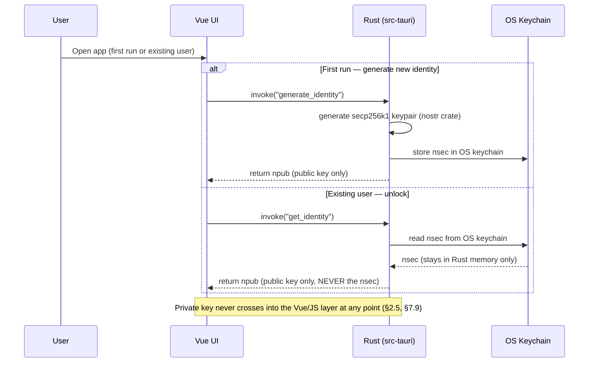
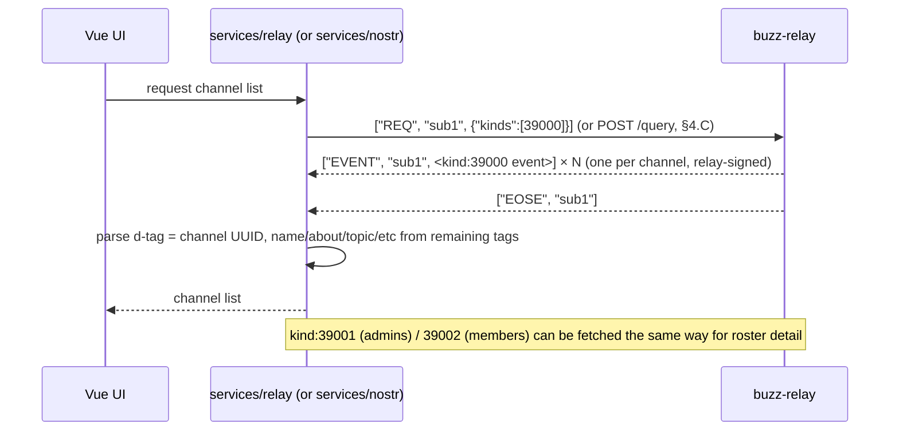
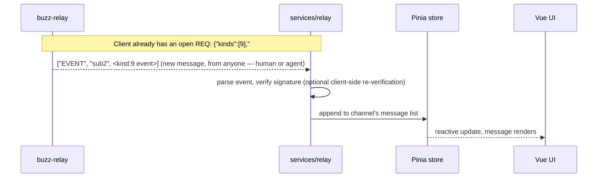
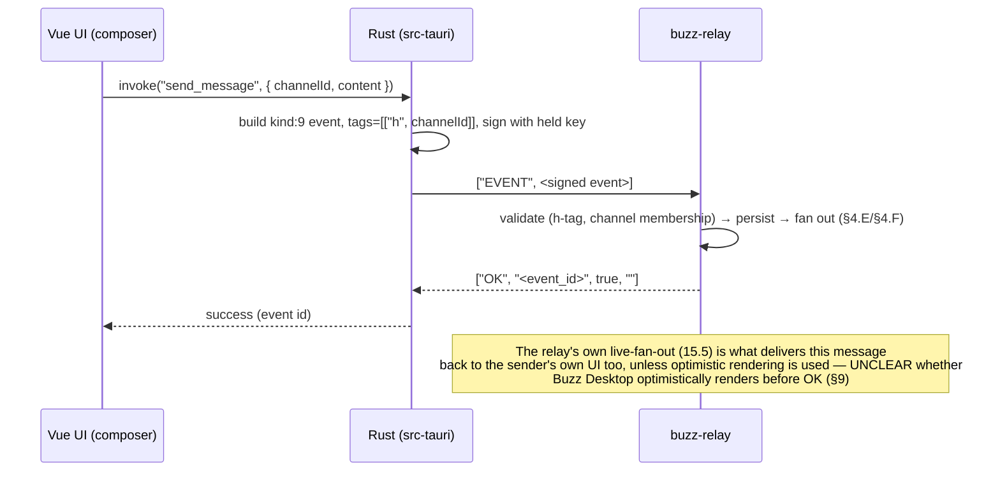
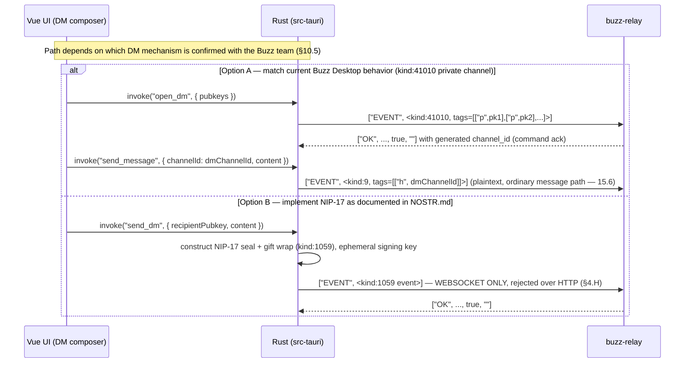
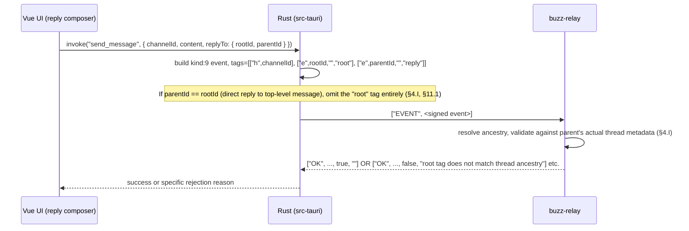
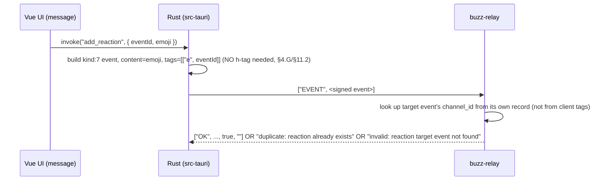
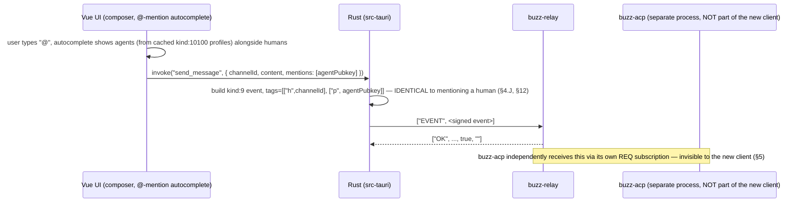
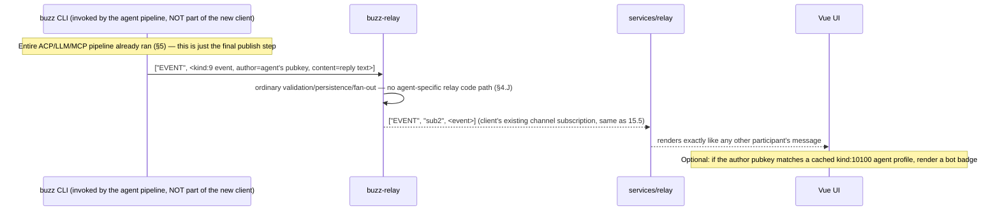
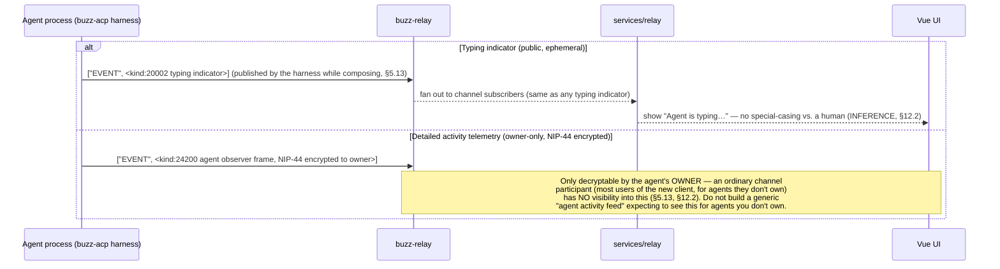

# Buzz Repository — Implementation Context for a New Vue 3 + Tauri 2 Desktop Client

This document briefs an AI assistant (or engineer) tasked with **building a brand-new desktop client from scratch** — Vue 3 + TypeScript + Vite + Tauri 2 + Rust — that talks to the **existing, unmodified** Buzz backend (`buzz-relay`, `buzz-acp`) over Nostr. The existing Buzz repository (`C:\Users\Pranshul\Downloads\buzz2.0\buzz`) is **not** being forked, copied, or modified. This document is pure research output: no source code was written, changed, deleted, or moved to produce it.

**Tagging convention used throughout, per the requester's rules:**
- **[CODE]** — directly verified by reading source in this repository.
- **[DOCS]** — stated in existing repository documentation (`NOSTR.md`, `docs/*`, code doc comments treated as documentation-level claims).
- **[INFERENCE]** — a reasoned recommendation that goes beyond directly-observed fact; always labeled as such, never presented as fact.
- **[UNCLEAR]** — could not be confirmed from what was read; flagged rather than guessed.

**The single most load-bearing finding in this document** (detailed in full in §10): the existing `NOSTR.md` documentation states Buzz DMs use NIP-17 gift wrap (kind:1059), and `crates/buzz-relay` does have real, actively-handled gift-wrap code — but the actual, shipping Buzz Desktop DM feature does **not** use it. It opens a private NIP-29-style channel via a Buzz-custom command (kind:41010 `KIND_DM_OPEN`) and sends ordinary `kind:9` messages inside it. This was independently confirmed by two separate research passes (one reading `buzz-core`/`buzz-sdk`, one reading `desktop/src-tauri`'s actual DM command code) and must be resolved with the Buzz team before the new client's DM feature is designed — do not silently pick one interpretation.

---

## 1. Repository Overview

### 1.1 Top-level structure and reuse classification

| Directory/Path | What it does | New client: use it? | Reference-only? | Out of scope? |
|---|---|---|---|---|
| `crates/buzz-core` | Zero-I/O shared Rust domain/protocol library: kind constants, event/filter types, NIP-10 parsing, channel/role enums, NIP-AB pairing crypto. `crates/buzz-core/src/lib.rs`, `Cargo.toml` | **Depend on it directly** (Rust layer) if the new client's `src-tauri` builds/verifies events in Rust — see §3 | Also serves as the port-from reference for kind numbers if TypeScript builds events instead | — |
| `crates/buzz-sdk` | "Typed Nostr event builders for Buzz operations" — depends on `buzz-core`, provides ready-made builder functions (`build_message`, `build_reaction`, `build_dm_open`, `build_create_channel`, etc.). `crates/buzz-sdk/src/builders.rs`, `Cargo.toml` | **Strong candidate to depend on directly** (Rust layer) — avoids hand-rolling correctly-tagged events | Also the precise reference for exact tag shapes if building events in TypeScript instead | — |
| `crates/buzz-relay` | The Nostr relay server — the backend the new client connects to. `crates/buzz-relay/src/main.rs`, `router.rs`, `connection.rs`, `handlers/*` | **Never link against or run its code** — connect to a *running instance* of it over WebSocket/HTTP, as an external dependency | Yes — its handler source is the ground truth for exact protocol behavior (§4) | Do not reimplement any of its logic |
| `crates/buzz-acp` | The ACP "harness" bridging relay events to an AI agent subprocess; holds an agent's Nostr key. `crates/buzz-acp/src/{acp,relay,pool,queue}.rs` | **Never link against, run, or reference at runtime** | Yes — reading it explains what the new client will observe (ordinary Nostr events) as the *result* of this pipeline (§5, §12) | Entirely out of scope — new client does not spawn/manage agents |
| `crates/buzz-agent` | Buzz's own minimal hand-rolled ACP agent (LLM tool-call loop). `crates/buzz-agent/src/{main,agent,llm}.rs`, `README.md` | **Never link against, run, or reference at runtime** | Yes — same reason as buzz-acp | Entirely out of scope |
| `crates/buzz-auth` | NIP-42/NIP-98 verification logic (server-side). `crates/buzz-auth/src/{nip42,nip98}.rs` | Not a dependency — this runs server-side, inside `buzz-relay` | Yes — the authoritative reference for exact NIP-42/NIP-98 wire mechanics the new client's Rust layer must reproduce client-side (§7) | — |
| `crates/buzz-dev-mcp`, `crates/buzz-persona`, `crates/buzz-workflow` | Agent tool server, persona-pack loader, YAML workflow automation engine | No | No — not relevant to a chat client's wire protocol | Out of scope (agent/automation infrastructure) |
| `crates/buzz-db`, `buzz-pubsub`, `buzz-search`, `buzz-audit`, `buzz-media`, `buzz-deletion`, `buzz-relay-mesh`, `buzz-push-gateway`, `buzz-backend-kubernetes` | Server-side backend infrastructure (Postgres access, Redis fan-out, search, audit log, media storage, inter-relay mesh, push, remote-agent hosting) | No | No | Out of scope — entirely server-side, invisible to any client |
| `crates/buzz-ws-client` | Shared Rust NIP-42 WebSocket client library, used by `buzz-relay` internals and Buzz Desktop's headless background-sync client | **Possible reference/dependency** if the new client's Rust layer wants a full Nostr-aware WS client rather than a thin transport plugin — see §2.4/§14 for the architectural tradeoff | Yes | — |
| `crates/buzz-cli` | Agent-first CLI for Buzz (JSON in/out); this is what actually signs and publishes an agent's reply (see §5) | No — this is a CLI binary invoked by the agent pipeline, not a client library | Yes — useful for manual testing against a relay from a terminal while building the new client | Not linked into the new client |
| `crates/git-*`, `crates/buzz-relay-mesh`, `crates/ifc-core` | Git-signing helpers, inter-relay mesh, information-flow-control primitives | No | No | Out of scope |
| `desktop/src` | Buzz Desktop's React 19 frontend — the **pattern reference**, not code to copy | No (different framework — Vue, not React) | **Yes — primary architectural reference for §2** | Do not copy source files |
| `desktop/src-tauri` | Buzz Desktop's Rust/Tauri backend | No (do not link against or copy) | **Yes — primary architectural reference for §2, especially `commands/*.rs` and `native_websocket.rs`** | `managed_agents/`, `commands/project_git*.rs`, `huddle/`, `commands/canvas.rs`, `commands/workflows.rs`, `terminal_runtime.rs` are explicitly excluded even as reference (§13) |
| `web/` | A separate, lightweight React+Vite web client: invite acceptance + read-only git repo browser only (not a full chat client) | No | Useful secondary reference — it constructs Nostr events directly in TypeScript with `nostr-tools`, a pattern relevant to §14's architectural choice | Its git-browsing feature is out of scope |
| `admin-web/` | Moderation/ops console, REST-only against `/api/admin/v1` | No | No | Out of scope — not a relevant client type |
| `mobile/` | Full-featured Flutter client talking to the same relay | No (different framework) | Mild reference only, not deep-dived in this pass | Out of scope for direct reuse |
| `migrations/`, `schema/schema.sql` | Postgres schema — server-side data model | No | No — the new client never touches the database directly, only the relay's Nostr/HTTP surface | Out of scope |
| `.env.example`, `docker-compose.yml`, `Justfile` | Local dev environment setup for the *entire* Buzz monorepo (relay, DB, Redis, MinIO, etc.) | **Yes — use this to stand up a local relay to develop/test the new client against** | — | Most individual services (search, push, mesh) are irrelevant to a minimal client — only the relay + its datastores matter |
| `docs/nips/` | 17 Buzz-authored draft NIP specs | No (not code) | **Yes — primary protocol reference for custom kinds** (§6) | — |
| `NOSTR.md` | Repo-root protocol usage reference | No (not code) | **Yes, with one important caveat** — its DM section conflicts with the actual Desktop implementation; see §10 | — |

### 1.2 Where the components named in the task live, precisely

- **buzz-core**: `crates/buzz-core/` — deep analysis in §3.
- **buzz-relay**: `crates/buzz-relay/` — deep analysis in §4.
- **buzz-acp**: `crates/buzz-acp/` — deep analysis in §5.
- **buzz-agent**: `crates/buzz-agent/` — covered alongside buzz-acp in §5.
- **Authentication-related crates/modules**: `crates/buzz-auth/` (server-side verification), `crates/buzz-core/src/pairing/` (device-pairing crypto) — deep analysis in §7.
- **Nostr-related modules**: `crates/buzz-core` (kind registry, event/filter types, NIP-10), `crates/buzz-sdk` (event builders), `crates/buzz-ws-client` (Rust WS client library) — §3, §6.
- **Database/schema/migrations**: `migrations/*.sql`, `schema/schema.sql` — server-side only, not touched by any client, not detailed further in this client-focused document.
- **Configuration/environment files**: `.env.example` (repo root) — relevant variable subset for local relay setup is in §18.
- **Testing infrastructure**: `TESTING.md`, `Justfile` test recipes — relevant subset (how to get a relay running to test the new client against) is in §18.
- **Build/deployment infrastructure**: `Justfile`, `docker-compose.yml`, `deploy/charts/buzz` — relevant subset (local relay only) is in §18; Kubernetes/Helm production deployment is out of scope for a client-focused document.

## 2. Buzz Desktop Architecture (reference only — React+Tauri2, not to be copied)

**Scope note:** Buzz Desktop is React 19 + Tauri 2. This section exists so the new Vue3+Tauri2 client can copy the *pattern*, not the code. All claims **[CODE]** unless marked **[INFERENCE]**/**[UNCLEAR]**.

### 2.1 Frontend framework, entry point, router, state management

- Entry: `desktop/src/main.tsx` — `ReactDOM.createRoot(...).render(<App/>)` wrapped in a stack of context providers (`CommunitiesProvider`, `ThemeProvider`, `TooltipProvider`, `UpdaterProvider`, etc.). No Redux/MobX/Zustand. **[CODE]**
- Router: TanStack Router, **hash history** (`createHashHistory()`), file-based routes generated into `desktop/src/app/routeTree.gen.ts` from `desktop/src/app/routes/` (`desktop/src/app/router.tsx`). **[CODE]** — Hash history (not browser history) avoids needing a Tauri-side URL-scheme handler for client-side routes in a `tauri://` origin; worth the same choice in the new client's router config.
- State management: React Query (`@tanstack/react-query`) for all server-derived state (channels, messages, agents). Local/UI state via plain hooks + a handful of custom external-store singletons (e.g. `desktop/src/features/agents/cardMintStore.ts`, `activeAgentTurnsStore.ts`) — not a global state library. **[CODE]** For Vue, TanStack Query has an official Vue adapter (`@tanstack/vue-query`) that maps directly onto this pattern; Pinia is the natural analogue for the small number of local-store singletons.

### 2.2 API/service layer — the single most reusable architectural pattern

`desktop/src/shared/api/` is a ~100-file directory that is the **exclusive** boundary between UI code and Tauri IPC. Two sub-patterns:

1. **Simple request/response commands** — one `invokeTauri<T>("command_name", args)` call per exported function, funneled through a single wrapper `invokeTauri()` (`desktop/src/shared/api/tauri.ts:295-308`) that normalizes Tauri errors into a typed `TauriInvokeError` and inspects error messages for a `"relay rate-limited:"` prefix to drive a shared client-side rate-limit gate. Manual camelCase (TS) ↔ snake_case (Rust JSON) conversion by hand per function (e.g. `fromRawFeedItem`, `fromRawManagedAgent`). No components call `invoke()` directly for these — they import named functions like `getHomeFeed()`, `addReaction()`, `joinChannel()`. **[CODE, `desktop/src/shared/api/tauri.ts`]**
2. **The live relay session** — a stateful class, not simple request/response (§2.4).

Components/hooks essentially never call `invoke()`/`listen()` directly (only 17-18 files do, almost all *inside* `shared/api/`). **This "all IPC behind a service layer" pattern is worth replicating directly** in the new client's `services/` directory (§14). **[CODE]**

### 2.3 Tauri IPC architecture (concrete before/after example)

Frontend (`desktop/src/shared/api/tauri.ts:581-587`):
```ts
export async function addReaction(eventId: string, emoji: string, emojiUrl?: string): Promise<void> {
  await invokeTauri("add_reaction", { eventId, emoji, emojiUrl });
}
```
Rust (`desktop/src-tauri/src/commands/messages.rs:816-833`):
```rust
#[tauri::command]
pub async fn add_reaction(event_id: String, emoji: String, emoji_url: Option<String>, state: State<'_, AppState>) -> Result<(), String> {
    let target_eid = EventId::from_hex(&event_id)...;
    let builder = match emoji_url {
        Some(url) => buzz_sdk_pkg::build_custom_emoji_reaction(target_eid, emoji.trim(), &url)...,
        None => events::build_reaction(target_eid, emoji.trim())?,
    };
    submit_event(builder, &state).await?;
    Ok(())
}
```
**[CODE]** This shows the general command pattern: a Rust command builds a Nostr event via a builder function (delegating to `buzz-sdk` where possible), then calls a shared `submit_event(builder, &state)` helper that signs + publishes. Tauri command naming is snake_case; frontend wrappers are camelCase, with Tauri's default IPC convention auto-converting JS object keys to Rust snake_case params.

### 2.4 WebSocket/relay communication — THE KEY ARCHITECTURAL FINDING

**This corrects a natural assumption worth flagging explicitly: the live relay session's Nostr protocol logic is implemented in TypeScript, not Rust.** Two Rust-side relay clients exist, and *neither* drives the main chat UI:

- `desktop/src-tauri/src/native_relay_client.rs` — Rust-native, built on `buzz-ws-client`, but its own doc comment states it exists for **"backend features that need live subscriptions (archive sync today; persona catalog and catch-up next)"** — headless background sync, not the UI's live feed. **[CODE, doc comment at `native_relay_client.rs:1-18`]**
- `desktop/src-tauri/src/native_websocket.rs` — a **generic, Nostr-agnostic Tauri plugin** named `"websocket"` (`tauri::plugin::Builder::new("websocket")`, line 354), exposing exactly 4 commands: `connect`, `send`, `disconnect`, `disconnect_all` (lines 181-249). It knows nothing about Nostr, NIP-42, kinds, or filters — it opens a raw WebSocket, streams inbound frames to JS via a Tauri `Channel`, and sends whatever raw text/binary payload JS gives it. **[CODE]**

**The actual live relay session — the thing driving the chat UI — is `RelayClient` in `desktop/src/shared/api/relayClientSession.ts` (1,070 lines), a TypeScript class.** It:
- Opens the raw socket via `invoke("plugin:websocket|connect", { url, onMessage: channel, config: {} })` (line 550).
- Builds NIP-01 subscription filters in TypeScript (`relayChannelFilters.ts`: `buildChannelFilter`, `buildChannelHistoryFilter`, `buildChannelMentionFilter`, `buildGlobalStreamFilter`, `buildChannelAuxDeletionFilter`).
- Sends raw NIP-01 frames itself: `invoke("plugin:websocket|send", { id: wsId, message: { type: "Text", data: JSON.stringify(["REQ", subId, filter]) } })` (lines 598-662).
- Implements reconnect/backoff (`relayReconnectPolicy.ts`), a stall watchdog (`relayStallWatchdog.ts`), inbound batching (`relayInboundBuffer.ts`), rate-limit gating (`relayRateLimitGate.ts`), closed-subscription recovery (`relayClosedRecovery.ts`) — **entirely in TypeScript**.
- Imports the exact Buzz kind constants directly (`KIND_STREAM_MESSAGE`, `KIND_TYPING_INDICATOR`, etc. from `@/shared/constants/kinds`). **[CODE]**
- For NIP-42 AUTH: challenge/response *orchestration* is TS (`relayAuthPolicy.ts::armRelayAuthentication`), but *event construction+signing* is delegated to Rust via `createAuthEvent({ challenge, relayUrl })` → `invoke("create_auth_event", ...)`, which returns an already-signed event JSON string that TS then sends raw over the socket.
- For publishing: TS builds plaintext `{kind, content, tags}`, calls `signRelayEvent(...)` → Rust `invoke("sign_event", ...)` for a signed `RelayEvent`, then `publishSessionEvent(session, signedEvent, ...)` sends `["EVENT", event]` raw over the socket and tracks the pending publish until `OK` arrives.

**Publish flow:**
```
Frontend (component)
    ↓  builds plaintext {kind, content, tags} in TypeScript
signRelayEvent() / createAuthEvent()
    ↓  Tauri IPC: invoke("sign_event" / "create_auth_event")
Rust command (commands/*.rs)
    ↓  holds the private key; signs; returns signed event JSON
Frontend: publishSessionEvent()
    ↓  invoke("plugin:websocket|send", {...})
Rust native_websocket plugin (transport only, no Nostr awareness)
    ↓  raw WebSocket frame
buzz-relay
```
**Receive flow:**
```
buzz-relay → raw WS frame
    ↓
Rust native_websocket plugin
    ↓  Tauri Channel (streaming IPC), inbound raw text/binary
Frontend: RelayClient's onMessageChannel → relayInboundBuffer → handleWsMessage()
    ↓  parses NIP-01 frames (EVENT/OK/EOSE/CLOSED/NOTICE/AUTH), matches to subscriptions
Frontend: React Query cache updates / subscription callbacks
```
A lighter TS class `ReadOnlyRelayClient` (`desktop/src/shared/api/readOnlyRelayClient.ts`) exists for one-shot history+publish against *inactive* communities — same generic plugin transport, no live subscription bookkeeping. **[CODE]**

**[INFERENCE — architectural recommendation for the new client, flagged explicitly as going beyond direct fact, elaborated further in §14]**: Buzz Desktop keeps almost all Nostr protocol logic (filters, reconnect policy, NIP-42 orchestration, event parsing) in TypeScript, using Rust *only* for (a) a generic raw-WebSocket transport plugin and (b) signing/key custody. The new Vue+Tauri client has a genuinely lighter option than porting `buzz-ws-client` into a new Rust layer: use a mature TS Nostr library (e.g. `nostr-tools`, already used by this same repo's `web/` client) for filter/event construction and NIP-01 framing, paired with either the browser's native `WebSocket` directly (simplest — what `web/` already does) or a small Rust transport plugin mirroring `native_websocket.rs`'s 4-command shape if there's a reason to keep the socket in Rust (surviving webview reloads, centralizing reconnect logic). Buzz Desktop's own code doesn't state a reason for choosing the Rust-transport-plugin route over a plain browser WebSocket, so treat this as an open design choice, not a hard requirement. **Either way, private-key custody and signing should stay in Rust** — this part of the split is a clear, reusable security pattern.

### 2.5 Identity/key handling

- `desktop/src-tauri/src/secret_store.rs` stores the nsec as one JSON blob per OS-keychain entry via the `keyring` crate (macOS Keychain / Windows Credential Store / Linux Secret Service). **[CODE]**
- Identity-related Tauri commands confirmed via frontend call sites: `sign_event` (`signRelayEvent`), `create_auth_event` (`createAuthEvent`), `nip44_encrypt_to_self`/`nip44_decrypt_from_self`. Additional commands (`get_identity`, `get_nsec`, `import_identity`) are referenced in `desktop/src/shared/api/tauriIdentity.ts` — exact function list **[UNCLEAR, not read line-by-line in this pass]**.
- **Critical for the new client's design**: the private key never appears in TypeScript at any point in Buzz Desktop's observed flow — every signing operation is "send plaintext event fields to Rust, get a signed event back." No JS-side Nostr signing library is used for the *user's own* identity, even though such a library is used (for ephemeral/unsigned purposes) in the `web/` client. **This is a deliberate security boundary worth replicating exactly: the new client's own identity/signing must go through Rust + OS keychain, never hold or use the user's real nsec in the Vue/JS layer**, even if the WebSocket transport itself ends up living in the Vue layer per §2.4's inference. **[CODE + INFERENCE for the recommendation clause]**

### 2.6 Event publishing / event subscription

Covered fully in §2.4 — the publish/receive diagrams above are the complete answer for both.

### 2.7 Channel loading / message loading / message sending (core commands only)

Confirmed core command names via `shared/api/tauri.ts` (not the full command enumeration — just what a minimal client needs):
- `getHomeFeed(input)` → `invoke("get_feed", input)` — mentions/needs-action/activity/agent-activity feed. **[CODE, `tauri.ts:430-448`]**
- `sendChannelMessage` — re-exported from `@/shared/api/tauriMessages`. **[CODE, existence confirmed at `tauri.ts:45`]**
- `getThreadReplies(rootEventId, channelId, options)` → `invoke("get_thread_replies", ...)` — server-side thread-subtree fetch with keyset pagination; doc comment explains this bypasses local cache and reads `thread_metadata` directly on the relay. **[CODE, `tauri.ts:494-528`]**
- `getEventById`/`getEventsByIds` — re-exported from `@/shared/api/tauriEvents`. **[CODE]**
- `joinChannel(channelId)` / `leaveChannel(channelId)` → `invoke("join_channel"/"leave_channel", ...)`. **[CODE, `tauri.ts:395-401`]**
- `editMessage` — re-exported from `@/shared/api/editMessage`. **[CODE, `tauri.ts:572`]**
- `deleteMessage(channelId, eventId)` → `invoke("delete_message", ...)`. **[CODE, `tauri.ts:574-579`]**
- Channel list/detail loading lives in `desktop/src/shared/api/tauriChannels.ts` (298 lines, re-exported wholesale) — exact function names **[UNCLEAR, not opened line-by-line — read this file directly for the minimal client's channel-list command name]**.

Flow shape for sending a message:
```
Frontend (compose UI)
    ↓  Tauri IPC: invoke("send_channel_message"-equivalent)  [exact command name in tauriMessages.ts, not confirmed]
Rust command
    ↓  builds kind:9 event via buzz-sdk / events::build_message, signs, publishes
    ↓  (uses the SAME live relayClientSession WS connection path per §2.4, OR a
        direct native_relay_client-style publish — not independently distinguished
        in this pass for this specific command; see §2.4's general pattern)
buzz-relay
```

### 2.8 DM implementation — see §10 for the full, critical treatment (contradicts NOSTR.md)

Summary: Buzz Desktop's actual DM feature uses a Buzz-custom command kind **41010** (`KIND_DM_OPEN`, `desktop/src-tauri/src/events.rs::build_dm_open`) to create a private NIP-29-style channel, then sends ordinary **kind:9** messages inside it — **not** NIP-17 gift wrap (kind:1059), despite `NOSTR.md` describing gift wrap as Buzz's DM mechanism. Full trace, evidence, and the explicit flag for the team in §10.

### 2.9 Thread implementation

`desktop/src/features/messages/lib/threading.ts::buildThreadReferenceTags(channelId, parentEventId, rootEventId)` (lines 130-149):
```ts
const tags: string[][] = [["h", channelId]];
if (!parentEventId) return tags;
if (!rootEventId || parentEventId === rootEventId) { tags.push(["e", parentEventId, "", "reply"]); return tags; }
tags.push(["e", rootEventId, "", "root"]);
tags.push(["e", parentEventId, "", "reply"]);
return tags;
```
**[CODE]** Standard NIP-10 marked-tag convention (`["e", id, relay-hint, marker]`, empty relay hint), plus Buzz's own `#h` channel-scope tag on every event. Retrieval for an open thread panel uses the server-side `getThreadReplies` command (§2.7) rather than filtering the locally-cached channel timeline, specifically to avoid deep/old threads rendering incomplete.

### 2.10 Reaction implementation

`add_reaction`/`remove_reaction` Tauri commands (`desktop/src-tauri/src/commands/messages.rs:816-833` and surrounding) — kind:7, content is the emoji, target via `events::build_reaction(target_event_id, emoji)`; a custom-emoji variant delegates to `buzz_sdk_pkg::build_custom_emoji_reaction`, producing an `["emoji", shortcode, url]` tag (NIP-30). Frontend wrappers: `addReaction(eventId, emoji, emojiUrl?)` / `removeReaction(eventId, emoji)`. **[CODE, `tauri.ts:581-594`]**

### 2.11 Presence implementation

No dedicated `set_presence`/`set_typing` Tauri command was found via direct grep of `desktop/src-tauri/src/commands/*.rs` — only a read command, `get_presence` (`commands/profile.rs:337-338`, wrapped by `getPresence(pubkeys)`). Given `relayClientSession.ts` directly imports `KIND_TYPING_INDICATOR`/`KIND_USER_STATUS` and the generic sign-then-publish pattern requires no kind-specific Rust command, presence/typing events are plausibly built and published from within the TS `RelayClient` itself using the same generic `sign_event` call. **[INFERENCE — the generic mechanism is confirmed; the exact publish call site for typing/presence specifically was not read in this pass]**

### 2.12 Agent UI — scope boundary (full detail in §5/§12)

- `desktop/src/features/agents/` files like `activeAgentTurnsStore.ts`, `agentWorkingSignal.ts`, `channelAgents.ts` (agent-in-channel membership/access display) are "display/interact with an agent as a chat participant" — **relevant** to the new client.
- Other files in the same directory (`acpRuntimesQuery.ts`, `cardMintStore.ts`) and the entire `desktop/src-tauri/src/managed_agents/` Rust module (~40 files: `runtime.rs`, `process_lifecycle.rs`, `spawn_snapshot/`, `claude_config/`, `env_vars/`, `discovery/`, `custom_harnesses.rs`, `bestie_assignment.rs`, `git_bash.rs`, etc.) are **local agent process creation/configuration/lifecycle management** — exactly what the new client must **not** reproduce.
- **The dividing line, stated precisely**: any code whose job is *"a human or agent published a Nostr event that should render in the timeline / update agent-turn UI state"* → in scope. Any code whose job is *"spawn/configure/restart an OS process running an agent CLI, manage its persona/model/provider config, or write its harness environment variables"* → `desktop/src-tauri/src/managed_agents/*` and the create/update/delete-managed-agent commands (`createManagedAgent`, `updateManagedAgent`, `deleteManagedAgent`, `listManagedAgents`, `getManagedAgentLog`, `installAcpRuntime`, `discoverBackendProviders`) → **excluded**.

### 2.13 Local agent process handling — explicitly out-of-scope directories (confirmed present, exclude)

| Path | Nature |
|---|---|
| `desktop/src-tauri/src/managed_agents/` (~40 files) | Local agent process spawn/lifecycle/config — **EXCLUDE** |
| `desktop/src-tauri/src/commands/project_git*.rs` (10 files) | Git-over-Nostr project/repo bridge — **EXCLUDE** |
| `desktop/src-tauri/src/huddle/` (incl. `agent_tts_publisher.rs`, `agent_tts_routing.rs`) | Voice/huddle calls — **EXCLUDE** |
| `desktop/src-tauri/src/commands/canvas.rs` | Shared canvas doc feature — **EXCLUDE** |
| `desktop/src-tauri/src/commands/workflows.rs` | YAML workflow automation UI — **EXCLUDE** |
| `desktop/src-tauri/src/terminal_runtime.rs` | PTY terminal sessions — **EXCLUDE** |

All six confirmed to exist as directories/files in the current repository. **[CODE, existence confirmed by directory listing]**

## 3. buzz-core Deep Analysis

### 3.1 Verdict: what buzz-core actually IS

**[CODE]** `buzz-core` is a **zero-I/O, shared Rust domain/protocol library** — not a service, not a database abstraction, and not something you run. It is deliberately dependency-starved: its `Cargo.toml` has no `tokio`, `sqlx`, `redis`, or `axum` dependency, and the file even carries a trailing comment confirming this on purpose: `# NO tokio, NO sqlx, NO redis, NO axum — zero I/O dependencies` (`crates/buzz-core/Cargo.toml`). Its crate-root doc comment states its role directly: *"zero-I/O foundation types for the Buzz relay... All other Buzz crates depend on this one."* (`crates/buzz-core/src/lib.rs:1-5`).

It contains three kinds of things:
1. **Kind constants** — the single authoritative registry of every Buzz event-kind number (`kind.rs`).
2. **Pure domain/wire types and algorithms** — event wrappers, filter matching, NIP-10 thread parsing, channel/role enums, tenant identity, invite-code shape, relay-URL canonicalization, NIP-AB pairing crypto, NIP-AE/NIP-AM/NIP-PMA/observer-frame codecs — all expressed as plain functions/structs over `serde_json`/`nostr`/`chrono`/`uuid`, with no network or DB calls.
3. **Re-exports of the external `nostr` Rust crate's core types** — `pub use nostr::{Event, EventId, Filter, Keys, Kind, PublicKey};` (`lib.rs:38`). buzz-core does **not** define its own event/key primitives; it builds on top of the third-party `nostr` crate (rust-nostr) and adds Buzz-specific constants/logic around it.

**Definitive answer to the "who uses it" question [CODE, verified via `grep -rn buzz-core --include=Cargo.toml`]:** buzz-core is a dependency of 17 other workspace crates, including both **server-side** crates (`buzz-relay`, `buzz-db`, `buzz-auth`, `buzz-pubsub`, `buzz-search`, `buzz-audit`, `buzz-deletion`, `buzz-media`, `buzz-workflow`, `buzz-admin`) **and client-side / cross-cutting** crates (`buzz-acp`, `buzz-cli`, `buzz-sdk`, `buzz-dev-mcp`, `buzz-pairing-cli`, `buzz-test-client`, `buzz-conformance`) — **and, critically, `desktop/src-tauri` itself**:
```
desktop/src-tauri/Cargo.toml:105:buzz_core_pkg = { package = "buzz-core", path = "../../crates/buzz-core" }
```
This is direct, unambiguous proof that the **existing Buzz Desktop's Rust/Tauri layer already depends on buzz-core as a plain path dependency**. A NEW Rust-based Tauri client can do exactly the same thing — add `buzz-core` as a git or path dependency to its own `src-tauri/Cargo.toml` — with no architectural obstacle. Because buzz-core has zero I/O dependencies, pulling it in adds no tokio/sqlx/axum/redis baggage.

**One nuance:** the crate's own doc comment says "for the Buzz relay" and several individual module doc comments say "Relay-side" (e.g. `event.rs`: *"Relay-side event wrapper... [`StoredEvent`] wraps a [`nostr::Event`] with relay-assigned metadata"*). This means **not every type in buzz-core is meant for a client** — some (`StoredEvent`, `TenantContext`, `CommunityId`) are explicitly relay-only by design (see §3.3 below). But other modules explicitly document a client role: `channel.rs`'s doc comment says outright *"These live in buzz-core (zero I/O deps) so both the SDK (client-side) and the DB layer (server-side) can use the same types."* (`crates/buzz-core/src/channel.rs:1-5`). So buzz-core is genuinely a **mixed-audience shared library** — some modules for both client and server, some relay-only — not a single-purpose thing.

### 3.2 Full kind constant registry (`crates/buzz-core/src/kind.rs`, read in full — 1089 lines)

This is the **complete, current** list — considerably larger than a generic Nostr kind list, and more extensive than any prior summary. All constants are `pub const ... : u32`.

**Standard/NIP-adjacent kinds**
| Constant | Kind | NIP | Purpose |
|---|---|---|---|
| `KIND_PROFILE` | 0 | NIP-01 | User profile metadata |
| `KIND_TEXT_NOTE` | 1 | NIP-01 | Short text note |
| `KIND_CONTACT_LIST` | 3 | NIP-02 | Contact/follow list |
| `KIND_DELETION` | 5 | NIP-09 | Event deletion request |
| `KIND_REACTION` | 7 | NIP-25 | Reaction (emoji or +/-) |
| `KIND_CHANNEL_METADATA` | 41 | NIP-01 | Channel metadata — **doc comment: "Not used by Buzz today"** |
| `KIND_MUTE_LIST` | 10000 | NIP-51 | Mute list (replaceable) |
| `KIND_PIN_LIST` | 10001 | NIP-51 | Pin list (replaceable) |
| `KIND_NIP65_RELAY_LIST_METADATA` | 10002 | NIP-65 | Read/write relay preferences |
| `KIND_BOOKMARK_LIST` | 10003 | NIP-51 | Bookmark list |
| `KIND_EMOJI_LIST` | 10030 | NIP-51 | Preferred emoji list |
| `KIND_FOLLOW_SET` | 30000 | NIP-51 | Named follow list (parameterized) |
| `KIND_BOOKMARK_SET` | 30003 | NIP-51 | Named bookmark collection |
| `KIND_EMOJI_SET` | 30030 | NIP-51/30 | Per-member custom emoji set; workspace palette = client-side union of all members' sets |
| `KIND_LONG_FORM` | 30023 | NIP-23 | Long-form content, global (not channel-scoped) |
| `KIND_USER_STATUS` | 30315 | NIP-38 | User status, global |
| `KIND_READ_STATE` | 30078 | NIP-78/custom "NIP-RS" | Per-client read-position sync, NIP-44-encrypted to self |
| `KIND_AUTH` | 22242 | NIP-42 | AUTH challenge response — never stored |
| `KIND_BLOSSOM_AUTH` | 24242 | BUD-01 | Blossom media-upload auth — never stored |
| `KIND_NOSTR_IDENTITY_BINDING` | 24243 | Buzz custom | One-time identity binding proof — ephemeral, not stored |
| `KIND_HTTP_AUTH` | 27235 | NIP-98 | HTTP auth event — never stored |
| `KIND_GIFT_WRAP` | 1059 | NIP-17 | *"Outer envelope for private DMs — hides sender, content, timestamp"* — see §3.5 for an important open question about how/whether this is actually used for Buzz DMs today |
| `KIND_FILE_METADATA` | 1063 | NIP-94 | File metadata attachment |
| `KIND_REPORT` | 1984 | NIP-56 | Report an event/pubkey/blob to moderators |

**NIP-29 group management (9000s / 39000s)**
| Constant | Kind |
|---|---|
| `KIND_NIP29_PUT_USER` | 9000 |
| `KIND_NIP29_REMOVE_USER` | 9001 |
| `KIND_NIP29_EDIT_METADATA` | 9002 |
| `KIND_NIP29_DELETE_EVENT` | 9005 |
| `KIND_NIP29_CREATE_GROUP` | 9007 |
| `KIND_NIP29_DELETE_GROUP` | 9008 |
| `KIND_NIP29_CREATE_INVITE` | 9009 |
| `KIND_NIP29_JOIN_REQUEST` | 9021 |
| `KIND_NIP29_LEAVE_REQUEST` | 9022 |
| `KIND_NIP29_GROUP_METADATA` | 39000 (addressable state mirror) |
| `KIND_NIP29_GROUP_ADMINS` | 39001 |
| `KIND_NIP29_GROUP_MEMBERS` | 39002 |
| `KIND_NIP29_GROUP_ROLES` | 39003 |

**Moderation / relay membership (NIP-43, custom)**
| Constant | Kind | Notes |
|---|---|---|
| `KIND_MODERATION_BAN` / `_UNBAN` / `_TIMEOUT` / `_UNTIMEOUT` / `_RESOLVE_REPORT` | 9040-9044 | Mod-signed commands, executed transactionally, never stored as regular events; each writes a `moderation_actions` audit row |
| `RELAY_ADMIN_ADD_MEMBER` / `_REMOVE_MEMBER` / `_CHANGE_ROLE` | 9030-9032 | NIP-43 membership admin commands |
| `RELAY_ADMIN_SET_WORKSPACE_PROFILE` | 9033 | Buzz custom: set workspace icon |
| `KIND_NIP43_MEMBERSHIP_LIST` | 13534 | Relay-signed membership snapshot |
| `KIND_NIP43_MEMBER_ADDED` / `_REMOVED` | 8000 / 8001 | Relay-signed announcements |
| `KIND_NIP43_LEAVE_REQUEST` | 28936 | User-signed, ephemeral |
| `KIND_IA_ARCHIVE_REQUEST` / `_UNARCHIVE_REQUEST` | 9035 / 9036 | Identity archival requests |
| `KIND_IA_ARCHIVED` / `_UNARCHIVED` / `_ARCHIVED_LIST` | 8002 / 8003 / 13535 | Relay-signed identity-archival deltas/snapshot |

**AI agent kinds (custom NIPs — NIP-AE/AM/AP/PMA)**
| Constant | Kind | Notes |
|---|---|---|
| `KIND_AGENT_PROFILE` | 10100 | Agent metadata + owner reference (replaceable) |
| `KIND_AGENT_ENGRAM` | 30174 | NIP-AE encrypted agent memory record |
| `KIND_PERSONA` | 30175 | NIP-AP persona definition — **author-only-unless-shared** read model (see code comment, `kind.rs:171-196`) |
| `KIND_TEAM` | 30176 | NIP-AP team definition — deliberately owner-private, NOT in the shared-gated set |
| `KIND_MANAGED_AGENT` | 30177 | NIP-AP managed-agent definition; MUST NOT carry secret key/env vars (world-readable) |
| `KIND_TEAM_CATALOG` | 30178 | Shareable team projection, embeds member persona projections |
| `KIND_PRIVATE_MANAGED_AGENT` | 30179 | NIP-PMA — **reservation-only; relay must reject until dedicated privacy/CAS work ships** (`private_managed_agent.rs` doc comment) |
| `KIND_AGENT_OBSERVER_FRAME` | 24200 | Ephemeral, owner-scoped, NIP-44-encrypted agent telemetry/control |
| `KIND_AGENT_TURN_METRIC` | 44200 | NIP-AM per-turn token-usage record, NIP-44-encrypted to owner, owner-only read |
| `KIND_JOB_REQUEST/_ACCEPTED/_PROGRESS/_RESULT/_CANCEL/_ERROR` | 43001-43006 | Agent job protocol — explicitly NOT NIP-90 kinds because *"Buzz requires auth chains (depth ≤ 3, breadth ≤ 10)"* |

**Chat / messaging (Buzz custom, 40000s / 41000s)**
| Constant | Kind | Notes |
|---|---|---|
| `KIND_STREAM_MESSAGE` | 9 | The core channel/DM chat message kind (NIP-29 group chat). Doc comment: *"V1 used kind:10001 (wrong, replaceable range), then 40001"* — i.e. this number was migrated twice before settling on 9. Also documents an **agent shutdown convention**: owner sends kind:9 `"!shutdown"` with a `#p` mention of the agent — a content convention, not a new kind. |
| `KIND_STREAM_MESSAGE_V2` | 40002 | Rich content variant |
| `KIND_STREAM_MESSAGE_EDIT` | 40003 | Edit |
| `KIND_STREAM_MESSAGE_PINNED` | 40004 | Pinned |
| `KIND_STREAM_MESSAGE_BOOKMARKED` | 40005 | Bookmarked |
| `KIND_STREAM_MESSAGE_SCHEDULED` | 40006 | Scheduled |
| `KIND_STREAM_REMINDER` | 40007 | Reminder attached to a message |
| `KIND_STREAM_MESSAGE_DIFF` | 40008 | Diff/patch message (unified diff) — Git/Projects-adjacent |
| `KIND_CANVAS` | 40100 | Shared document/canvas for a channel |
| `KIND_SYSTEM_MESSAGE` | 40099 | Channel state-change system message |
| `KIND_CHANNEL_SUMMARY` | 40901 | **Relay-only sidecar**, never client-submitted |
| `KIND_PRESENCE_SNAPSHOT` | 40902 | **Relay-only sidecar** |
| `KIND_DM_OPEN` | 41010 | Open/create a DM (p-tags = participants) |
| `KIND_DM_ADD_MEMBER` | 41011 | Add member to group DM |
| `KIND_DM_HIDE` | 41012 | Hide DM from sidebar |
| `KIND_DM_CREATED` | 41001 | A new DM conversation was created |
| `KIND_DM_VISIBILITY` | 30622 | **Relay-only**, relay-signed, per-viewer hidden-DM snapshot (NIP-DV) |
| `KIND_THREAD_SUMMARY` | 39005 | **Relay-only**, synthesized at query time, never stored — reply_count/descendant_count/last_reply_at/participants |
| `KIND_WINDOW_BOUNDS` | 39006 | **Relay-only**, cursor-pagination "has_more"/"next_cursor" — *"the only authority on exhaustion — clients must not infer `has_more` from row counts"* |

**Ephemeral (20000-29999, never persisted)**
| Constant | Kind |
|---|---|
| `KIND_PRESENCE_UPDATE` | 20001 |
| `KIND_TYPING_INDICATOR` | 20002 |
| `KIND_PAIRING` | 24134 (NIP-AB) |
| `KIND_AGENT_OBSERVER_FRAME` | 24200 |
| `KIND_HUDDLE_REACTION` | 24810 |

**Forum, workflow, huddle, git, misc (all Buzz custom ranges)**
| Range | Purpose |
|---|---|
| 45000s | Forum post/vote/comment |
| 46000s | Workflow engine (trigger/step/approval events) — **workflow functionality is explicitly out of scope for the new client per the user's requirements** |
| 48000s | Audit entry, huddle lifecycle (started/joined/left/ended/liveness/guidelines) |
| 49000s | Media upload audit (internal, not a relay event kind) |
| 1617-1633, 30617-30621 | NIP-34 git (patch/PR/issue/status/repo announcement) + Buzz custom NIP-MP multi-repo project — **explicitly out of scope (Git/Projects) per the user's requirements** |
| 30300 | NIP-ER event reminder |
| 30350 | NIP-PL push lease |
| 30620 | Workflow definition |
| 42000 | Product feedback (sidecarred, never an event) |
| 44100 / 44101 | Relay-signed member-added / member-removed notification (global, p-tag+h-tag gated) |

**Behavioral helper functions also in `kind.rs`** (pure, `#[const fn]` where possible): `is_ephemeral`, `is_replaceable`, `is_parameterized_replaceable`, `is_workflow_execution_kind`, `is_relay_admin_kind`, `is_identity_archive_request_kind`, `is_command_kind`, `is_relay_only_kind` (client submission of these MUST be rejected: `KIND_NIP43_MEMBERSHIP_LIST`, `KIND_CHANNEL_SUMMARY`, `KIND_PRESENCE_SNAPSHOT`, `KIND_DM_VISIBILITY`, `KIND_THREAD_SUMMARY`, `KIND_WINDOW_BOUNDS`), `is_shared_gated_kind`/`event_is_shared`/`is_unshared_gated_event` (the persona/team-catalog "author-only-unless-shared" read model), `event_kind_u32`/`event_kind_i32`.

**Read-access model constants** (important for a client to understand what it can/cannot expect to read back): `AUTHOR_ONLY_KINDS` (event reminders, push leases, private managed agents — readable only by author), `RESULT_GATED_KINDS` (DM visibility, agent turn metric — must match `#p` even via a kindless `ids` lookup), `P_GATED_KINDS` (agent observer frames, member-added/removed notifications, gift wrap, DM visibility, agent turn metric — REQ subscriptions must have an exact `#p` filter for the requester's own pubkey or the relay rejects them), `SHARED_GATED_KINDS` (persona, team catalog — author-only unless tagged `["shared","true"]`).

### 3.3 Module-by-module documentation

| Module | Purpose | I/O? | Relay-only or shared? |
|---|---|---|---|
| `kind.rs` | Authoritative kind-number registry + kind-classification helpers | None | **Shared** — every client needs these numbers to build/parse events correctly |
| `event.rs` | `StoredEvent` — wraps a `nostr::Event` with **relay-assigned** metadata (`received_at`, `channel_id`, `verified`) | None | **Relay-only** by design (doc comment: "Relay-side event wrapper... relay-assigned metadata") — a client has no reason to construct this type |
| `filter.rs` | `filters_match()` — in-memory NIP-01 filter matching against a `StoredEvent`, including a documented `#h`-tag fallback to `StoredEvent.channel_id` for reaction/deletion events that don't carry their own `h` tag; `reader_authorized_for_event()` — the result-level `#p` read gate for `RESULT_GATED_KINDS` | None | **Relay-only** — this is the relay's live-subscription/fan-out matching engine operating on relay-side `StoredEvent`; a client does not need to reimplement or depend on this (the client just sends a `REQ` and trusts the relay's matching) |
| `nip10.rs` | `ThreadMarkers`/`parse_thread_markers()` — the single canonical parser for NIP-10 `root`/`reply` `e`-tag markers, with a precise resolution rule (`resolve()`) turning markers into `(root_id, parent_id)`. Doc comment explicitly warns this exists because "a second hand-rolled copy is exactly how the two drifted" | None | **Shared logic, easy to port** — a small, pure, well-tested algorithm (id must be exactly 64 hex chars; last valid marker of each type wins). A TypeScript client should mirror this exact algorithm rather than inventing its own, to match Buzz's threading semantics precisely |
| `verification.rs` | `verify_event()` — thin wrapper delegating to `nostr::Event::verify_id()`/`verify_signature()` (from the external `nostr` crate); documented as CPU-bound, must run via `spawn_blocking` in async contexts | None (pure CPU) | **Shared, but trivially replaceable** — a Rust client can call this directly, or just call the same external `nostr` crate functions itself; no unique Buzz logic here beyond error typing |
| `error.rs` | `VerificationError` enum for the above | None | Shared, minor |
| `channel.rs` | `ChannelVisibility` (Open/Private), `ChannelType` (Stream/Forum/**Dm**/Workflow), `MemberRole` (Owner/Admin/Member/Guest/Bot with `permission_level()`/`has_at_least()`), `canonical_channel_name()`. Doc comment: *"so both the SDK (client-side) and the DB layer (server-side) can use the same types"* | None | **Explicitly shared, client-relevant** — confirms a DM in Buzz is `ChannelType::Dm`, i.e. a channel, not a separate data model |
| `presence.rs` | `PresenceStatus` (Online/Away/Offline) enum, serde `lowercase` rename | None | **Shared** — doc comment says "shared across REST, MCP, and WebSocket surfaces"; note the WS path (kind:20001) accepts arbitrary status strings, this enum is only the curated REST/MCP set |
| `tenant.rs` | `CommunityId`/`TenantContext`, `normalize_host()`, `relay_url_authority()`. Extensive doc comment on the multi-tenant "fence" invariant: a community is **only** ever resolved server-side from the connection host, never client-supplied — the type has no `Deserialize` impl on purpose | None | **Relay-only by design** — a client never constructs a `TenantContext`; it just connects to a hostname and the server resolves the tenant. `normalize_host`/`relay_url_authority` are pure string utilities a client *could* reuse for consistent relay-URL handling, but nothing prevents reimplementing the same simple rule in TypeScript |
| `relay.rs` | `normalize_relay_url()` — canonicalizes a `ws(s)://` URL for use as a **runtime identity/dedup key** (folds loopback spellings to `127.0.0.1`, lowercases host, strips default ports/root slash). Explicitly documented as NOT the NIP-42 AUTH comparison rule (that's narrower, lives in `buzz-auth`) | None | **Small, portable, worth mirroring** if the new client needs to deduplicate/identify configured relay connections consistently with other Buzz components |
| `invite.rs` | v2 invite-code constants (TTL bounds, `MAX_INVITE_USES`) and `encode_v2_code`/`validate_v2_code`/`hash_v2_code` — pure functions for the `v2.<base64url-32-bytes>` opaque invite-code shape | None | **Shared** — doc comment: "The relay transport and database persistence layers both depend on buzz-core." A client accepting a pasted/typed invite code could validate its shape client-side before submitting to `/api/invites/claim`, but this is optional since the server validates anyway |
| `network.rs` | SSRF-safe IP classification utilities (408 lines, not read in full this pass) | None | **[UNCLEAR/not needed]** — this is almost certainly a relay-side defense (validating outbound URLs for e.g. webhook/media-fetch targets) rather than something a chat client needs; **not read in full — low priority, needs verification only if the new client ever fetches arbitrary URLs server-side** |
| `git_perms.rs` | Git ref-pattern protection rules and push-policy evaluation for the NIP-34/git-on-object-storage feature (1027 lines) | None | **Out of scope** — this is Git/Projects functionality, explicitly excluded per the user's requirements. Do not reuse or study for the new client. |
| `engram.rs` | NIP-AE Agent Engram pure crypto/parsing primitives (slug grammar, conversation-key derivation, d-tag HMAC, envelope build/validate). Doc comment: *"Shared by `buzz-cli` (`buzz mem …`) and `buzz-acp` (core injection at session creation)"* (1049 lines, not read in full) | None | **Not needed by the new client** — this is agent-memory infrastructure consumed by `buzz-cli`/`buzz-acp`, i.e. the agent side, not the human-client side. The new client only needs to *display* agent activity, not manage agent memory. |
| `observer.rs` | Agent observer-frame tag/size constants and NIP-44 encrypt/decrypt helpers for ephemeral owner↔agent telemetry/control frames (kind:24200) | None | **Possibly relevant, narrowly** — if the new client wants to show live "agent is thinking / running tool X" status (a legitimate "display agent activity" feature per the user's requirements), this is the wire format for that signal. Needs a follow-up read of the full 159 lines to confirm exact frame shape before depending on it. |
| `private_managed_agent.rs` | NIP-PMA wire codec (1134 lines) — explicitly **reservation-only**: *"Relays must not accept [this kind] until the dedicated privacy and aggregate-CAS transactions are deployed."* | None | **Not needed** — inert/unshipped feature. Do not build against it. |
| `agent_turn_metric.rs` | NIP-AM payload type + NIP-44 encrypt/decrypt helpers for per-turn token-usage records (kind:44200), owner-only read (543 lines, top of file read) | None | **Possibly relevant, narrowly** — if the new client wants to show agent cost/usage stats per turn (a legitimate "agent activity" display feature), this is the wire format. Owner-only readable, so only the agent's owner's client would ever decrypt these. |
| `pairing/` (`mod.rs`, `crypto.rs`, `qr.rs`, `session.rs`, `types.rs` — ~2750 lines total) | Full **NIP-AB device pairing** implementation: HKDF-SHA256 key derivation, ECDH shared secret, NIP-44 v2 payload encryption, Short Authentication String (SAS) out-of-band confirmation, QR payload encoding, and a `PairingSession`/`SessionState` state machine. Doc comment: lets two Nostr devices "securely exchange a secret (e.g. an `nsec` or a NIP-46 bunker connection string) over an untrusted relay." | None (pure crypto/state; transport is the caller's job) | **Strong candidate to reuse directly as a Rust dependency** if the new client wants a "scan a QR code from an already-logged-in device to log in" flow (mirrors what mobile/desktop already do). This is a complete, tested, non-trivial security protocol — reimplementing it in TypeScript would be considerable duplicated effort and security risk. If device pairing is in scope for the new client, depend on this crate's `pairing` module directly from Rust rather than reimplementing. |

### 3.4 `buzz-sdk` — directly relevant sibling crate found during this research (not originally in scope, but essential context)

**[CODE]** `crates/buzz-sdk` (`Cargo.toml`: `description = "Typed Nostr event builders for Buzz operations"`) depends on `buzz-core` (`crates/buzz-sdk/Cargo.toml:11`) and re-exports its kind constants (`pub use buzz_core::kind;`, `crates/buzz-sdk/src/lib.rs:17`). Its own doc comment states the model precisely:
```
caller params → builder fn → validates → EventBuilder → caller signs → Event
```
*"No keys are held here. No network calls are made."* (`crates/buzz-sdk/src/lib.rs:1-11`)

This crate is a **near-complete, ready-to-use library of correctly-shaped event builders** for almost everything a chat client needs, confirmed by function signatures read in `crates/buzz-sdk/src/builders.rs`: `build_message` (kind:9, channel messages, with `ThreadRef`/mentions/broadcast/media/emoji tag support), `build_edit`, `build_delete_message`/`build_delete_message_with_options`, `build_reaction`/`build_custom_emoji_reaction`/`build_remove_reaction`/`build_vote`, `build_custom_emoji_set`, `build_set_canvas`, `build_profile`, `build_add_member`/`build_remove_member`/`build_leave`/`build_join`, `build_create_channel`/`build_update_channel`/`build_set_topic`/`build_set_purpose`/`build_archive`/`build_unarchive`/`build_delete_channel`, `build_dm_open`/`build_dm_add_member`, `build_presence_update`/`build_user_status`, `build_contact_list`, `build_moderation_ban`/`_unban`/`_timeout`/`_untimeout`/`_resolve_report`, `build_archive_identity_request`/`build_unarchive_identity_request`, plus git/workflow builders (out of scope for the new client).

**Recommendation for the new client:** if the new desktop client's native/Rust layer talks to the relay directly (rather than purely from TypeScript), it should **depend on `buzz-sdk` (and transitively `buzz-core`) as a Rust dependency** rather than hand-rolling event/tag construction. This directly satisfies the project's stated goal of using Buzz as "an existing backend dependency" rather than reimplementing protocol details. If the new client's event-building instead happens in TypeScript (e.g. using a JS Nostr library directly from Vue), buzz-sdk's builder function signatures and tag-construction logic (all in one file, `builders.rs`) are the precise reference for what tags/shapes to replicate — but exact parity would need to be verified function-by-function; do not assume a JS Nostr library's defaults match Buzz's custom tag conventions.

**Important open question flagged, not resolved in this pass [UNCLEAR — flag for the DM-implementation research thread]:** `buzz-sdk` has builders for `build_dm_open`/`build_dm_add_member` (which manage a DM **channel/conversation container**, kind 41010/41011) and reuses the plain `build_message` (kind:9) builder for message content — but has **no** `build_gift_wrap`/NIP-17-specific builder. Meanwhile `KIND_GIFT_WRAP` (1059) is real, actively handled in `buzz-relay` (`handlers/event.rs`, `handlers/ingest.rs`, `push_runtime.rs` — confirmed via grep, e.g. ingest specially allows a gift-wrap event's `pubkey` to differ from the authenticated pubkey, matching gift wrap's ephemeral-signing-key design). **This means it is not yet established from buzz-core/buzz-sdk alone whether Buzz's actual DM *message content* is (a) a plain unencrypted kind:9 message inside a `channel_type=dm` channel (access-controlled only by channel membership), (b) wrapped in a NIP-17 gift wrap per-message, or (c) both, for different DM types.** This must be resolved by directly reading `buzz-relay`'s DM-specific handler code and/or the desktop client's DM composer before writing the new client's DM implementation — do not assume NIP-17 is used for ordinary DM messages just because `KIND_GIFT_WRAP` exists in the registry.

### 3.5 Auth-related types: confirmed boundary

**[CODE]** A repository-wide search for `AuthContext` or any `Auth`-named struct/enum inside `crates/buzz-core/src` returned **zero matches**; `AuthContext` is defined and lives entirely in `crates/buzz-auth/src/lib.rs`. **buzz-core contains no auth service logic or auth context types** — only the `KIND_AUTH`/`KIND_HTTP_AUTH`/`KIND_BLOSSOM_AUTH` kind constants (just numbers) and generic building blocks (`verify_event`) that `buzz-auth` composes into the actual NIP-42/NIP-98 verification flows. A new client does not need anything from buzz-core for authentication beyond the kind constant `22242` (NIP-42 AUTH) — the actual challenge/response protocol logic is relay-side (`buzz-auth`), and the client side of NIP-42 is just "sign a kind:22242 event with the given challenge/relay-url tags," which any Nostr signing library (Rust or JS) can do without any Buzz-specific code.

### 3.6 Summary table: buzz-core modules and the new client

| buzz-core module | Purpose | Used by (confirmed via Cargo.toml) | Needed by new client? | Why |
|---|---|---|---|---|
| `kind.rs` | Kind-number registry + classification helpers | buzz-relay, buzz-db, buzz-auth, buzz-pubsub, buzz-search, buzz-audit, buzz-deletion, buzz-media, buzz-workflow, buzz-admin, buzz-acp, buzz-cli, buzz-sdk, buzz-dev-mcp, buzz-pairing-cli, buzz-test-client, buzz-conformance, **desktop/src-tauri** | **Yes — essential, either way** | Every client, in any language, must know the exact kind numbers to build/parse Buzz events correctly. If the new client's native layer is Rust, depend on this module directly (via `buzz-core`, transitively via `buzz-sdk`). If building from TypeScript, this file is the single source of truth to port kind constants from — do not guess numbers from generic Nostr docs. |
| `event.rs` (`StoredEvent`) | Relay-side event + metadata wrapper | buzz-relay, buzz-db (implied), buzz-search | **No** | Explicitly relay-assigned metadata (`received_at`, verified flag). A client has its own local event-arrival bookkeeping needs, unrelated to this type. |
| `filter.rs` | Relay-side live-subscription filter matching against `StoredEvent` | buzz-relay | **No** | This is the relay's own fan-out matching engine. The client sends a `REQ` and trusts the relay to match correctly; it does not need to reimplement NIP-01 filter matching itself for basic operation. |
| `nip10.rs` | Canonical NIP-10 thread-marker parse/resolve algorithm | buzz-relay (ingest), buzz-acp (thread anchoring), buzz-cli | **Reference the algorithm** | Small, precisely specified, well-tested. Port the exact same root/reply resolution rule (not a reinvented one) so the new client's thread UI groups replies identically to how the relay/other clients do. |
| `verification.rs` | Thin `verify_event()` wrapper over the external `nostr` crate | buzz-relay, buzz-auth (transitively) | **Optional (Rust layer only)** | If the new client's Rust layer verifies event signatures locally (e.g. before displaying an event), it can call this directly, or just call the same external `nostr` crate functions itself — no unique logic to lose either way. |
| `channel.rs` (`ChannelType`, `ChannelVisibility`, `MemberRole`) | Shared channel/role enums, explicitly designed for client+server reuse | buzz-relay, buzz-db, buzz-sdk (transitively) | **Yes, if Rust layer; else port precisely** | Confirms DM = `ChannelType::Dm` (a channel, not a separate model), and the exact role hierarchy/permission-level logic (`Owner(4) > Admin(3) > Member(2) > Guest(1)`, `Bot` separate at 0). Get this exact, since it drives UI permission gating. |
| `presence.rs` (`PresenceStatus`) | Curated presence enum (Online/Away/Offline) | REST/MCP/WS surfaces (per doc comment) | **Yes, port the enum** | Small and exact — matches what the relay expects on the REST/MCP surface; note the raw WS kind:20001 path is more permissive (any string). |
| `tenant.rs` | Relay-only tenant-resolution types | buzz-relay, buzz-db, buzz-auth, buzz-pubsub, buzz-search, buzz-audit, buzz-admin | **No** | Server-only by design; the client's role is just "connect to a hostname," full stop. |
| `relay.rs` (`normalize_relay_url`) | Relay-URL canonicalization for identity/dedup | buzz-acp (implied), possibly desktop | **Optional** | Useful if the new client manages multiple configured relay connections and wants consistent identity/dedup with other Buzz components; a simple rule, easy to port if needed. |
| `invite.rs` | v2 invite-code shape validation | buzz-relay, buzz-db (per doc comment) | **Optional** | Client-side pre-validation of a pasted invite code is a nice-to-have, not required — the server validates on submit regardless. |
| `network.rs` | SSRF-safe IP classification | **[UNCLEAR — not fully traced]** | **No (likely)** | Almost certainly a server-side defense for validating outbound fetch targets; not a client concern unless the new client itself proxies arbitrary URLs server-side. |
| `git_perms.rs` | Git ref/push permission policy | buzz-relay (git handlers), desktop (`project_git_workflow.rs` per its own comment) | **No — out of scope** | Git/Projects functionality is explicitly excluded from the new client per the project requirements. |
| `engram.rs` | NIP-AE agent-memory crypto/parsing | buzz-cli, buzz-acp | **No** | Agent-memory management belongs to the agent/harness side, not a human client that only observes agents. |
| `observer.rs` | Agent observer-frame tag/encryption helpers | buzz-acp (implied) | **Possibly — narrow, optional** | Only relevant if the new client wants to show live "agent is working" telemetry, a legitimate but non-essential display feature. Needs a follow-up read before depending on it. |
| `private_managed_agent.rs` | NIP-PMA wire codec | **[UNCLEAR — reservation-only, relay rejects the kind today]** | **No** | Inert/unshipped feature; do not build against it. |
| `agent_turn_metric.rs` | NIP-AM per-turn cost/usage record codec | buzz-acp/buzz-agent (implied, owner-only decrypt) | **Possibly — narrow, optional** | Only relevant if the new client wants to show per-turn agent cost/usage stats; owner-only readable. |
| `pairing/` | Full NIP-AB device-pairing protocol (crypto + session state machine + QR) | buzz-pairing-cli, (implied: mobile/desktop pairing UI) | **Yes, if device pairing is in scope — reuse directly, do not reimplement** | Complete, tested, non-trivial security protocol. If the new client wants "scan QR from an already-logged-in device" login, depend on this Rust module rather than rebuilding HKDF/ECDH/SAS logic in TypeScript. |

### 3.7 What the new client should NOT do with buzz-core

- Do **not** reimplement the kind-number registry from memory or from generic Nostr documentation — copy/reference `kind.rs`'s exact numbers (many are Buzz-custom, non-standard, and some have documented "wrong number, migrated" history, e.g. `KIND_STREAM_MESSAGE`'s doc comment).
- Do **not** attempt to construct a `TenantContext` or otherwise resolve "which community am I in" client-side — this is a server-only concept by explicit design (no `Deserialize`, no client-input path).
- Do **not** copy `StoredEvent` or `filter.rs`'s matching logic into the client — these are relay-internal fan-out machinery, not a client-facing contract. The client's contract with the relay is simply: send a `REQ`, receive matching `EVENT`s, trust the relay's matching.
- Do **not** build against `KIND_PRIVATE_MANAGED_AGENT`/NIP-PMA — it is explicitly reservation-only and the relay rejects it today.
- Do **not** pull in `git_perms.rs` or anything git-kind-related (1617-1633, 30617-30621) — out of scope per the project's stated requirements.

## 4. buzz-relay Deep Analysis

`buzz-relay` is the backend the new client connects to. It is **never linked against, copied, or reimplemented** — the new client treats it purely as an existing network dependency, speaking Nostr WebSocket (NIP-01) and a small HTTP bridge.

### 4.1 Relay startup, connection lifecycle, general architecture (context, not reused code)

**[CODE]** `buzz-relay` is a single Rust binary (Tokio + Axum + sqlx) that is simultaneously a Nostr relay, an HTTP API server, a media/blob host, a Git-over-HTTP server, and a background-worker runner. It is multi-tenant: every table/code path is scoped by `community_id`, resolved once per connection from the HTTP `Host` header (`crates/buzz-relay/src/tenant.rs::bind_community`) — **this resolution happens before any WebSocket frame is read**, so an unmapped host gets a generic 404 that never reveals which hosts exist. Entry point: `crates/buzz-relay/src/main.rs`. Router composition: `crates/buzz-relay/src/router.rs::build_router`. This general shape is context for understanding the server the new client talks to — none of it is reused by the client.

### 4.2 Flow-by-flow protocol reference (A–J)

Source-verified against `crates/buzz-relay/src/{protocol.rs,connection.rs,handlers/{auth,event,ingest,req}.rs,api/bridge.rs}` and `crates/buzz-core/src/{kind.rs,nip10.rs}`. All tags below are **[CODE]** unless marked **[UNCLEAR]**.

#### A. User connects

| Field | Value | Source |
|---|---|---|
| Mechanism | HTTP request upgraded to WebSocket. `Host` header resolved to a `TenantContext` (community) **before** any WS frame is read ("row zero" binding) | `router.rs::nip11_or_ws_handler`, `tenant.rs::bind_community` |
| Unmapped host | Generic 404, never reveals which hosts exist | `tenant.rs` |
| Connection admission | A global connection-count semaphore; over-limit connections are rejected before the challenge is sent | `connection.rs::handle_active_connection` |
| First server frame | `["AUTH", "<challenge>"]` sent immediately after the semaphore permit is acquired | `connection.rs:205` |
| Client implication | A client must be prepared to receive `AUTH` as literally the first frame, before sending anything | — |

#### B. User authenticates (NIP-42)

| Field | Value | Source |
|---|---|---|
| Kind | 22242 (`KIND_AUTH`, `nostr::Kind::Authentication`) | `crates/buzz-core/src/kind.rs:77` |
| Client message | `["AUTH", <signed kind:22242 event>]` | `protocol.rs::ClientMessage::Auth` |
| Required tags | `["relay", "<relay-url>"]`, `["challenge", "<challenge-string>"]` (standard NIP-42 shape, via `nostr::EventBuilder::auth`) | `protocol.rs` test helper `make_auth_event` |
| Optional tag | `["auth", <owner-pubkey-hex>, "", <sig>]` — NIP-OA owner-attestation tag; lets an agent gain relay access via its owner's membership | `handlers/auth.rs::extract_auth_tag_json` |
| Timing constraint | Client has **5 seconds** (`AUTH_TIMEOUT`) from connection open to send a valid AUTH or the connection is closed | `connection.rs:30` |
| Server validation order | 1) NIP-42 crypto verification (challenge match, relay-url match, signature) → 2) community ban check → 3) optional pubkey-allowlist check → 4) optional relay-membership check → 5) NIP-OA owner materialization | `handlers/auth.rs::handle_auth` |
| Success response | `["OK", "<event_id>", true, ""]`; connection's `AuthState` becomes `Authenticated(AuthContext)` | `handlers/auth.rs:282-286` |
| Failure responses (exact strings) | `"auth-required: already authenticated"`, `"auth-required: authentication already failed"`, `"blocked: you are banned from this community"`, `"error: internal error checking restriction state"`, `"auth-required: verification failed"`, `"restricted: not a relay member"` | `handlers/auth.rs` |
| Re-auth | A connection can only successfully AUTH **once**; a second attempt is rejected — **the client cannot re-authenticate as a different pubkey on the same socket; it must reconnect** | `handlers/auth.rs:47-67` |
| Client implication | Sign with `EventBuilder::auth(challenge, relay_url)`; `relay_url` must exactly match what the server expects (only localhost↔127.0.0.1 and trailing-slash differences are forgiven) | — |

#### C. User loads channels

| Field | Value | Source |
|---|---|---|
| Discovery mechanism | No dedicated HTTP "list channels" endpoint found in `crates/buzz-relay/src/api/*`. Discovery is via NIP-29 **addressable mirror events**, fetched with an ordinary `REQ` | grep of `api/`; `handlers/side_effects.rs::emit_group_discovery_events` is the only writer |
| Kinds to query | 39000 (metadata), 39001 (admins), 39002 (members) | `crates/buzz-core/src/kind.rs:422-426` |
| kind:39000 tag shape | `["d", <channel_uuid>]`, `["name", ...]`, `["about", ...]` (if non-empty), `["private"]`/`["public"]`, `["hidden"]` (DM channels only, plus one `["p", pubkey]` per DM participant), `["closed"]` (always), `["t", channel_type]`, `["topic", ...]`, `["purpose", ...]`, `["archived","true"]` (if archived), `["ttl", seconds]`+`["ttl_deadline", rfc3339]` (if ephemeral) | `handlers/side_effects.rs::emit_group_discovery_events`, lines 1068-1129 |
| kind:39001 tag shape | `["d", channel_uuid]` + one `["p", pubkey, role]` per owner/admin member | `handlers/side_effects.rs:1131-1149` |
| kind:39002 tag shape | **[UNCLEAR]** — not directly read; presumed same `d`-tag + one `p` per member by analogy to 39001 |
| Author of discovery events | The relay's own keypair — **relay-signed system events**, not user events | `handlers/side_effects.rs:1065` |
| Live-push caveat | Channel-scoped addressable events do **not** appear on a live global subscription per `NOSTR.md` — a client must issue a historical `REQ` (with EOSE) to discover channels | **[DOCS]**, not re-verified against `req.rs` in this pass |
| HTTP alternative | `POST /query` (NIP-98 auth) accepts the same filter shape as a WS `REQ` for one-shot discovery over plain HTTP | `api/bridge.rs` |
| Client implication | To list channels: `REQ`/`POST /query` with `{"kinds":[39000]}` (scoped as needed); parse the `d` tag as the channel UUID and remaining tags as metadata. This is a discovery/metadata mirror, not an authorization source — actual membership enforcement happens separately server-side. |

#### D. User loads messages

| Field | Value | Source |
|---|---|---|
| Kind | 9 (`KIND_STREAM_MESSAGE`) | `crates/buzz-core/src/kind.rs:479` |
| Filter shape | `{"kinds":[9], "#h":["<channel_uuid>"], "limit":N, "since":..., "until":...}` | `#h` requirement confirmed via `requires_h_channel_scope`; rest is standard NIP-01 |
| Pagination extension | Buzz-specific `before_id` field alongside `until`: `{"...", "until": T, "before_id": "<64-hex-event-id>"}` — a composite cursor tiebreak for events sharing the same `created_at` second. Requires `until` also set and exactly 64 hex chars, or the whole REQ is rejected as `InvalidMessage` | `protocol.rs::ClientMessage::parse`, lines 108-136 |
| Response | Zero or more `["EVENT", sub_id, event]` frames, terminated by `["EOSE", sub_id]` | `protocol.rs` |
| Limits | Max 10 filters per REQ, max 256-char sub_id | `protocol.rs:9-12` |
| HTTP alternative | `POST /query` with the same filter JSON, NIP-98 authenticated | `api/bridge.rs:1-4`; exact response envelope **[UNCLEAR]** |
| Client implication | For a Tauri client, `POST /query` is materially simpler for "load channel history" than a full REQ/EOSE state machine — worth considering for initial history load, while a live WS REQ handles real-time delivery |

#### E. User sends a message

| Field | Value | Source |
|---|---|---|
| Kind | 9 (`KIND_STREAM_MESSAGE`) | `crates/buzz-core/src/kind.rs:479` |
| Required tag | `["h", "<channel_uuid>"]` — missing it is rejected | `handlers/ingest.rs::requires_h_channel_scope`, line 710; check at line 2470 |
| Optional NIP-10 tags | `["e", root-id, "", "root"]` and/or `["e", parent-id, "", "reply"]` — see §11 for exact resolution rules | `crates/buzz-core/src/nip10.rs` |
| Optional broadcast tag | `["broadcast", "1"]` — read by the thread-metadata resolver; exact UI effect **[UNCLEAR]** | `handlers/ingest.rs:902-905` (parsing confirmed only) |
| Content format | Free-form string; no dedicated JSON-schema validator for kind:9 content found beyond frame-size limits | **[UNCLEAR]** — check `handlers/ingest.rs`'s full kind-9 validation block for size/format limits if needed |
| Author check | `event.pubkey` must equal the authenticated connection's pubkey for all kinds **except** gift-wrap (kind:1059) | `handlers/ingest.rs:2252-2256` |
| Authorization | Sender must be a channel member, OR the channel must be `visibility == "open"` | `handlers/ingest.rs::check_channel_membership`, lines 745-775 |
| Acceptance pipeline | Validate → persist to Postgres → thread-metadata resolution/insert if a reply → fan-out via Redis pub/sub to matching subscribers on other pods/connections | `handlers/event.rs`/`handlers/ingest.rs` |
| Response | `["OK", event_id, true, ""]` success; `"invalid: ..."` / `"restricted: not a channel member"` / `"error: ..."` on rejection | `handlers/ingest.rs` |
| Client implication | Build a `kind:9` event, sign with the user's key, include `["h", channel_id]`, publish via `["EVENT", event]` over WS (kind:9 has no HTTP-only/WS-only restriction found) |

#### F. Relay broadcasts the message

| Field | Value | Source |
|---|---|---|
| Live delivery | A connection's open `REQ` subscription is matched against every newly-persisted event by `handlers/req.rs`'s live-subscription registry; matching events pushed as `["EVENT", sub_id, event]` | `handlers/req.rs` |
| Cross-pod fan-out | For multi-pod deployments, `buzz-pubsub`'s Redis subscriber relays events to sibling processes so their locally-connected subscribers also receive them | `handlers/event.rs::fan_out_pubsub_event` (referenced, internal Redis mechanics not re-verified in this pass) |
| Client implication | Maintain one open `REQ` per channel (or a broader filter) to receive new messages live — no separate "broadcast" concept to implement client-side |

#### G. User sends a reaction

| Field | Value | Source |
|---|---|---|
| Kind | 7 (`KIND_REACTION`, NIP-25) | `crates/buzz-core/src/kind.rs:58` |
| Target tag | `["e", "<target-event-id>"]` — **required**; absent → `"invalid: reaction must reference a target event via e tag"` | `handlers/ingest.rs:2410-2415` |
| Channel derivation — **precisely confirmed** | Reactions do **NOT** require/use a client-supplied `#h` tag (`requires_h_channel_scope(KIND_REACTION) == false`, test `reactions_do_not_require_h_tag`). The relay looks up the target event by its `e` tag and reads **that event's own `channel_id`** | `handlers/ingest.rs:563-609, 707-736`; test at `event.rs:1238-1248` |
| Target-not-found | `"invalid: reaction target event not found"` | `handlers/ingest.rs:3085-3089` |
| Duplicate reaction | `"duplicate: reaction already exists"` — atomic upsert dedupes before the kind:7 event is stored | `handlers/ingest.rs:3090-3096` |
| Emoji validation | Max 64 chars; a `:shortcode:` form must be canonical lowercase or rejected | `handlers/ingest.rs:160-190` |
| Client implication | To react: sign a `kind:7` event with `content` = emoji/shortcode and `["e", target_message_id]` — do **not** rely on an `h` tag for channel scoping (it isn't read for that purpose) |

#### H. User sends a DM

**Important — see the full, critical treatment in §10.** The relay-level facts below describe how `buzz-relay` handles kind:1059 gift-wrap **as a protocol feature**; whether Buzz Desktop's actual DM UI uses this mechanism is a separate, contradicted question resolved in §10.

| Field | Value | Source |
|---|---|---|
| Kind | 1059 (`KIND_GIFT_WRAP`, NIP-17 transport) | `crates/buzz-core/src/kind.rs:60` |
| **WebSocket-only** | Gift-wrap events are **explicitly rejected over the HTTP bridge**: `"invalid: kind {kind} is only accepted via WebSocket"` | `handlers/ingest.rs:2203-2206` |
| Author-mismatch exemption | Gift-wrap is the **one** kind exempted from the "event.pubkey must equal the authenticated pubkey" check, because NIP-17 signs with a throwaway ephemeral key | `handlers/ingest.rs:2252-2256` |
| Channel scoping | Not associated with a `channel_id` the way kind:9 is | `handlers/ingest.rs:2421-2422` |
| Outer wrapper vs. encrypted inner content | Standard external-crate (`nostr`) NIP-17 shape (outer `["p", recipient]` tag in clear, encrypted `content`); Buzz doesn't appear to alter it — it stores/routes the already-wrapped event | **[UNCLEAR]** exact outer-tag enumeration not byte-verified against Buzz source (standard library behavior, not Buzz-reimplemented) |
| Delivery eligibility (#p gating) | A live/global `REQ` matching `kind:1059` (or any `P_GATED_KINDS`) is rejected unless its `#p` filter contains exactly the authenticated pubkey — `"restricted: p-gated events require #p matching your pubkey"` | `handlers/req.rs:1319`, gate at lines 235-245 |
| Construction responsibility | Entirely client-side — the relay is a dumb, opaque store/router for this kind; no decrypt/construct logic found in the ingest path | Inferred from the above evidence |
| NIP-04 | **Confirmed not implemented** — no kind:4 handling found | Absence confirmed by grep in this pass; explicit statement in `NOSTR.md` |
| Client implication | A DM-capable client (IF this mechanism is confirmed to be the intended one — see §10) must use the WebSocket (not HTTP), construct real NIP-17 gift-wrap client-side, and subscribe with `{"kinds":[1059], "#p":["<own-pubkey>"]}` |

#### I. User creates a thread/reply (NIP-10)

| Field | Value | Source |
|---|---|---|
| Tag shape | `["e", root-id-hex, "", "root"]` and/or `["e", parent-id-hex, "", "reply"]` — 4-element tags; only tags with `len() >= 4` and a valid 64-char lowercase-hex id are recognized | `crates/buzz-core/src/nip10.rs::parse_thread_markers_from_parts`, lines 65-81 |
| Resolution rule | `root`+`reply` both present → `(root, reply)` used as `(root_id, parent_id)`. `reply` only → `(reply, reply)`, i.e. direct reply to a top-level message. `root` only, or neither → not a reply at all | `nip10.rs::ThreadMarkers::resolve`, lines 38-44 |
| Malformed id handling | Non-64-hex ids silently ignored for marker purposes | `nip10.rs::is_event_id_hex` |
| Parent-not-found | `"reply parent not found"` (exact string) | `handlers/ingest.rs:841-843` |
| Cross-channel reply | `"parent event belongs to a different channel"`; no channel: `"parent event has no channel association"` | `handlers/ingest.rs:845-850` |
| Root-tag mismatch | `"root tag does not match thread ancestry"` if the client's `root` tag disagrees with the relay's own computed ancestry | `handlers/ingest.rs:866-867, 895-897` |
| Depth limit | Max 100; exceeding → `"thread depth limit exceeded"` | `handlers/ingest.rs:880-882` |
| Ancestry recovery | If a parent has no `thread_metadata` row yet, the relay recursively derives root/depth from the parent's own NIP-10 tags rather than failing | `handlers/ingest.rs:886-899, 923-965` |
| Client implication | A client creating a reply must know the real root id (not guess), tag both `root` and `reply` (or just `reply` for a direct top-level reply), and expect a **hard rejection**, not a silent correction, if its `root` tag disagrees with the relay's own computed ancestry |

#### J. User interacts with an existing AI agent

| Field | Value | Source |
|---|---|---|
| Relay-side special-casing | **None found for ordinary channel/DM messages.** A message to/mentioning an agent is an ordinary `kind:9` (or `kind:1059`) event, validated/authorized/stored via the exact same pipeline as §E/§I. No agent-specific branch found in `handlers/event.rs` or `handlers/ingest.rs`'s core message path | Confirmed by absence in the code read |
| What IS agent-specific at the relay layer | Separate kinds for agent *data* a channel-message client doesn't need to construct: `KIND_AGENT_PROFILE=10100`, `KIND_AGENT_ENGRAM=30174`, `KIND_AGENT_OBSERVER_FRAME=24200`, `KIND_PERSONA=30175`, `KIND_MANAGED_AGENT=30177`, `KIND_TEAM_CATALOG=30178`, `KIND_AGENT_TURN_METRIC=44200` | `crates/buzz-core/src/kind.rs:87-129, 196, 469-472, 545` |
| Where "this is for an agent" logic lives | Entirely in `buzz-acp`, a separate WebSocket client of `buzz-relay` — full detail in §5 | Cross-referenced with §5's research |
| Client implication | **A new client needs no special protocol handling to talk to an agent** — see §12 for the full treatment |

### 4.3 HTTP bridge — practical implementation note

`buzz-relay` exposes `POST /events`, `POST /query`, `POST /count`, all NIP-98-authenticated, as an HTTP alternative to raw WebSocket NIP-01 (`crates/buzz-relay/src/api/bridge.rs`). **[CODE]**

- `POST /events` = HTTP equivalent of `["EVENT", ...]` — **except gift-wrap (kind:1059) and presence updates are explicitly rejected over HTTP**.
- `POST /query` = HTTP equivalent of a one-shot `REQ`/`EOSE` (no live subscription).
- `POST /count` = HTTP equivalent of NIP-45 `COUNT`.

**Practical implication:** a full live WebSocket connection with NIP-42 AUTH is unavoidable for real-time delivery and required outright for DMs. But one-shot needs — initial channel discovery, message-history load on channel open, counting — could use `POST /query`/`POST /count` with simpler NIP-98 request/response auth instead of maintaining WS auth state for those specific calls. This is a design option, not a requirement.

### 4.4 Confidence notes (carried over from the underlying research pass)

- Exact byte-for-byte NIP-17 gift-wrap outer-tag enumeration (§H) — WS-only and author-exemption facts are precisely confirmed in Buzz code; the full outer-tag shape is standard external-crate behavior, not independently re-derived from Buzz source.
- kind:39002 tag shape (§C) — inferred by analogy to 39001, not independently read.
- Exact @-mention tag convention for addressing an agent (§J) — cross-referenced from the ACP research pass, not re-verified in `buzz-relay` source directly.
- `POST /query`'s exact JSON response envelope shape (§D) — endpoint existence/auth model confirmed; precise response body schema not read.

## 5. buzz-acp Deep Analysis

**This section explains a pipeline the new client will NEVER run, spawn, or link against.** It exists so the implementer understands why agent interaction from the client's side is trivial (§12) — all the complexity below is already solved, invisible backend machinery.

### 5.1 What ACP means, why Buzz uses it

**[CODE+DOCS]** "ACP" = **Agent Client Protocol** — an external, still-evolving JSON-RPC-2.0-over-stdio protocol (also used by editors like Zed/JetBrains) for driving AI coding/chat agents. Buzz did not invent ACP; it implements a **client** of it (`buzz-acp`, the "harness") and a from-scratch **agent** for it (`buzz-agent`). A code comment in `crates/buzz-acp/src/acp.rs:611-614` states Buzz is "squatting on ACP v2 ahead of the upstream ACP RFD" — i.e. deliberately tracking an unfinished external spec, an accepted-risk choice worth knowing about but irrelevant to the new client since it never speaks ACP itself.

### 5.2 buzz-acp's and buzz-agent's responsibilities

- **`buzz-acp`** (`crates/buzz-acp/`) = the ACP **client/"harness"**. It is just another authenticated WebSocket client of `buzz-relay` (not privileged, not part of the relay process). It holds the agent's own Nostr private key, subscribes to relay events matching its configured scope, queues/dedups them, and drives an agent subprocess over ACP to produce turns.
- **`buzz-agent`** (`crates/buzz-agent/`) = one possible ACP **agent** (server) implementation buzz-acp can spawn — a minimal, hand-rolled (no ACP SDK) LLM tool-call loop. Buzz-acp is not limited to it — see §5.7.

### 5.3 Communication between relay and buzz-acp

**[CODE]** `buzz-acp` connects to `buzz-relay` over ordinary NIP-01 WebSocket + NIP-42 AUTH — identical mechanism to any other client (§4.A/§4.B). It subscribes via a standard `REQ` filter (`crates/buzz-acp/src/relay.rs::send_subscribe`), shape controlled by `BUZZ_ACP_SUBSCRIBE`/`BUZZ_ACP_KINDS`/`BUZZ_ACP_CHANNELS` (`crates/buzz-acp/src/config.rs`):
- `SubscribeMode::Mentions` (**default**): `{"kinds":[9, ...], "#h":["<channel_id>"], "#p":["<agent_pubkey_hex>"], "since": ...}` — only events in the target channel that explicitly `#p`-tag the agent.
- `SubscribeMode::All`: same but drops the `#p` requirement.
- `SubscribeMode::Config`: rule-based, from a TOML file — 100% harness-side configuration, irrelevant to any other client.

### 5.4 ACP JSON-RPC messages

**[CODE]** `crates/buzz-acp/src/acp.rs`: spawns the agent as a real OS subprocess (`tokio::process::Command::new(command)`), stdio-piped, NDJSON-framed. Methods confirmed: `initialize`, `session/new` (creates a session; carries `mcpServers`, `cwd`, etc.), `session/prompt` (sends a turn, returns a `stopReason`), `session/cancel` (notification), `session/update` (agent→client streamed notifications: `agent_message_chunk`, `agent_thought_chunk`, `tool_call`, `tool_call_update`, `keepalive`), `session/request_permission` (agent→client request). This is entirely internal to the harness↔agent-subprocess boundary — no relay or client visibility into any of it.

### 5.5 Subprocess model, agent lifecycle

**[CODE]** `AcpClient::spawn` uses `tokio::process::Command`, stdin/stdout piped, stderr inherited, `kill_on_drop(true)` plus process-group isolation on Unix. `pool.rs` owns N agent-process slots (`AgentPool`), claims one per turn, returns it when done — one OS subprocess runs one turn at a time; concurrency comes from having multiple pooled subprocesses. A turn exceeding `max_turn_duration` or hitting a transport failure is marked dead and (under Queue dedup mode) requeued rather than lost. Nothing inside `buzz-acp` restarts the harness **process itself** if it crashes — that's an external supervisor's job, entirely outside anything the new client would run.

### 5.6 Agent identity, agent Nostr keypair

**[CODE]** The harness is started with `--private-key`/`BUZZ_PRIVATE_KEY`, parsed into a `nostr::Keys`. This **is** the agent's Nostr identity — to the relay and other clients, an agent is indistinguishable from any other pubkey publishing events. There is no separate "agent account" abstraction. A `.persona.md` file (`crates/buzz-persona`) provides the agent's *behavioral* identity (name, system prompt) — a separate axis from its cryptographic identity.

### 5.7 Supported agent runtimes

**[CODE]** `--agent-command`/`BUZZ_ACP_AGENT_COMMAND` (default `"goose"`, an external third-party ACP-speaking runtime — Block's Goose, not implemented in this repo). Recognized identities: `goose`, `codex`/`codex-acp`, `claude-agent-acp`/`claude-code-acp`/`claude-code`, and Buzz's own `buzz-agent`. A `pi-acp` native launcher variant also exists. So buzz-acp is agent-implementation-agnostic by design.

### 5.8 Environment variables (harness + agent — for context only, never configured by the new client)

Harness (`buzz-acp`): `BUZZ_PRIVATE_KEY`, `BUZZ_RELAY_URL`, `BUZZ_ACP_AGENT_COMMAND`/`_AGENT_ARGS`, `BUZZ_ACP_SUBSCRIBE`/`_KINDS`/`_CHANNELS`, `BUZZ_ACP_SESSION_POLICY`, `BUZZ_ACP_AGENTS` (pool size), `BUZZ_ACP_IDLE_TIMEOUT`/`_MAX_TURN_DURATION`. Agent (`buzz-agent`): `BUZZ_AGENT_PROVIDER`, provider API keys (`ANTHROPIC_API_KEY` etc.), `BUZZ_AGENT_REQUIRE_REPLY` (Reply Guard toggle, see §5.9), `BUZZ_AGENT_MAX_*` limits. **None of these are ever set or read by the new desktop client** — they exist entirely within the agent-hosting process tree.

### 5.9 Reply Guard — precise correction to a common oversimplification

**[CODE]** `crates/buzz-agent/README.md` "Reply Guard" section, `crates/buzz-agent/src/agent.rs` (`REPLY_GUARD_NAG` const, `is_reply_shaped` fn):
- Reply Guard is **off by default** (`BUZZ_AGENT_REQUIRE_REPLY=0`), except Buzz Desktop sets it to `1` automatically for "shared-compute (mesh)" agents.
- It is **advisory, not enforced**: "at most two reminders, then the turn ends whether or not anything was published... The guard catches accidental omission; it does not compel speech."
- The actual reason a reply becomes visible is structural, independent of the guard: `is_reply_shaped()` checks whether a tool call's name ends in `__shell` AND its command string contains `"messages send"` or `"reactions add"` — **only a real `buzz messages send`/`buzz reactions add` shell invocation counts as "publishing."** Plain LLM assistant text is never surfaced to Buzz users under any circumstances — there is no code path that turns raw LLM output into a Nostr event.

### 5.10 Tool calls, MCP interaction

**[CODE]** The agent subprocess calls its LLM provider (e.g. `crates/buzz-agent/src/llm.rs`) and, to act, invokes MCP tools (typically `buzz-dev-mcp`'s shell tool) — stdio, NDJSON JSON-RPC, one MCP child per session, no HTTP/SSE. Entirely internal to the agent subprocess; invisible to `buzz-acp` and the relay.

### 5.11 Agent message publishing — WHICH KEY ACTUALLY SIGNS (precisely traced)

**[CODE — the single most important mechanical detail in this section]**:
1. `crates/buzz-acp/src/lib.rs::build_mcp_servers()` constructs the `mcpServers` array sent to the agent inside `session/new`. For each MCP server, it injects env vars `BUZZ_RELAY_URL` and **`BUZZ_PRIVATE_KEY`** — the value is `config.keys.secret_key().to_bech32()`, i.e. **the harness's own held Nostr secret key**, explicitly re-injected here.
2. The agent's shell tool runs `buzz messages send ...` (the `buzz` CLI) as a child of that MCP server process, inheriting `BUZZ_PRIVATE_KEY` from its parent's environment.
3. The `buzz` CLI reads `BUZZ_PRIVATE_KEY`, builds and **signs the kind:9 reply event itself**, and publishes it directly to the relay over its own connection.

**Conclusion: signing happens in the `buzz` CLI process**, using a copy of the harness's private key passed down through two levels of subprocess environment inheritance (harness → MCP server → shell → CLI) — it is never `buzz-acp` itself calling a "publish" function. `BUZZ_AUTH_TAG` (NIP-OA owner attestation) is forwarded the same way when present, so the CLI can attach the correct attestation tag.

### 5.12 Permissions and security model

**[CODE]** `crates/buzz-agent/src/permission.rs` — a `session/request_permission` broker inside `buzz-agent`: its own doc comment describes the client applying a `BUZZ_ACP_PERMISSION_POLICY` to authorize every LLM-issued MCP tool call. **However**, on the client (`buzz-acp`) side, `crates/buzz-acp/src/acp.rs::handle_permission_request` does **not** apply any configurable policy — it scans for an `allow_once` option and automatically selects it, with no `BUZZ_ACP_PERMISSION_POLICY` implementation found anywhere in `crates/buzz-acp`. **Today, every tool-call permission request an agent makes is auto-approved.** This is a real doc/code mismatch worth knowing about (§17), but it does **not** affect the new client — it's entirely inside the agent-hosting pipeline the new client never touches.

MCP-level sandboxing that *does* exist is process-boundary only (whitelisted env vars, process-group kill, bounded output size) — `crates/buzz-agent/README.md`'s own "Security Model" states the shell tool "runs at the operator's trust level, like bash itself." Credential lifecycle (API key rotation/injection for LLM providers) is explicitly out of scope for the agent crate — an operator/deployment responsibility.

### 5.13 The required flow, traced end-to-end with citations

```
Human
 ↓   publishes ordinary kind:9 event, #h=channel, #p=agent-pubkey (§4.J) — identical to @-mentioning a human
Buzz Relay
 ↓   ordinary REQ-matched delivery to any subscriber whose filter matches — no agent-specific code path
buzz-acp
 ↓   admits event into a per-channel/per-thread queue (queue.rs), claims a pooled agent-process slot (pool.rs)
ACP JSON-RPC
 ↓   session/prompt sent over stdio (NDJSON) to the spawned agent subprocess (acp.rs)
Agent  (Goose / buzz-agent / Codex / Claude Code / Pi — pluggable, §5.7)
 ↓   calls its configured LLM provider
LLM
 ↓   returns a response; agent decides to call a tool (crates/buzz-agent/src/llm.rs)
MCP/tool call
 ↓   e.g. buzz-dev-mcp's shell tool executes `buzz messages send ...` (the buzz CLI)
Nostr event
 ↓   the buzz CLI process signs a kind:9 event using BUZZ_PRIVATE_KEY inherited from the harness (§5.11)
Buzz Relay
 ↓   ordinary EVENT ingestion — validated/stored/fanned-out identically to any human message
Human
     receives the reply as an ordinary kind:9 event on the same live subscription used for any other message
```

### 5.14 Definitive three-way responsibility split

| | Scope |
|---|---|
| **Server/backend responsibility — new client does nothing here** | Everything in the middle of the chain above: `buzz-acp`'s relay subscription/queueing/pooling, ACP JSON-RPC spawn/session/prompt lifecycle, the agent subprocess's LLM calls, MCP tool execution, the Reply Guard nag, and the actual event-signing/publishing via the `buzz` CLI. All of `crates/buzz-acp`, `crates/buzz-agent`, `crates/buzz-dev-mcp`, `crates/buzz-persona`. |
| **Client responsibility — what the new client must actually implement** | (a) Know the agent's pubkey (from its public profile, kind:10100 — see §12) well enough to let a user `@`-mention it: produce an ordinary kind:9 message with a `#p` tag containing the agent's pubkey, exactly the same code path as mentioning a human. (b) Maintain the ordinary live channel/DM subscription already required for any messaging — the agent's reply arrives as an ordinary kind:9 event, indistinguishable in wire format from a human reply. (c) Optionally read the agent's public kind:10100 profile to render a bot badge. |
| **Completely unnecessary — never link against or invoke** | `crates/buzz-acp`, `crates/buzz-agent`, `crates/buzz-dev-mcp`, `crates/buzz-persona`, the `buzz` CLI's signing path, ACP JSON-RPC of any kind, MCP of any kind, any LLM provider SDK/API call, any subprocess spawning for agent purposes, any `BUZZ_PRIVATE_KEY`-style env-var handling for an *agent's* identity (the new client only ever holds the human user's own key). The new client will **never see** ACP messages, MCP messages, or LLM calls — only the **result**: ordinary signed Nostr events the `buzz` CLI publishes on the agent's behalf. |

Full elaboration of the client-facing consequences of this split is in §12.

## 6. Nostr + NIP Implementation Map

Sources read in full: `NOSTR.md` (repo root), `crates/buzz-core/src/kind.rs` (complete kind registry, 1089 lines), `crates/buzz-auth/src/{lib.rs,nip42.rs,nip98.rs,nip_fi/mod.rs}`, `crates/buzz-core/src/pairing/{mod.rs,types.rs,NIP-AB.md}`. All kind numbers below are copy-verified against `kind.rs` constants, not recalled from generic Nostr knowledge.

### 6.1 NIP implementation table

| NIP | Purpose | Buzz implementation | Event kinds | Client relevance | Must implement? |
|---|---|---|---|---|---|
| NIP-01 | Base event/filter format, replaceable events | Foundation of everything; `crates/buzz-core` wraps the external `nostr` crate | 0, 1, 3, 5, 10000-19999, 30000-39999 | Every event the client builds/parses is a NIP-01 event | **Yes** |
| NIP-02 | Contact/follow list | `KIND_CONTACT_LIST = 3` | 3 | No evidence Buzz's UI uses follow lists for chat function | Optional |
| NIP-09 | Event deletion | `KIND_DELETION = 5` **[DOCS: `NOSTR.md`]**. Self-authored only; `#e` required, `#h` optional. Admin deletion of others' events uses Buzz-custom kind:9005 | 5 | Yes, if "delete my message" is a feature | **Yes** (for delete-own-message) |
| NIP-10 | Threaded replies | `crates/buzz-core/src/nip10.rs` builds/parses `e`-tags **[CODE+DOCS]**. Server-side thread_metadata created atomically; unknown parents rejected | 9 (same kind as a normal message, distinguished by tags) | Client must construct the `e` tag correctly to reply in a thread | **Yes** |
| NIP-11 | Relay information document | `crates/buzz-relay/src/nip11.rs`; `GET /` with `Accept: application/nostr+json` | n/a (HTTP JSON doc) | Useful for relay-icon/name display, not required for MVP | Optional |
| NIP-17 | Private DMs via gift wrap | **[CODE+DOCS, but see §10's critical caveat]** `KIND_GIFT_WRAP = 1059`. Real, actively-handled relay code exists — WS-only, author-key-exempted, `#p`-gated delivery | 1059 | Yes, IF this turns out to be the intended DM mechanism — **unresolved, see §10** | **Conditional — resolve §10 first** |
| NIP-25 | Reactions | `KIND_REACTION = 7` **[CODE+DOCS]**. Channel is derived from the reaction's `#e` target event, not a client-supplied `#h` | 7 | Yes, if reactions are in scope | **Yes, if reactions are in scope** |
| NIP-29 | Relay-based groups | Buzz's native channel/community model **[CODE+DOCS]**. Full command set in §6.2 | 9, 9000/9001/9002/9005/9007/9008/9009/9021/9022, 39000/39001/39002/39003 | This is the core of channel functionality | **Yes** |
| NIP-33 | Parameterized replaceable events | `is_parameterized_replaceable()`, range 30000-39999 | (range) | Client must understand "latest `(pubkey,kind,d_tag)` wins" semantics for personas/profiles/etc. | **Yes** (as a concept) |
| NIP-42 | Client-to-relay auth | `crates/buzz-auth/src/nip42.rs`: `generate_challenge()`/`verify_nip42_event()`. 32-byte random hex challenge; ±60s tolerance; relay URL normalized | 22242 (`KIND_AUTH`) — **never stored/logged** | Every WebSocket connection must complete this | **Yes** |
| NIP-44 | Versioned symmetric encryption | Used for: agent engrams (30174), event reminders (30300), read-state sync (30078, encrypted to self), push leases (30350), NIP-AM turn metrics (44200), inside NIP-17 gift wraps, inside NIP-AB pairing payloads | many (see above) | Only if the client implements a secondary encrypted feature (read-state sync, reminders). **The core chat path (kind:9, kind:7, kind:39000-series) is plaintext** | Conditional |
| NIP-46 | Remote signing (bunker) | **[CODE, definitively confirmed — see §7.5]** Limited to a *transportable string* inside NIP-AB device pairing. No signer role implemented anywhere | n/a | None for a minimal client | **Out of scope** |
| NIP-49 | Encrypted key storage (`ncryptsec`) | Referenced as the "recommended" format for transferring an nsec during pairing | n/a | Only relevant if implementing NIP-AB pairing | Optional |
| NIP-50 | Search | One-shot `REQ` with a `search` field, not a persistent subscription **[DOCS]** | n/a (REQ filter field) | Yes, if in-app search is a feature | Optional |
| NIP-56 | Reports | `KIND_REPORT = 1984` — "signals, not triggers" | 1984 | Only if "report message" UI is exposed | Optional |
| NIP-59 | Gift wrap (generic mechanism) | Underlies NIP-17's kind:1059 | 1059 (via NIP-17) | Same as NIP-17 | Same as NIP-17 |
| NIP-65 | Relay list metadata | `KIND_NIP65_RELAY_LIST_METADATA = 10002` | 10002 | Buzz is single-relay-per-community in practice; outbox-model relay-hopping isn't how Buzz clients work | Out of scope |
| NIP-70 | Protected events | Referenced for kind:13534 (NIP-43 membership snapshot) | 13534 | Relay-signed, relay-only — client only reads it | N/A (read-only) |
| NIP-94 | File metadata | `KIND_FILE_METADATA = 1063` | 1063 | Only if media attachments are in scope | Optional |
| NIP-98 | HTTP request authentication | `crates/buzz-auth/src/nip98.rs`: client signs a short-lived kind:27235 event with `u`/`method`/optional `payload`-hash tags, sent as `Authorization: Nostr <base64-event>`. **Stateless — no WS session required.** ±60s tolerance | 27235 (`KIND_HTTP_AUTH`) | Needed if the client uses ANY HTTP bridge endpoint | **Yes, if using HTTP bridge; optional if WS-only** |

### 6.2 NIP-29 (Buzz's channel model) — exact command/event reference

| Kind | Name | Direction | Required tags | Notes |
|---|---|---|---|---|
| 9 | Group chat message (`KIND_STREAM_MESSAGE`) | client → relay | `h` = channel UUID (**required**, rejected without it) | Content is plain text |
| 7 | Reaction (`KIND_REACTION`) | client → relay | `e` = target event id (channel derived from this, not `#h`) | `#h` optional but recommended |
| 5 | Deletion (`KIND_DELETION`) | client → relay | `e` = target event id (required); `h` optional | Self-authored only |
| 9000 | Add user | client → relay | `p` = target pubkey | Open channels: any user, subject to `channel_add_policy`. Private: owner/admin only |
| 9001 | Remove user | client → relay | `p` = target pubkey | Self-remove allowed (last-owner guard); removing others requires owner/admin |
| 9002 | Edit group metadata | client → relay | `name`/`about` (owner/admin only), `topic`/`purpose` (any member) | |
| 9005 | Admin delete event | client → relay | targets an event | Author can always delete own; otherwise owner/admin |
| 9007 | Create group | client → relay | `name` (required), `visibility`, `channel_type` (optional) | |
| 9008 | Delete group | client → relay | — | Owner only |
| 9009 | Create invite | client → relay | — | **Accepted/stored but side-effect handler is a no-op** — do not rely on this producing a usable invite |
| 9021 | Join request | client → relay | — | Open channels only; private channels rejected at ingest |
| 9022 | Leave group | client → relay | — | Any member; last-owner guard |
| 39000 | Group metadata | relay → client (relay-signed) | `d`=channel UUID, `name`, `closed` (always); `about` if non-empty; `private` if applicable; `hidden` for DM channels | Channel-scoped storage — not delivered via live global kind-only subscriptions |
| 39001 | Group admins | relay → client | `d` + `p` tags with role (`owner`/`admin`) | Same channel-scoped discovery caveat |
| 39002 | Group members | relay → client | `d` + `p` tags for all members | Same caveat |
| 39003 | Group roles | — | — | **Defined but never emitted by the relay** — do not build UI depending on this existing on the wire |
| 44100 | Member added notification | relay → client (relay-signed only) | `p`=target, `h`=channel UUID | Community-global scope; client-submitted 44100/44101 are rejected |
| 44101 | Member removed notification | relay → client (relay-signed only) | `p`=target, `h`=channel UUID | Same |

**Subscription rule the new client MUST implement correctly:** any global (non-`#h`-scoped) `REQ` that could match a `#p`-gated kind (44100, 44101, 1059) is **rejected** unless the filter's `#p` values are exactly `[your-own-pubkey]`. Error: `restricted: p-gated events require #p matching your pubkey`.

**Live fan-out rule for reactions:** subscribe with `{"kinds":[7],"#h":["<channel-uuid>"]}`, not a bare `{"kinds":[7]}` — channel-scoped and global subscriptions are strictly separate in the fan-out layer.

### 6.3 Buzz-custom NIPs relevant to a chat client

| Doc | Kind(s) | Summary | Client relevance |
|---|---|---|---|
| NIP-WP (Workspace Profile) | command kind 9033, read via NIP-11 `icon` | Admin/owner sets a relay-scoped workspace icon | Read-only — display via NIP-11 |
| NIP-DV (DM Visibility) | 30622 | Per-viewer, relay-signed snapshot of hidden DM conversations | Only if implementing DM hide/unhide UI |
| NIP-RS (Read State) | 30078 | Encrypted (NIP-44 to self) per-context "read up to timestamp T" sync — **not** a read-receipt visible to others | Only for cross-device unread-badge sync; optional for MVP |
| NIP-AA / NIP-OA (Agent Auth / Owner Attestation) | `auth` tag pattern | Lets an agent whose owner is a relay member gain implicit access | Only relevant if the client manages agents — **out of scope** |
| NIP-AE (Agent Engram) | 30174 | Encrypted agent memory | Not client-relevant — server/agent-side only |
| NIP-AM (Agent Turn Metric) | 44200 | Encrypted per-turn token-usage record, owner-readable only | Only if showing agent cost/usage stats — optional |
| NIP-AO (Agent Observability) | 24200, ephemeral | Session telemetry from agent process to owner's client | Only for an agent-activity indicator, and **only visible to the agent's owner** (see §12) |
| NIP-AP (Agent Personas) | 30175/30176/30177/30178 | Public/shared-gated "blueprint" events describing an agent's identity | Client-relevant for **displaying** agent identity (name, avatar) — read, don't author |

### 6.4 What Buzz does NOT implement (explicit, from `NOSTR.md`'s own "What Doesn't Work" table)

- **NIP-04** (legacy encrypted DM, kind:4) — **not implemented**. **[DOCS: `NOSTR.md`]**
- **kind:10050** (DM relay list) — deferred, not implemented.
- **kind:9009 side effects** (create invite) — event accepted/stored, but nothing happens.
- **kind:39003** (NIP-29 group roles) — defined, never emitted.

### 6.5 Definitive answer: NIP-46 is NOT implemented as a signer role anywhere in this repository

**[CODE — exhaustive]** A full-repository grep for `bunker`, `nostrconnect`, `NIP-46`, `nip46` returns hits only in: unrelated docs mentioning NIP-46 in passing, and the NIP-AB device-pairing module (`crates/buzz-core/src/pairing/{mod.rs,types.rs,NIP-AB.md}`) plus its CLI, where `PayloadType::Bunker`/`PayloadType::Connect` are two of four possible **opaque string payload types** a pairing session can carry (others: `Nsec`, `Custom`). `NIP-AB.md` states directly: *"This NIP can even bootstrap a NIP-46 session as one of its payload types"* — Buzz's pairing protocol can hand a `bunker://...` string from one device to another, but **nothing in this repository parses that string further, connects to a bunker, or implements the NIP-46 wire protocol.**

**Conclusion for the new client: treat NIP-46/bunker support as entirely out of scope.** Hold a local Nostr keypair directly, like every other Buzz client.

---

## 7. Authentication and Identity

### 7.1 Identity model: is a "user" purely a Nostr keypair?

**[CODE]** `crates/buzz-auth/src/lib.rs` lines 1-16, crate-level doc comment (not an inference): "Security invariants — AUTH events (kind:22242) are NEVER stored or logged. All paths produce an `AuthContext` bound to the connection. No JWT validation, no token management, no IdP runtime dependency."

`AuthService::verify_auth_event()` (`lib.rs:131-156`) is the entire core auth path: verify the NIP-42 signature via `spawn_blocking`, return `AuthContext { pubkey, scopes: Scope::all_known(), channel_ids: None, auth_method: AuthMethod::Nip42, agent_owner_pubkey: None }`. **No session table, no token issuance, no JWT** on this path. `Scope::all_known()` means every successfully-NIP-42-authenticated pubkey gets the full scope set — per-channel authorization is enforced separately, downstream, by NIP-29 membership checks (§4), not the auth layer.

**One exception**: NIP-FI (`crates/buzz-auth/src/nip_fi/mod.rs`) is a separate, opt-in federated-identity path — a distinct HTTP header (`Nostr-Federated-Identity`), combining an offline JWKS-verified assertion with a fresh NIP-42 proof of key possession. Explicitly additive/optional, not a replacement. **[UNCLEAR]** whether any shipped client actually uses NIP-FI today — irrelevant to a minimal new client either way.

### 7.2 Where a private key can legitimately live (repository evidence)

| Location | Component | Evidence |
|---|---|---|
| OS keychain (macOS Keychain / Windows Credential Store / Linux Secret Service) | Buzz Desktop | `desktop/src-tauri/src/secret_store.rs` |
| Environment variable (`BUZZ_PRIVATE_KEY`) | `buzz-acp` harness, `buzz`/`buzz-admin` CLI | `.env.example`, `crates/buzz-acp/src/config.rs` — for **agent/CLI processes only**, never end-user desktop clients |
| Browser page memory (ephemeral) or NIP-07 extension | `web/` standalone web client | `web/src/shared/lib/nostr-signer.ts` |
| Flutter secure storage | `mobile/` client | `mobile/pubspec.yaml` (`flutter_secure_storage`) |
| Transferred between devices, encrypted in transit | NIP-AB pairing protocol | `crates/buzz-core/src/pairing/NIP-AB.md:561`: "Clients MUST store imported keys in platform-secure storage" |

**There is no evidence anywhere in this repository of a private key being sent to, or handled by, the relay/backend.** Signing always happens client-side; the relay only ever verifies signatures.

### 7.3 Signing

**[CODE]** All signing goes through the external `nostr` crate's `Keys`/`EventBuilder` API (e.g. `EventBuilder::auth(challenge, url).sign_with_keys(&keys)`) — BIP-340 Schnorr over the SHA-256 hash of the canonical serialized event. Buzz does not reimplement signing cryptography.

### 7.4 NIP-42 flow — exact mechanics

**[CODE, `crates/buzz-auth/src/nip42.rs`]**
1. `generate_challenge()`: 32 CSPRNG bytes, hex-encoded — relay sends `["AUTH", "<challenge>"]` immediately on connect, 5-second response window.
2. Client signs a kind:22242 event with `challenge` (exact string received) and `relay` (the WS URL it's connecting to) tags, sends as `EVENT`.
3. `verify_nip42_event()` checks: `event.kind == Authentication`; Schnorr signature; `challenge` tag matches exactly; `relay` tag matches the expected URL after `normalize_relay_url()` (localhost/`::1`→127.0.0.1, trailing slash stripped); `created_at` within ±60s.
4. On success, returns `AuthContext` (§7.1).

**Implication:** send the `relay` tag as the exact URL dialed (or a normalization-equivalent), sign within a 60-second clock-skew budget.

### 7.5 NIP-46/bunker — see §6.5 for the full, definitive answer

Not implemented as a signer role anywhere. Do not build bunker/remote-signer support into the new client.

### 7.6 Okta / KMS / OIDC / OAuth / Keycloak — definitive findings

- **Okta**: **Not integrated as working code.** An unused DB column `users.okta_user_id` (`schema/schema.sql:176`) has **zero references anywhere in `crates/`**. `docs/admin/README.md:156-158,245-246` mentions Okta only as an *example* of external network-layer auth an operator could put in front of the admin dashboard — deployment guidance, not an integration.
- **KMS**: **Zero repository hits.** No key-management-service integration exists.
- **OIDC / OAuth**: The only real, working OAuth code is `crates/buzz-agent/src/auth.rs` — RFC 6749 + RFC 7636 (PKCE) for **LLM provider authentication** (e.g. Databricks). Unrelated to end-user identity, out of scope for the new client (which doesn't spawn/configure agents at all).
- **Keycloak**: Real Docker Compose service (port 8180); docs describe it as "for local OAuth/OIDC testing"; no code in `crates/` references it by name. Best-supported conclusion **[INFERENCE, well-supported]**: it's local dev infrastructure standing in as a generic OIDC provider to test `buzz-agent`'s LLM-provider OAuth flow, not part of Buzz's end-user identity system. **The new client does not need Keycloak for anything.**

### 7.7 Login/session flow — is there a persistent session concept?

**[CODE]** No. Every WebSocket connection independently redoes the NIP-42 challenge/response from scratch. NIP-98 (HTTP) is explicitly **stateless** per-request. **There is no "log in once, get a token, reuse the token" model to replicate.**

### 7.8 Relay authentication — consolidated summary

A Buzz "login" is not an account login — it is generating/loading a Nostr keypair, then using it to sign a fresh NIP-42 challenge response on every WebSocket connection (and, separately, a fresh NIP-98 event per authenticated HTTP request). No password, no username-based account, no persistent server-side session, no token to store/refresh. The relay's only job is cryptographic verification.

### 7.9 WHAT THE NEW CLIENT SHOULD DO (recommendation, based on requirements + repository evidence)

**Must NEVER be stored/handled by the Vue/TypeScript layer:**
- The user's real private key (nsec). No existing Buzz client (desktop, web, mobile) puts the real signing key in JS/Dart application logic beyond ephemeral/ungated use in `web/`'s intentionally-limited flows — **[INFERENCE, following Buzz Desktop's own explicit pattern]** the new client should follow desktop's model exactly: private key never leaves Rust.

**Can be stored (client-side only, never sent to any server):**
- The private key itself, in the OS's most secure local storage (keychain via the Rust `keyring` crate, matching `secret_store.rs`'s pattern) — **[INFERENCE, recommended]**.
- The public key, relay URL(s), and any non-secret UI preferences — fine in either layer.

**Should be handled by Rust:**
- Key generation/import, all event signing, NIP-42 AUTH event construction, NIP-98 HTTP auth event construction — mirroring Buzz Desktop's `sign_event`/`create_auth_event` command pattern (§2.5). **[INFERENCE, recommended, based directly on the existing app's security boundary]**.

**Should remain server-side (i.e., the new client does nothing here — it's already handled by `buzz-relay`):**
- All authorization decisions (channel membership, roles, relay membership/allowlist), all identity verification (signature checking), all session/connection state.

**No client-side session/token management is needed at all** — treat "authenticate" as something that happens fresh per WebSocket connection (NIP-42) and, separately, fresh per HTTP request if using REST endpoints (NIP-98), both driven by the same locally-held keypair.

## 8. Channel / Community Implementation

**[CODE]** In Buzz, "community" = tenant (one relay-served workspace, resolved from the connection's HTTP `Host` header, never client-supplied — `crates/buzz-core/src/tenant.rs`). "Channel" = a NIP-29 group (`crates/buzz-core/src/channel.rs`'s `ChannelType` enum: `Stream`, `Forum`, `Dm`, `Workflow`). A DM is structurally a channel (`ChannelType::Dm`), not a separate data model — see §10 for the important nuance in how DM channels are actually used by the shipping desktop app.

**Membership/roles**: `crates/buzz-core/src/channel.rs::MemberRole` — `Owner(4) > Admin(3) > Member(2) > Guest(1)`, plus `Bot` at 0 with its own `permission_level()`/`has_at_least()` helpers. **[CODE]**

**Invites**: handled via a separate HTTP flow (`POST /api/invites`, `POST /api/invites/claim`, NIP-98 authenticated) documented in the prior architecture pass on this repository — not part of the NIP-29 event flow itself. `crates/buzz-core/src/invite.rs` defines the v2 invite-code shape (`v2.<base64url-32-bytes>`) purely client-side-validatable, though the server validates regardless.

### 8.1 End-to-end flow

```
Vue UI (channel list view)
    ↓
client service (relay/channels.ts-equivalent)
    ↓  builds a REQ (or POST /query) filter: {"kinds":[39000]}
Nostr event
    ↓  WS "REQ" frame or HTTP POST
Buzz relay
    ↓  NIP-29 discovery-event lookup (relay does NOT compute this live — it reads
        already-materialized kind:39000/39001/39002 mirror events, relay-signed,
        emitted by handlers/side_effects.rs::emit_group_discovery_events on every
        channel-metadata-affecting operation)
database/storage
    ↓  Postgres `channels`/`channel_members` tables (server-internal, never touched
        directly by any client)
```

### 8.2 Exact event kinds and tags (from source, §4.C/§6.2, repeated here for this section's completeness)

| Operation | Kind | Required tags | Direction |
|---|---|---|---|
| Discover channel metadata | 39000 | `d`=channel UUID, `name`, `closed` (always), `about`/`private`/`hidden`/`t`/`topic`/`purpose`/`archived`/`ttl` as applicable | relay → client (relay-signed) |
| Discover admins | 39001 | `d` + `p,role` per owner/admin | relay → client |
| Discover members | 39002 | `d` + `p` per member (**[UNCLEAR]** exact shape, inferred by analogy) | relay → client |
| Create channel | 9007 | `name` (required), `visibility`, `channel_type` (optional) | client → relay |
| Edit metadata | 9002 | `name`/`about` (owner/admin only), `topic`/`purpose` (any member) | client → relay |
| Add member | 9000 | `p`=target pubkey | client → relay |
| Remove member | 9001 | `p`=target pubkey | client → relay |
| Join (open channels only) | 9021 | — | client → relay |
| Leave | 9022 | — | client → relay |
| Delete channel | 9008 | — (owner only) | client → relay |

**Important caveat, repeated from §4.C**: kind:39000-39002 discovery events do **not** appear on a live global subscription per `NOSTR.md` — the client must issue a historical `REQ` (with EOSE) to (re-)discover channels/membership; they are channel-scoped storage, not globally live-pushed. **[DOCS, not independently re-verified against `req.rs` in this pass]**

### 8.3 buzz-sdk builders available for channel operations (Rust reuse candidates — §3.4)

`crates/buzz-sdk/src/builders.rs`: `build_create_channel`, `build_update_channel`, `build_set_topic`, `build_set_purpose`, `build_archive`/`build_unarchive`, `build_delete_channel`, `build_add_member`, `build_remove_member`, `build_leave`, `build_join`. **[CODE]**

---

## 9. Message Implementation

**[CODE]** Normal channel messages: kind **9** (`KIND_STREAM_MESSAGE`, `crates/buzz-core/src/kind.rs:479`). Doc comment in `kind.rs` notes this kind number was **migrated twice** in Buzz's history (v1 used 10001, then 40001, before settling on 9) — a useful reminder to trust the current source, not any cached memory of Buzz's kind numbers.

| Field | Value | Source |
|---|---|---|
| Kind | 9 | `kind.rs:479` |
| Content | Free-form string (no dedicated JSON-schema validator for content found) | `handlers/ingest.rs` — **[UNCLEAR]** beyond frame-size limits |
| Required tag | `["h", "<channel_uuid>"]` | `handlers/ingest.rs::requires_h_channel_scope` |
| Author | `event.pubkey` (must equal the authenticated connection's pubkey — enforced server-side) | `handlers/ingest.rs:2252-2256` |
| Timestamp | Standard NIP-01 `created_at` | — |
| Channel reference | The `h` tag | — |
| Message ID | Standard NIP-01 `id` (SHA-256 of canonical serialization) | — |
| Reply/thread metadata | Optional NIP-10 `e` tags with `root`/`reply` markers (§4.I/§11) | `crates/buzz-core/src/nip10.rs` |
| Reactions | Separate kind:7 events targeting this message's id (§4.G/§11) | — |
| Deletion | Kind:5 (NIP-09, self-authored) or Buzz-custom kind:9005 (admin delete) | `NOSTR.md` |
| Editing | Kind:**40003** (`KIND_STREAM_MESSAGE_EDIT`) — a Buzz custom kind, confirmed in the kind registry, and confirmed as a real client feature via `deleteMessage`'s sibling `editMessage` (`desktop/src/shared/api/tauri.ts`, re-exported from `@/shared/api/editMessage`) | `crates/buzz-core/src/kind.rs`; Desktop reference: §2.7 |
| Receiving/subscription | Live `REQ` with `{"kinds":[9],"#h":[channel_id]}`, matched by the relay's live-subscription registry and pushed as `EVENT` frames (§4.D/§4.F) | `handlers/req.rs` |
| Optimistic UI | **[UNCLEAR]** — not established from source in this pass whether Buzz Desktop shows an optimistic (pre-`OK`) message bubble before the relay confirms; recommend checking `desktop/src/features/messages` directly if this matters for the new client's UX design |

### 9.1 buzz-sdk builders for messages

`build_message` (kind:9, with `ThreadRef`/mentions/broadcast/media/emoji tag support), `build_edit`, `build_delete_message`/`build_delete_message_with_options`. **[CODE, `crates/buzz-sdk/src/builders.rs`]**

---

## 10. Direct Message Implementation — CRITICAL: unresolved contradiction, read this fully before implementing

### 10.1 What the documentation says

**[DOCS]** `NOSTR.md` states Buzz DMs use **NIP-17 gift wrap** (kind:1059): "accepted with ephemeral signing keys, stored community-globally, delivered via `#p`-filtered subscriptions, not indexed in search." NIP-04 is explicitly documented as **not implemented**.

### 10.2 What the relay's code actually supports (real, but a separate question from what a client uses)

**[CODE, §4.H]** `crates/buzz-relay`'s ingest pipeline has real, non-trivial special-case handling for kind:1059: it's WebSocket-only (rejected over the HTTP bridge), it's the one kind exempted from the author-must-equal-authenticated-pubkey check (because gift wrap uses a throwaway signing key), and `#p`-gated live delivery is enforced. This is genuine, shipped relay functionality — not vaporware.

### 10.3 What Buzz Desktop's actual DM feature does (independently confirmed by two separate research passes)

**[CODE — high confidence, corroborated twice]**
- Opening a DM: `desktop/src-tauri/src/commands/dms.rs::open_dm` → `events::build_dm_open(&pubkeys)` (`desktop/src-tauri/src/events.rs:741-751`):
  ```rust
  pub fn build_dm_open(pubkeys: &[String]) -> Result<EventBuilder, String> {
      let mut tags: Vec<Tag> = Vec::with_capacity(pubkeys.len());
      for pk in pubkeys { tags.push(tag(vec!["p", &pk.to_ascii_lowercase()])?); }
      Ok(EventBuilder::new(Kind::Custom(41010), "").tags(tags))
  }
  ```
  This is a **Buzz-custom command kind, 41010** (`KIND_DM_OPEN`) — **not** kind:1059. Independently confirmed present in `crates/buzz-core/src/kind.rs:507`, `crates/buzz-relay/src/handlers/command_executor.rs`, `crates/buzz-sdk/src/builders.rs:1692`, and `crates/buzz-cli/src/commands/dms.rs` (`crates/buzz-core`'s own research pass, run independently of the desktop-focused pass, found the same kind number and the same `build_dm_open`/`build_dm_add_member` builder pair in `buzz-sdk` with **no** NIP-17/gift-wrap builder anywhere in that crate).
- The relay processes this command and replies with a generated `channel_id` (`OpenDmAck { channel_id }`).
- Hiding a DM: `hide_dm` → `events::build_dm_hide` → kind:**41012**.
- After opening, the code fetches the channel's metadata as a standard **kind:39000** NIP-29 group-metadata mirror event, filtered by `#d: [channel_id]` — i.e., **a Buzz DM is structurally a private, multi-participant NIP-29-style channel**, using the exact same metadata/membership machinery as a regular channel.
- **No gift-wrap (kind:1059) construction, NIP-59 wrapping, or NIP-44 encryption call sites were found anywhere in `desktop/src-tauri/src/commands/dms.rs` or `commands/messages.rs::send_channel_message`** — no `channel_type`/`is_dm` branch exists in `send_channel_message` that would trigger different event construction for DM vs. regular channels.
- **Conclusion: DM messages are ordinary kind:9 events, scoped by `#h` to the DM channel's id, exactly like any other channel message.** Privacy comes from relay-side channel-membership access control (only the DM's participants are channel members), **not** from client-side end-to-end content encryption.

### 10.4 Does this mean gift wrap is unused? Not necessarily — flagged, not resolved

`KIND_GIFT_WRAP` (1059) is real, actively-handled relay code. Candidates for what it's actually used for, **none confirmed in this research**: a different/legacy DM mode not currently wired into Desktop's UI, a forward-looking replacement Desktop hasn't migrated to yet, or a mechanism used by a different client (mobile?) or a different feature entirely (device pairing transport — though NIP-AB pairing has its own separate encryption, per §6/§7). **[UNCLEAR — this specific question needs a direct answer from the Buzz team, not further code archaeology by this document.]**

### 10.5 Explicit recommendation for the new client

**Do not silently pick one interpretation.** Before building the DM feature:
1. **Ask the Buzz team directly**: "Is kind:41010 (private channel) + plaintext kind:9 the intended/current DM mechanism, or is NIP-17 gift wrap (kind:1059) the intended forward path that Desktop simply hasn't migrated to yet?"
2. **If told to match current production behavior**: implement the kind:41010/41011/41012 + private-channel + kind:9 pattern described in §10.3 — this is what the actual running Buzz Desktop app does today, confirmed twice.
3. **If told NIP-17 is the intended path**: implement real client-side NIP-17 gift-wrap construction (a mature Nostr library — `nostr-tools`'s `nip17`/`nip59` helpers in TS, or the Rust `nostr` crate's equivalents — should be used; do not hand-roll the cryptography) and rely on `buzz-relay`'s already-implemented kind:1059 handling per §4.H/§10.2.
4. Either way: **NIP-04 (bare encrypted kind:4) is confirmed not implemented and should not be built.**

---

## 11. Threads and Reactions

(Full flow-level detail already given in §4.G/§4.I; this section consolidates the client-implementation-relevant subset.)

### 11.1 NIP-10 threads

- **Tag shape**: `["e", root-id-hex, "", "root"]` and/or `["e", parent-id-hex, "", "reply"]` (4-element tags, empty relay-hint). **[CODE, `crates/buzz-core/src/nip10.rs`]**
- **Resolution rule**: both present → `(root, reply)`. `reply` only → treated as a direct reply to a top-level message (root = reply = that message's id). `root` only, or neither → not a thread reply at all.
- **Event creation** (Desktop's actual tag-building logic, §2.9): a reply always includes `["h", channelId]` plus the resolved `e` tags per the rule above — `desktop/src/features/messages/lib/threading.ts::buildThreadReferenceTags`.
- **Retrieval**: server-side `get_thread_replies`-equivalent command (`getThreadReplies` in Desktop) is preferred over local-cache filtering, specifically to avoid deep/old threads rendering incomplete — **[INFERENCE, recommended pattern]** the new client should do the same rather than trying to reconstruct thread trees purely from a locally-cached timeline.
- **Rejection behavior the client must handle**: `"reply parent not found"`, `"parent event belongs to a different channel"`, `"root tag does not match thread ancestry"`, `"thread depth limit exceeded"` (max depth 100) — all exact `OK false` reason strings, not generic errors (§4.I).

### 11.2 NIP-25 reactions

- **Exact kind**: 7. **[CODE]**
- **Exact target**: `["e", "<target-event-id>"]`, required.
- **Channel derivation**: derived from the **target event's own `channel_id`** server-side — a client-supplied `#h` tag on a reaction is not read for this purpose (confirmed precisely against `derive_reaction_channel` and a dedicated test, `reactions_do_not_require_h_tag`).
- **Storage/retrieval**: reactions are deduped server-side (atomic upsert; duplicate → `"duplicate: reaction already exists"`); retrieval is presumably alongside the target message's data rather than a separate REQ — **[UNCLEAR]**, exact retrieval shape (embedded in the message fetch vs. a separate query) not established in this pass; check `commands/messages.rs`'s message-fetch response shape or `getHomeFeed`/channel-history response directly if this matters.
- **Custom emoji**: `build_custom_emoji_reaction` (buzz-sdk) produces an additional `["emoji", shortcode, url]` tag (NIP-30).

---

## 12. Agent Interaction From the New Client

This section directly answers the task's explicit requirement: **the new client treats AI agents as remote participants — it does not create, configure, spawn, or manage them.** Full mechanical detail (what happens behind the scenes) is in §5; this section is the client-facing distillation.

### 12.1 The required flow, with exactly what's client-visible vs. not

```
Human
 ↓   [CLIENT-VISIBLE] ordinary kind:9 message, #h=channel/DM, optionally #p=agent-pubkey to mention
Channel/DM
 ↓   [NOT CLIENT-VISIBLE — just the relay's normal storage/fan-out, §4.E/§4.F]
Relay
 ↓   [NOT CLIENT-VISIBLE] ordinary REQ-matched delivery — buzz-acp receives it as just another subscriber
buzz-acp
 ↓   [NOT CLIENT-VISIBLE — entire §5 pipeline: ACP JSON-RPC, agent subprocess, LLM call, MCP tool call]
Agent
 ↓   [NOT CLIENT-VISIBLE] agent's tool call runs `buzz messages send`, signing with the harness's key
Relay
 ↓   [CLIENT-VISIBLE] ordinary kind:9 event arrives on the client's existing live subscription — no
      different than any other channel message, from the agent's pubkey as author
Client
     renders the reply exactly like a human's message
```

### 12.2 What the client needs to know about "agent events" — precisely enumerated

- **To mention an agent**: know the agent's pubkey. Source: the agent's public profile, kind **10100** (`KIND_AGENT_PROFILE`) — a normal, **plaintext, publicly-readable, replaceable** event (10000-19999 range, not NIP-44 encrypted). **[CODE, kind number/range confirmed; exact field schema of a kind:10100 event not read in this pass — [UNCLEAR]]**. Reading this kind lets the client detect "this pubkey is an agent" and render a bot badge/icon.
- **To send a message to/mentioning an agent**: publish an ordinary kind:9 event with a `#p` tag containing the agent's pubkey — **exactly the same code path as mentioning a human user** (§4.J). **No special kind, no special tag beyond the ordinary `#p` mention convention.**
- **To receive the agent's reply**: it arrives as an ordinary kind:9 event on the channel/DM's existing live subscription — **no separate "agent reply" kind or subscription to set up.**
- **To display "agent is working" status (optional, if desired)**: **[CODE]** agent observer/telemetry frames (kind:24200, NIP-AO) are **NIP-44 encrypted to the agent's owner only** — an ordinary channel participant (including the new client, for any agent it doesn't own) has **no visibility** into this live "thinking/using tool X" telemetry. If the harness publishes typing indicators on the agent's behalf (kind:20001/20002, ephemeral, plaintext, per the general presence system), those **are** publicly visible like any other participant's typing state — **[INFERENCE]** the new client can treat an agent's typing indicator identically to a human's, with no special-casing needed, though the exact call site publishing this was not independently confirmed.
- **To display agent cost/usage (optional, owner-only)**: kind:44200 (NIP-AM), NIP-44 encrypted to the owner — only relevant/decryptable for a client viewing as the agent's own owner.

### 12.3 What the client must explicitly NOT do

Per the task's own requirements, restated with the specific crates/directories that implement each excluded capability (§13 has the full reuse table):
- Do not create agents (excludes any UI/command mirroring `createManagedAgent`).
- Do not configure agents (excludes persona/model/provider config UI, `crates/buzz-persona`).
- Do not spawn agents (excludes `desktop/src-tauri/src/managed_agents/*`, any subprocess-spawning code).
- Do not store agent provider credentials (excludes any `ANTHROPIC_API_KEY`-style secret handling — the new client only ever holds the human user's own Nostr key).
- Do not manage agent subprocesses (excludes `crates/buzz-acp`, `crates/buzz-agent`, `crates/buzz-dev-mcp` entirely — never linked, run, or invoked).

The client's entire agent-related surface area is: display an agent's public profile/badge, let a user @-mention it, and render its replies — identical, in wire-protocol terms, to how the client already handles human participants.

## 13. What to Reuse vs. What Not to Reuse

| Existing Buzz component | Reuse? | Reference only? | Exclude? | Reason |
|---|---|---|---|---|
| `crates/buzz-core` | **Yes** (as a Rust dependency, if the client's native layer builds/verifies events) | Also useful as the port-from reference for kind constants if TypeScript builds events | — | Zero-I/O shared domain/protocol library; already depended on by `desktop/src-tauri` itself (`buzz_core_pkg`) — no architectural obstacle |
| `crates/buzz-sdk` | **Yes** (as a Rust dependency) | Also the precise reference for exact tag shapes if building events in TypeScript instead | — | Ready-made, correctly-tagged event builders (`build_message`, `build_reaction`, `build_dm_open`, etc.) — avoids hand-rolling protocol details, satisfies "use Buzz as an existing backend dependency" |
| `crates/buzz-core/src/pairing/` (NIP-AB) | **Yes, if device-pairing login is in scope** (as a Rust dependency) | — | — | Complete, tested, non-trivial security protocol (HKDF/ECDH/SAS/QR); reimplementing in TypeScript would be considerable duplicated effort and security risk |
| `crates/buzz-ws-client` | **Optional** — depends on the §14 architectural choice (Rust WS layer vs. TS WS layer) | Yes, either way | — | Provides a full Nostr-aware WS client with NIP-42 baked in; only needed if the new client puts protocol logic in Rust rather than TypeScript |
| `crates/buzz-relay` | — | — | **Exclude** (never linked/run/copied) | Existing backend dependency — connect to a running instance over the network, do not reimplement |
| `crates/buzz-acp` | — | Yes — reading it explains what the client observes as a *result* | **Exclude** (never linked/run/invoked) | Entire agent-hosting pipeline is server/operator-side infrastructure the client never touches |
| `crates/buzz-agent` | — | Yes — same reason | **Exclude** | Same reason |
| `crates/buzz-dev-mcp`, `crates/buzz-persona`, `crates/buzz-workflow` | — | No | **Exclude** | Agent tool server, persona-pack loader, workflow automation engine — all out of scope per requirements |
| `desktop/src` | — | **Yes — primary pattern reference** (§2) | Do not copy source files (different framework: Vue vs. React) | The service-layer/IPC-boundary pattern, thread-tag construction, and reaction/message command shapes are directly informative |
| `desktop/src-tauri` | — | **Yes — primary pattern reference**, especially `commands/*.rs`, `native_websocket.rs`, `secret_store.rs` | `managed_agents/`, `commands/project_git*.rs`, `huddle/`, `commands/canvas.rs`, `commands/workflows.rs`, `terminal_runtime.rs` explicitly excluded even as reference | Same reasoning split as `desktop/src` |
| `managed_agents/` (in `desktop/src-tauri`) | — | — | **Exclude entirely** | Local agent process spawn/lifecycle/config — exactly what the new client must not reproduce |
| Git bridge / Projects (`commands/project_git*.rs`, `crates/buzz-core/src/git_perms.rs`) | — | — | **Exclude entirely** | Explicitly out of scope per requirements |
| Huddles (`desktop/src-tauri/src/huddle/`) | — | — | **Exclude** | Not requested for the new client |
| Canvas (`commands/canvas.rs`) | — | — | **Exclude** | Not requested |
| Workflow (`commands/workflows.rs`, `crates/buzz-workflow`) | — | — | **Exclude** | Not requested; server-side automation engine, irrelevant to a chat client's wire protocol |
| Authentication modules (`crates/buzz-auth`) | — | **Yes — authoritative reference for exact NIP-42/NIP-98 client-side mechanics** | Not a dependency (runs server-side) | The new client's Rust layer must reproduce the *client side* of this protocol (sign a challenge response), not depend on the crate itself |
| Nostr modules (`crates/buzz-core`, `crates/buzz-sdk`) | **Yes** | — | — | See rows above |
| Shared API modules (`desktop/src/shared/api/`) | — | **Yes — the single most reusable architectural pattern (§2.2)** | Do not copy the TS files verbatim (different framework) | Port the *pattern* (all IPC behind a typed service layer) to the new client's `services/` |
| Media proxy (`desktop/src-tauri/src/media_proxy.rs`, `buzz-media://` URI scheme) | — | Optional reference, only if media/attachments are in scope | Not requested explicitly by the task; evaluate if needed | Not deep-dived in this research pass |
| Tauri config (`desktop/src-tauri/tauri.conf.json`) | — | **Yes — reference for CSP/capabilities scoping approach** | Do not copy verbatim (different app identity, different plugin set — the new client doesn't need `managed_agents`-related sidecars) | Buzz Desktop's capability scoping (no generic fs/shell plugin permissions, native access via reviewed Rust commands) is a security pattern worth replicating, not the literal config |

---

## 14. New Vue + Tauri Client Mapping

**This is an architecture mapping document only — no implementation code.** Based on the actual Buzz repository's patterns (§2, §13) and the protocol facts established in §4-§12.

```
new-client/
  src/
    app/
    components/
      chat/
      channels/
      dm/
      messages/
      threads/
      reactions/
      agents/
      presence/
    views/
    stores/
    services/
      relay/
      auth/
      nostr/
      agents/
    router/
    types/

  src-tauri/
    src/
      main.rs
      commands/
      auth/
      relay/
      security/
```

### 14.1 `src/services/` — the IPC/protocol boundary (mirrors §2.2's pattern)

- **`services/relay/`** — the equivalent of Buzz Desktop's `relayClientSession.ts`: connection lifecycle, NIP-01 REQ/EVENT/CLOSE/EOSE framing, reconnect/backoff, subscription bookkeeping. **Architectural choice to make here (§2.4's finding applies directly)**: either (a) build this in TypeScript using a mature Nostr library (`nostr-tools`), talking to a Rust transport plugin that mirrors `native_websocket.rs`'s minimal 4-command shape (`connect`/`send`/`disconnect`/`disconnect_all`), matching Buzz Desktop's actual split — **[INFERENCE, recommended, since it matches the proven pattern]** — or (b) put protocol logic in Rust using `buzz-core`+`buzz-sdk`+`buzz-ws-client` directly, exposing higher-level Tauri commands (e.g. `send_message`, `join_channel`) to a thinner Vue layer. Either is viable; (a) is a smaller lift and directly mirrors the app this analysis is based on; (b) leans more heavily on "Buzz as an existing backend dependency" by reusing `buzz-sdk`'s builders and `buzz-ws-client`'s connection logic directly in Rust.
- **`services/auth/`** — NIP-42 challenge/response orchestration (TS, if following pattern (a)) calling into `src-tauri/commands/` for the actual signing.
- **`services/nostr/`** — kind constants (ported from `crates/buzz-core/src/kind.rs`, §3.2, or imported directly if the Rust layer exposes them), filter-builder helpers (mirroring `relayChannelFilters.ts`'s `buildChannelFilter`/`buildChannelHistoryFilter`/`buildChannelMentionFilter` pattern), NIP-10 thread-marker resolution (port the exact algorithm from `crates/buzz-core/src/nip10.rs`, §3.3, do not reinvent).
- **`services/agents/`** — deliberately thin: read kind:10100 agent profiles for display, and nothing else. No process management, no credential handling (§12.3).

### 14.2 `src/stores/` (Pinia)

Mirrors Buzz Desktop's React Query + small external-store pattern (§2.1): one store (or TanStack/Vue-Query-backed composable) per domain area — channels, messages (per-channel), DMs, threads, reactions, presence, agent-profile cache. Server-derived state (anything that ultimately comes from the relay) should go through `@tanstack/vue-query` for cache/refetch semantics, matching React Query's role in Buzz Desktop; small pieces of purely-local UI state (active channel, composer draft) are plain Pinia stores.

### 14.3 `src/components/` and `src/views/`

Directly maps to the task's requested structure:
- **`chat/`** — the message-timeline shell, composer.
- **`channels/`** — channel list (kind:39000 discovery), channel header/metadata display.
- **`dm/`** — DM list, DM open/hide UI — **pending resolution of §10's contradiction before finalizing wire behavior.**
- **`messages/`** — individual message rendering, edit/delete UI.
- **`threads/`** — thread panel, using the server-side thread-fetch pattern (§11.1) rather than local-only reconstruction.
- **`reactions/`** — reaction picker/display.
- **`agents/`** — agent badge/icon (from kind:10100), @-mention autocomplete including agents alongside humans, agent-reply rendering (identical to human message rendering — no special component needed beyond the badge).
- **`presence/`** — online/away/offline + typing indicators (kind:20001/20002).

### 14.4 `src/router/`, `src/types/`

- **`router/`** — Vue Router; **[INFERENCE, recommended]** follow Buzz Desktop's choice of hash-based routing if the app is a pure Tauri desktop shell with no need for deep-linked browser URLs, to sidestep any Tauri custom-protocol URL handling for client routes.
- **`types/`** — TypeScript interfaces for Buzz's event/kind shapes, ported precisely from `crates/buzz-core/src/kind.rs` (§3.2) and cross-checked against `crates/buzz-sdk/src/builders.rs`'s exact tag construction (§3.4) — this is the single highest-value porting task for correctness, since Buzz's kind numbers and tag conventions are non-standard/custom in many places and must not be guessed from generic Nostr knowledge.

### 14.5 `src-tauri/src/`

- **`main.rs`** — thin launcher, mirrors Buzz Desktop's `main.rs`+`lib.rs::run()` split (§2's general shape) but **without** any `managed_agents`, `huddle`, `canvas`, `workflows`, or `project_git*` module registration — a materially smaller `AppState` and command set.
- **`commands/`** — Tauri commands, organized by domain (identity, messages, channels, dms, reactions, presence) — mirrors §2.2/§2.3's pattern of "Rust command builds/signs an event via `buzz-sdk`, then publishes." If following architectural choice (a) from §14.1, this module is small (mostly signing + transport); if choice (b), it's larger (full protocol logic in Rust).
- **`auth/`** — NIP-42 AUTH event construction (`create_auth_event`-equivalent) and NIP-98 HTTP-auth event construction if any REST endpoints are used (§4.3), mirroring `crates/buzz-auth`'s client-side counterpart logic (not the crate itself, which is server-side).
- **`relay/`** — either the WebSocket transport plugin (choice (a)) or the full connection/subscription logic via `buzz-ws-client` (choice (b)).
- **`security/`** — private-key storage via the OS keychain (the `keyring` crate, mirroring `secret_store.rs`'s pattern exactly, §2.5/§7.9) — this module's boundary (never let the raw key leave Rust) is the one non-negotiable security pattern to carry over regardless of which architectural choice is made elsewhere.

## 15. Important Flows — Sequence Diagrams

All diagrams use only kinds/tags/mechanisms confirmed in §4-§12; anything uncertain is annotated inline as `UNCLEAR`.

### 15.1 Login (key generation/load)



### 15.2 Relay authentication (NIP-42)

```mermaid
sequenceDiagram
    participant V as Vue UI / relay service
    participant R as Rust (src-tauri)
    participant W as buzz-relay

    V->>W: Open WebSocket connection to wss://<relay-host>
    W-->>V: ["AUTH", "<challenge>"]  (first frame, within a 5s window — §4.A)
    V->>R: invoke("create_auth_event", { challenge, relayUrl })
    R->>R: sign kind:22242 event, tags [["relay", url], ["challenge", challenge]]
    R-->>V: signed auth event JSON
    V->>W: ["AUTH", <signed event>]
    W->>W: verify signature, challenge match, relay-url match, ±60s timestamp (§7.4)
    W-->>V: ["OK", "<event_id>", true, ""]
    Note over V,W: Connection's AuthContext is now bound; re-auth on the same socket is rejected (§4.B) — reconnect to switch identity
```

### 15.3 Load communities (select/connect to a workspace)

```mermaid
sequenceDiagram
    participant U as User
    participant V as Vue UI
    participant R as Rust (src-tauri)
    participant W as buzz-relay

    U->>V: Enter/select a relay URL (workspace)
    Note over V,W: A community is resolved server-side from the connection's Host header —<br/>it is NOT a client-selectable runtime concept once connected (§7, §8, crates/buzz-core/src/tenant.rs)
    V->>R: invoke("connect_relay", { url })
    R->>W: open WebSocket to that host
    W-->>R: ["AUTH", challenge] → NIP-42 handshake (15.2)
    R-->>V: connection established / auth result
    Note over V: "Loading communities" in a multi-workspace UI = maintaining a list<br/>of configured relay URLs and repeating this flow per selection — UNCLEAR whether<br/>Buzz Desktop supports multiple simultaneous community connections; not verified in this pass
```

### 15.4 Load channels



### 15.5 Receive messages (live)



### 15.6 Send message



### 15.7 Send DM — ⚠️ pending resolution of §10's contradiction



### 15.8 Reply in thread



### 15.9 Add reaction



### 15.10 Mention AI agent



### 15.11 Receive AI agent response



### 15.12 Agent activity/status (optional, owner-only where applicable)



## 16. Security Review

### 16.1 Private keys

- **[CONFIRMED FROM CODE]** No code path anywhere examined sends a private key to `buzz-relay` or any backend service — signing is exclusively client-side in every client examined (§7.2). The relay only ever verifies signatures.
- **[CONFIRMED FROM CODE]** Buzz Desktop stores the user's key as one OS-keychain blob entry (`desktop/src-tauri/src/secret_store.rs`), never exposed to the JS/TS layer (§2.5).
- **[CONFIRMED FROM CODE]** Agent private keys are handled via environment variables (`BUZZ_PRIVATE_KEY`), passed down through multiple levels of subprocess inheritance (harness → MCP server → shell → CLI, §5.11) — a materially weaker exposure model than OS-keychain storage, but this is entirely within the agent-hosting pipeline, **not applicable to the new client**, which only ever holds a human user's key via the desktop-style keychain pattern.
- **[INFERENCE, recommended]** The new client should follow the OS-keychain pattern exactly, never the environment-variable pattern used for agents.

### 16.2 Signing

- **[CONFIRMED FROM CODE]** All signing uses the external `nostr` crate's BIP-340 Schnorr implementation — Buzz does not reimplement cryptography (§7.3).

### 16.3 NIP-42

- **[CONFIRMED FROM CODE]** Exact mechanics in §7.4/§15.2. Notable security properties: AUTH events (kind:22242) are **never stored or logged** (they may carry sensitive tags); a connection can only authenticate **once** (no re-auth as a different pubkey without reconnecting) — both are explicit, documented invariants in `crates/buzz-auth`.

### 16.4 NIP-46

- **[CONFIRMED FROM CODE, exhaustive repo-wide grep]** Not implemented as a signer role anywhere (§6.5/§7.5). No security surface to evaluate — it simply doesn't exist as a live protocol path.

### 16.5 NIP-44

- **[CONFIRMED FROM CODE]** Used for several encrypted-at-rest kinds (agent engrams, event reminders, read-state sync, push leases, agent turn metrics) and inside NIP-17 gift wraps. The core chat path (kind:9, kind:7, kind:39000-series) is **plaintext** — a new client should not assume message content is encrypted unless it specifically implements one of these secondary encrypted features or a confirmed gift-wrap DM path (§10).

### 16.6 Agent credentials

- **[CONFIRMED FROM CODE + DOCS]** LLM-provider credentials (API keys, Databricks OAuth) are read from environment variables by `buzz-agent`; credential lifecycle (rotation/injection) is explicitly out of scope for that crate per its own README's "Security Model" section (§5.12). **Entirely irrelevant to the new client — it never handles any agent/LLM-provider credential of any kind.**

### 16.7 Environment variables

- **[CONFIRMED FROM CODE]** Relevant only to the *agent-hosting* pipeline (`BUZZ_PRIVATE_KEY`, `BUZZ_ACP_*`, `BUZZ_AGENT_*`, LLM provider keys) — none of these are read, set, or relevant to the new desktop client, which has no agent-hosting responsibilities at all.

### 16.8 Subprocesses

- **[CONFIRMED FROM CODE]** Buzz's subprocess-spawning security patterns (process-group isolation, `kill_on_drop`, whitelisted env var passthrough to MCP children) exist entirely within `buzz-acp`/`buzz-agent`/Buzz Desktop's `managed_agents/` module — **the new client spawns no subprocesses of its own related to any of this**, since it never runs agents.

### 16.9 Tauri IPC

- **[CONFIRMED FROM CODE]** Buzz Desktop's capability scoping grants no generic filesystem/shell/HTTP plugin permissions to the webview — all native access is mediated through individually-reviewed `#[tauri::command]` functions (this was established in a prior architecture research pass on this repository, `desktop/src-tauri/capabilities/default.json`, not re-verified line-by-line in this pass but consistent with everything observed here — **[CONFIRMED FROM CODE, prior pass]**). **[INFERENCE, recommended]** the new client should follow the same minimal-capability pattern: no blanket fs/shell/http plugin grants, only specific reviewed commands.

### 16.10 WebSocket authentication

- **[CONFIRMED FROM CODE]** Fully covered in §4.A/§4.B/§7.4 — NIP-42 challenge/response, 5-second timeout, one-time-per-connection authentication, ±60s clock-skew tolerance, exact relay-URL matching (with only localhost/127.0.0.1 and trailing-slash normalization forgiven).

### 16.11 Relay permissions

- **[CONFIRMED FROM CODE]** Channel-level authorization is separate from the auth layer — a successfully NIP-42-authenticated pubkey gets full `Scope::all_known()`, with actual per-channel access enforced downstream by NIP-29 membership checks (§7.1, §4.E). Relay-wide membership (optional, opt-in via `BUZZ_REQUIRE_RELAY_MEMBERSHIP`/`BUZZ_PUBKEY_ALLOWLIST`) is a separate, server-operator-configured gate — **[CONFIRMED FROM CODE, prior pass on this repository]** not re-verified in this specific pass, but consistent with `handlers/auth.rs`'s validation order (§4.B) which explicitly includes an allowlist/membership check step.

### 16.12 CORS / origin handling

- **[CONFIRMED FROM CODE, prior pass on this repository, not re-verified line-by-line in this pass]** `crates/buzz-relay/src/router.rs::build_router` applies a CORS layer configured by `BUZZ_CORS_ORIGINS` — **permissive (allow-any) if unset**. This is a relay-operator configuration concern, not something the new client controls, but worth knowing: **do not assume a production Buzz relay has CORS locked down by default** — verify with whoever operates the target relay if the new client will ever make browser-context (not Tauri-native) requests to it.

### 16.13 Origin handling for the WebSocket itself

- **[UNCLEAR]** Whether `buzz-relay` validates the WebSocket upgrade request's `Origin` header (as distinct from CORS on HTTP endpoints) was not established in this pass — recommend checking `crates/buzz-relay/src/connection.rs`/`router.rs` directly if the new client will run in a context where Origin spoofing is a realistic threat model concern (a native Tauri WebSocket connection is not subject to browser Origin restrictions the same way a web page's `fetch`/`WebSocket` would be, which somewhat reduces the practical relevance of this question for a Tauri-native client).

---

## 17. Known Gaps / Risks / Mismatches

Ranked by relevance to the new client. Severity is the finding's practical impact; "affects new client?" is answered explicitly for each.

| # | Finding | Source file | Documentation claim | Actual behavior | Severity | Affects new client? |
|---|---|---|---|---|---|---|
| 1 | **DM mechanism contradiction** | `NOSTR.md` vs. `desktop/src-tauri/src/commands/dms.rs` + `crates/buzz-sdk/src/builders.rs` | `NOSTR.md`: DMs use NIP-17 gift wrap (kind:1059) | Buzz Desktop's shipping DM feature uses a Buzz-custom kind:41010 "open DM" command creating a private NIP-29-style channel, then ordinary plaintext kind:9 messages inside it — no gift-wrap/NIP-44 construction found anywhere in the DM command path | **High** | **Yes — directly blocks a correct DM implementation until resolved.** See §10 for full detail and the explicit recommendation to ask the Buzz team before building. |
| 2 | **ACP permission-policy doc/code mismatch** | `crates/buzz-agent/src/permission.rs` doc comment vs. `crates/buzz-acp/src/acp.rs::handle_permission_request` | Agent module doc describes a client-enforced `BUZZ_ACP_PERMISSION_POLICY` gating tool calls | The harness auto-approves every tool-call permission request unconditionally; no policy implementation exists in `buzz-acp` | Medium (real security-relevant gap in the *backend*) | **No — entirely inside the agent-hosting pipeline the new client never touches (§5.12).** Documented here for completeness/awareness only. |
| 3 | **Reply Guard overstated in casual description** | `crates/buzz-agent/README.md`, `crates/buzz-agent/src/agent.rs` | Could be read as "agents are required to reply via a tool call" | It's off by default, advisory only (max 2 nags), and does not block a turn from ending without a reply | Low | **No — backend/agent-side behavior only (§5.9).** |
| 4 | **NIP-29 group-roles (kind:39003) defined but never emitted** | `crates/buzz-core/src/kind.rs`, `NOSTR.md` | Kind exists in the registry | Relay never emits it | Low | **Yes, minor** — do not build UI expecting to read role-detail from this kind; use kind:39001 (admins) instead, per §6.2/§8.2 |
| 5 | **kind:9009 (create invite) accepted but no-op** | `NOSTR.md`, cross-checked against relay ingest behavior | Kind is defined for creating invites via NIP-29 command | Event is accepted and stored, but nothing happens — a warning is logged server-side | Low-Medium | **Yes, if invite creation is built via this event path** — use the documented HTTP `POST /api/invites` endpoint instead (§8), not the NIP-29 kind:9009 command |
| 6 | **NIP-46 commonly expected in the Nostr ecosystem, absent here** | Whole-repo grep, §6.5/§7.5 | N/A — not documented as a gap, simply not present | No bunker/remote-signer support anywhere | Informational | **Yes, mildly — do not build bunker-login UI expecting relay/backend support for it; the new client must hold a local key directly** |
| 7 | **Dead `users.okta_user_id` DB column** | `schema/schema.sql:176` | N/A | Column exists with a unique index, zero code references anywhere in `crates/` | Informational | **No — server-side schema artifact, irrelevant to any client** |
| 8 | **CORS permissive by default** | `crates/buzz-relay/src/router.rs::build_router` (confirmed in a prior research pass on this repository) | N/A | `BUZZ_CORS_ORIGINS` unset → allow-any | Low-Medium, deployment-dependent | **Only if the new client makes browser-context requests to the relay (unlikely for a native Tauri app, but relevant if any embedded webview content does)** — see §16.12 |
| 9 | **Presence/typing dedicated Tauri commands not found in Buzz Desktop** | `desktop/src-tauri/src/commands/*.rs` (grep for `pub async fn.*typing\|presence`) | N/A | Only a read command (`get_presence`) was found; publish likely happens via the generic `sign_event` path from TS, not a dedicated Rust command | Informational, [UNCLEAR — not the exact call site] | **Mildly — informs how the new client should architect presence/typing publish (§2.11), not a functional gap** |
| 10 | **Optimistic UI behavior for sent messages not established** | Not located in this pass | N/A | Unknown whether Buzz Desktop renders a message before the relay's `OK` confirms it | Informational | **Design-decision-relevant for the new client's UX (§9), not a correctness risk either way** |

**Gaps NOT found** (explicitly checked, worth stating so the reader doesn't wonder): no TODO/FIXME comments indicating an incomplete core-messaging code path were surfaced by any of the five research passes feeding this document; no evidence of a dangerous default (e.g., auth bypass, unauthenticated write path) in the core NIP-42/NIP-98/NIP-29 flows examined.

## 18. Build and Development

This section covers only what's needed to **stand up a local Buzz relay to develop/test the new client against** — full production build/deployment infrastructure for the entire Buzz monorepo is out of scope for a client-focused document (see the companion `docs/BUZZ_PROJECT_ARCHITECTURE_AND_REQUIREMENTS.md` for the complete picture if needed).

**[CODE, confirmed via `rust-toolchain.toml`, `package.json`, `Justfile`, `docker-compose.yml`, `.env.example`]** — reused from prior verified research on this repository; not re-derived from scratch in this pass, but all facts below were independently confirmed in earlier direct reads of these exact files during this engagement.

### 18.1 Prerequisites

- **Rust** `1.95.0` — pinned via `rust-toolchain.toml`.
- **Docker** — required to run Postgres/Redis/MinIO for a local relay.
- **Node.js / pnpm** — `pnpm@11.4.0` pinned in the Buzz monorepo's root `package.json`. The **new client** is a separate project and can choose its own Node/pnpm versions, but matching these avoids toolchain friction if any Buzz-authored TS packages (e.g. `nostr-tools` version parity with `web/`) are referenced.
- **Tauri** — Buzz Desktop uses **Tauri 2.x**; the new client's target architecture also specifies Tauri 2, so no version mismatch to reconcile.

### 18.2 Getting a local relay running (to develop the new client against)

From the Buzz repository root:
```bash
. ./bin/activate-hermit     # activates Buzz's pinned toolchain (only if working inside the Buzz repo checkout)
just bootstrap               # one-time: toolchain + .env + a stable relay signing key
just relay                   # starts the relay (debug build) against Docker-provisioned Postgres/Redis/MinIO
```
This exposes the relay's WebSocket/HTTP surface at `ws://localhost:3000` (default `BUZZ_BIND_ADDR`) — the new client's development configuration should point at this URL.

Alternative, CLI-verified smoke path (useful for confirming the relay is healthy before pointing a new client at it):
```bash
curl -s http://localhost:3000/health        # → ok
curl -s http://localhost:8080/_readiness    # → {"status":"ready"}
```

### 18.3 Relevant environment variables (names and purpose only — never copy actual secret values)

| Variable | Purpose | Relevant to new-client development? |
|---|---|---|
| `DATABASE_URL` / `PG*` | Postgres connection for the relay | Only if running the relay yourself locally |
| `REDIS_URL` | Redis connection for the relay | Same |
| `BUZZ_BIND_ADDR` | Relay WS/HTTP bind address (default `0.0.0.0:3000`) | **Yes — this is what the new client's dev config connects to** |
| `RELAY_URL` | Public WS URL advertised in NIP-42 challenges/NIP-11 | **Yes — must match what the new client sends as its NIP-42 `relay` tag (§7.4)** |
| `BUZZ_RELAY_PRIVATE_KEY` | The relay's own Nostr signing key (for system/discovery events) | Not needed by the client; generated automatically by `just bootstrap` |
| `BUZZ_CORS_ORIGINS` | CORS allow-list for HTTP endpoints | Relevant only if the new client makes browser-context requests (§16.12) |
| `BUZZ_REQUIRE_RELAY_MEMBERSHIP`, `BUZZ_PUBKEY_ALLOWLIST` | Optional relay-wide membership gates | **Yes, if testing against a locked-down relay** — the new client's auth flow (§7) is unaffected either way, but connection may be rejected post-auth if the test pubkey isn't a member |
| `RELAY_OWNER_PUBKEY` | Bootstraps the first admin/owner | Useful for local testing (grants the dev identity full access) |
| `BUZZ_S3_ENDPOINT` / `_ACCESS_KEY` / `_SECRET_KEY` / `_BUCKET` | Object storage (media/git) — MinIO locally | Only relevant if the new client implements media upload |

**No secret values are reproduced here** — only variable names and purposes, per the documentation rules. See the Buzz repository's own `.env.example` for the full reference and local-dev placeholder values.

### 18.4 Commands relevant to relay-only local testing

```bash
just setup     # bootstrap + start Docker services + run migrations
just down      # stop Docker services, keep data
just reset     # DESTRUCTIVE — wipes all local dev data (confirmation-gated)
just ps        # list running Docker services
just logs      # tail Docker service logs
```

### 18.5 Testing infrastructure relevant to a client integration developer

- `just test-unit` — fast Rust unit tests for the relay/protocol crates (not needed for new-client development, but useful if you're also verifying `buzz-core`/`buzz-sdk` behavior while integrating).
- A live-relay CLI smoke flow (documented in `TESTING.md`): mint an identity with `buzz-admin generate-key`, create a channel with `buzz channels create`, send a message with `buzz messages send`, read it back with `buzz messages get` — this is a fast way to manually verify the relay's behavior for any flow in §4 without needing the new client built yet.
- **Recommended integration-testing approach for the new client itself [INFERENCE]**: build the new client's automated tests against a locally-running relay instance (per §18.2) rather than mocking the WebSocket protocol, since several relay behaviors are subtle and exact-string-dependent (rejection reasons in §4, §11) and a mock would risk drifting from real relay behavior.

### 18.6 Not covered in this document (out of scope for a client-implementation brief)

Production Helm/Kubernetes deployment, the full CI/CD pipeline, desktop-app release signing, and the complete `.env.example` (17KB, covering push notifications, search, moderation, audit, and every other Buzz subsystem) are all Buzz-repository-operator concerns, not new-client-development concerns, and are intentionally not repeated here.

## 19. Final Implementation Checklist

### Foundation
- [ ] Tauri 2 shell (`src-tauri/`), minimal `AppState` (signing keys, active relay URL, HTTP client) — no `managed_agents`/`huddle`/`canvas`/`workflows`/`project_git*` modules (§2.13, §13, §14.5)
- [ ] Vue 3 + TypeScript + Vite application shell
- [ ] Decide architectural split for protocol logic: Rust (`buzz-core`+`buzz-sdk`+`buzz-ws-client`) vs. TypeScript (`nostr-tools` + thin Rust transport plugin) — §2.4, §14.1
- [ ] Port/reference exact kind constants from `crates/buzz-core/src/kind.rs` — do not guess numbers from generic Nostr knowledge (§3.2, §14.4)

### Identity & authentication
- [ ] Key generation/import, OS-keychain storage in Rust (never expose nsec to Vue/JS) — §2.5, §7.9, §16.1
- [ ] NIP-42 WebSocket authentication (challenge/response, 5s timeout, ±60s clock tolerance, exact relay-URL matching) — §4.B, §7.4, §15.2
- [ ] NIP-98 HTTP authentication, if using any HTTP bridge endpoints — §4.3, §6.1
- [ ] No session/token management needed — every connection/request re-authenticates fresh — §7.7
- [ ] No NIP-46/bunker support — out of scope, confirmed unused (§6.5, §7.5)

### Core relay connection
- [ ] Relay connection lifecycle: tenant/community binding via chosen relay URL, connect, receive first `AUTH` frame — §4.A, §15.3
- [ ] NIP-01 REQ/EVENT/CLOSE/EOSE framing (via TS library or Rust)
- [ ] Reconnect/backoff handling (mirror Buzz Desktop's pattern conceptually — §2.4)

### Channels
- [ ] Channel discovery via kind:39000/39001/39002 REQ (or `POST /query`) — §4.C, §8, §15.4
- [ ] Channel create/edit/join/leave via NIP-29 command kinds (9007/9002/9021/9022) — §6.2, §8.2
- [ ] Respect the "discovery events are not live-pushed globally" caveat — re-query on demand, don't expect a standing global subscription to surface new channels

### Messages
- [ ] Load channel history (`REQ` with `#h`+`before_id` pagination, or `POST /query`) — §4.D
- [ ] Send message (kind:9, `#h` tag, sign, publish) — §4.E, §9, §15.6
- [ ] Receive messages live (open `REQ` per channel, handle incoming `EVENT` frames) — §4.F, §9, §15.5
- [ ] Edit message (kind:40003) — §9
- [ ] Delete message (kind:5 self-authored via NIP-09) — §9

### Direct messages
- [ ] **Resolve the kind:41010-vs-NIP-17 contradiction with the Buzz team BEFORE implementing (§10.5) — do not guess**
- [ ] Implement whichever mechanism is confirmed
- [ ] Confirm NIP-04 is correctly excluded (it is not implemented anywhere in Buzz) — §6.4, §10.3

### Threads (NIP-10)
- [ ] Reply-tag construction matching Buzz's exact resolution rule (root+reply, or reply-only for direct top-level replies) — §4.I, §11.1, §15.8
- [ ] Handle exact server rejection strings (`"reply parent not found"`, etc.) rather than generic error UI
- [ ] Server-side thread-fetch for opening a thread panel, not local-cache-only reconstruction

### Reactions (NIP-25)
- [ ] Add/remove reaction (kind:7, `#e` target tag, no `#h` needed) — §4.G, §11.2, §15.9
- [ ] Handle duplicate-reaction rejection

### Presence
- [ ] Online/away/offline + typing indicators (kind:20001/20002, ephemeral, plaintext) — §2.11

### Remote agent interaction
- [ ] Read agent public profiles (kind:10100) for bot-badge display — §12.2
- [ ] @-mention an agent identically to mentioning a human (`#p` tag, ordinary kind:9) — §4.J, §12, §15.10
- [ ] Render agent replies identically to human messages (no special kind to subscribe to) — §12, §15.11
- [ ] Optional: display agent typing indicators identically to human ones (public, no special handling) — §12.2, §15.12
- [ ] Optional: display owner-only agent activity telemetry (kind:24200) **only when the viewing user is the agent's owner** — §5.13, §12.2, §15.12

### Explicitly must NOT build
- [ ] **No local agent spawning** — no dependency on/invocation of `buzz-acp`, `buzz-agent`, `buzz-dev-mcp` (§5.14, §12.3, §13)
- [ ] **No Git/Projects functionality** — no `project_git*`-equivalent code (§13)
- [ ] **No `managed_agents`-equivalent functionality** — no agent creation/configuration/credential storage/subprocess management (§12.3, §13)
- [ ] **No huddles, canvas, or workflow automation UI** unless separately requested (§13)
- [ ] No NIP-46/bunker signer implementation (§6.5)
- [ ] No agent LLM-provider credential handling of any kind

### Security review
- [ ] Confirm private key never appears in Vue/JS-layer memory or logs (§16.1)
- [ ] Confirm signing only happens in Rust (§16.2)
- [ ] Tauri capability scoping: no blanket fs/shell/HTTP plugin grants — specific reviewed commands only (§16.9)
- [ ] Confirm CORS/origin posture of the target relay before assuming any browser-context request will succeed (§16.12-16.13)

### Integration testing
- [ ] Test against a real locally-running `buzz-relay` instance (§18.2, §18.5), not a mocked protocol — several relay behaviors are exact-string-dependent
- [ ] Verify each flow in §4/§15 against actual relay responses, including the documented rejection-reason strings

---

## Executive Summary For Another AI

1. **What is Buzz?** A self-hostable team communication workspace (chat channels, DMs, threads, reactions) where humans and AI agents participate as equal, first-class members — each with their own cryptographic identity, not a special "bot" account type.

2. **What is Nostr?** An open protocol where identity is a public/private keypair (no usernames/passwords), and all data is a signed JSON "event" with an integer `kind` tag, published to and queried from "relays" (servers) over WebSocket.

3. **What are NIPs?** "Nostr Implementation Possibilities" — numbered protocol extension specs (e.g. NIP-42 = authentication, NIP-29 = relay-based groups). Buzz implements several standard ones and defines 17+ of its own custom draft NIPs for features standard Nostr doesn't cover (agents, push, workspace profiles, etc.).

4. **What is buzz-core?** A zero-I/O, shared Rust library — the single source of truth for Buzz's event-kind numbers and a handful of pure domain types (channel roles, NIP-10 thread parsing). It is not a server, not a database, not something you run. It's a dependency, already used by both `buzz-relay` (server) and Buzz Desktop's own Rust layer.

5. **What is buzz-relay?** The actual Nostr relay server — a single Rust binary that stores every event, enforces NIP-42 authentication and NIP-29 channel membership, and pushes live updates to connected clients. This is the backend the new client talks to. It is never modified, copied, or reimplemented — only connected to, as an existing dependency.

6. **What is buzz-acp?** A separate process ("the harness") that bridges Buzz relay events to an AI agent subprocess (Goose, or Buzz's own `buzz-agent`, or others) via a protocol called ACP. It holds an agent's own Nostr keypair and is what makes an agent behave like a chat participant. **The new client never runs, spawns, or talks to buzz-acp directly.**

7. **How do these three interact?** `buzz-core` supplies the shared vocabulary (kind numbers, types) that both `buzz-relay` and everything else in the ecosystem use. `buzz-relay` is the central server every client (including `buzz-acp`) connects to as an ordinary authenticated WebSocket client. `buzz-acp` is, from the relay's point of view, just another client — it has no special server-side privileges. An agent's reply reaches humans by publishing an ordinary Nostr event back through `buzz-relay`, exactly like a human sending a message.

8. **What should our new client build?** A Vue 3 + Tauri 2 + Rust desktop chat client that: authenticates to a Buzz relay via NIP-42, discovers and displays channels (NIP-29), loads and sends messages (kind:9), supports threaded replies (NIP-10) and reactions (NIP-25), and treats AI agents as ordinary participants it can @-mention and receive replies from.

9. **What should our new client NOT build?** Anything from the agent-hosting pipeline (no spawning/configuring/managing AI agent processes, no LLM provider credentials, no ACP/MCP protocol code), no Git/Projects bridge, no huddles/canvas/workflow-automation UI, no NIP-46/bunker remote-signer support, and no reimplementation of `buzz-relay` or `buzz-acp` — these are existing backend dependencies to connect to, not code to rebuild.

10. **Which NIPs are actually required?** NIP-01 (base protocol, always), NIP-29 (channels, always), NIP-42 (auth, always), NIP-10 (threads, if replies are supported), NIP-25 (reactions, if supported). NIP-98 is needed only if using HTTP bridge endpoints. NIP-17 is needed *only if* the DM contradiction in §10 resolves toward gift wrap; NIP-04 is confirmed unused; NIP-46 is confirmed unused and should not be built.

11. **Which Buzz files should we study?** `crates/buzz-core/src/kind.rs` (every event-kind number, ground truth), `crates/buzz-sdk/src/builders.rs` (exact tag shapes for every event type), `crates/buzz-auth/src/nip42.rs` (exact auth mechanics), `crates/buzz-relay/src/handlers/ingest.rs` (exact validation rules and rejection strings), `desktop/src/shared/api/relayClientSession.ts` and `desktop/src-tauri/src/native_websocket.rs` (the proven WS-transport architecture pattern), `desktop/src-tauri/src/secret_store.rs` (the key-custody security pattern), `NOSTR.md` (protocol overview, with the one caveat in §10).

12. **Which Buzz files should we avoid?** Anything under `desktop/src-tauri/src/managed_agents/`, `commands/project_git*.rs`, `src/huddle/`, `commands/canvas.rs`, `commands/workflows.rs`, `terminal_runtime.rs`; the entirety of `crates/buzz-acp`, `crates/buzz-agent`, `crates/buzz-dev-mcp`, `crates/buzz-persona`, `crates/buzz-workflow`; and do not copy any Buzz Desktop React/TypeScript source files verbatim (different framework — study the pattern, write new Vue code).

13. **Which functionality is already provided by the backend?** Everything: event validation, channel membership enforcement, thread-ancestry resolution, reaction deduplication, live fan-out to subscribers, agent hosting/LLM orchestration, presence/typing relay. The new client is a pure protocol client — it builds/signs events and renders what the relay sends back; it never re-implements server-side logic.

14. **Which functionality must be implemented in the new Vue/Tauri client?** Identity/key management and signing (Rust), the WebSocket connection and NIP-01/NIP-42 protocol handling, UI for channels/messages/threads/reactions/DMs/agent-mentions, and the client-side construction of every event kind it needs to publish, with exact tag shapes matching §3-§12 of this document.

15. **What is the minimum working milestone?**
```
New Tauri app
 ↓
Vue UI
 ↓
Authenticate (generate/load a Nostr keypair in Rust, keep it out of Vue/JS — §15.1)
 ↓
Connect to existing Buzz relay (WebSocket, receive AUTH challenge — §15.2/§15.3)
 ↓
Load community/channels (REQ kind:39000, or POST /query — §15.4)
 ↓
Open channel (subscribe REQ {"kinds":[9],"#h":[channelId]} — §15.4/§15.5)
 ↓
Receive messages (live EVENT frames on that subscription — §15.5)
 ↓
Send message (build+sign kind:9 with #h tag, publish EVENT — §15.6)
 ↓
Receive message back (the relay's own live fan-out delivers it to the same open subscription — §15.5/§15.6)
```
Everything else in this document (DMs, threads, reactions, agent interaction, presence) is a layer on top of this working core, addable incrementally once the base connect→auth→discover→subscribe→publish→receive loop is solid.
