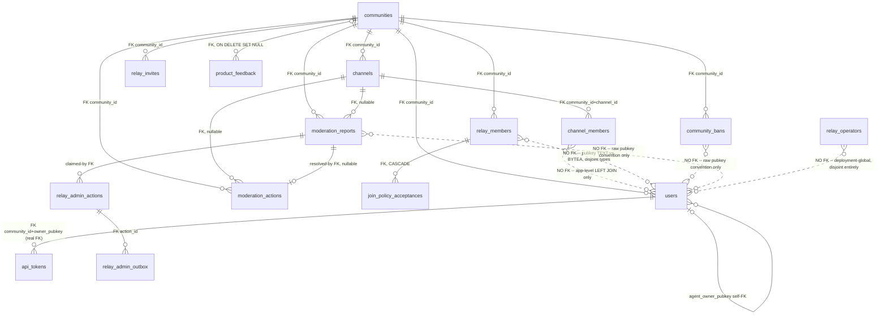

# Buzz → SWF Buzz: Authorization & Business Workflow Blueprint

**Method note:** every claim is labeled `[CODE]` (read directly from source, file:line cited), `[DOCS]` (from a doc/comment in the repo, cross-checked against code where noted), `[INFERRED]` (reasonable conclusion, not directly confirmed), `[UNCLEAR]` (a real open question or internal discrepancy found during research), or `NOT FOUND` (searched for, does not exist). Nothing here is invented. This is a **research document only** — no source files were modified, no builds run, no dependencies installed, no config changed.

Old-Buzz repo root: `C:\Users\Pranshul\Downloads\buzz2.0\buzz` (referred to as `buzz/`). New project: `C:\Users\Pranshul\Downloads\buzz2.0\swf buzz` (referred to as `swf buzz/`). Compiled from six parallel, independently-sourced research passes, cross-verified. This document supersedes nothing already in `docs/` — it complements `ROLE_PERMISSION_AUDIT.md` (static role/permission/API catalog) and `ADMIN_PANEL_REVERSE_ENGINEERING_REPORT.md` (admin-panel-specific implementation notes) by adding full **workflow traces** (exact call chains) and a **code-verified gap analysis against the current SWF Buzz codebase**.

---

## Table of contents

1. [Role hierarchy](#1-role-hierarchy)
2. [Complete user lifecycle](#2-complete-user-lifecycle)
3. [Community owner workflow](#3-community-owner-workflow)
4. [Community admin workflow](#4-community-admin-workflow)
5. [Platform moderator workflow](#5-platform-moderator-workflow)
6. [Platform operator workflow](#6-platform-operator-workflow)
7. [Report lifecycle](#7-report-lifecycle)
8. [Ban / kick / timeout flow](#8-ban--kick--timeout-flow)
9. [Authentication + authorization](#9-authentication--authorization)
10. [Database relationships](#10-database-relationships)
11. [New SWF Buzz gap analysis](#11-new-swf-buzz-gap-analysis)
12. [Final recommended architecture](#12-final-recommended-architecture)
13. [Permission matrix](#13-permission-matrix)
14. [Business flow](#14-business-flow)
15. [Implementation plan](#15-implementation-plan)

---

## 1. Role hierarchy

### A. Community-level roles

Stored in `relay_members` (`community_id, pubkey`, `role TEXT CHECK IN ('owner','admin','member')`) `[CODE migrations/0001_initial_schema.sql:574-581]`, plus a **separate, independent** per-channel role in `channel_members` (`role member_role ENUM ('owner','admin','member','guest','bot')`) `[CODE migrations/0001_initial_schema.sql:29-30,132-145]`. These two are **not the same system** — a community owner is not automatically a channel owner in every channel; see §2/§6 of `ROLE_PERMISSION_AUDIT.md` for the full independent-lattice picture.

#### owner (community)
- **Who can have it**: exactly one pubkey per community at a time. Bootstrapped from `RELAY_OWNER_PUBKEY` config, or the result of an ownership transfer `[CODE relay_members.rs:381-428,514-611]`.
- **Assign**: cannot be "assigned" via any in-band admin command — kind:9032 explicitly refuses `role="owner"` (`"cannot set role to owner"`) `[CODE relay_admin.rs:436-441]`. Only `transfer_ownership()` (owner-initiated or Operator-initiated via `/operator/communities/transfer`) changes who holds it.
- **Remove**: never removable — `remove_relay_member`/`update_relay_member_role` both hard-exclude `role='owner'` rows `[CODE relay_members.rs:251-284,346-364]`. Only *replaced* via transfer, which demotes the outgoing owner to `member` (not `admin`) `[CODE relay_members.rs:509-511]`.
- **Read**: everything in its community — full member roster, all reports (open/resolved/dismissed/escalated), full audit log, all channels' content by virtue of channel access rules.
- **Create**: members (kind:9030), invites (`POST /api/invites`, owner/admin only) `[CODE invites.rs:291-304]`, channels (subject to channel-creation rules, not owner-specific).
- **Modify**: any member's role (kind:9032, owner-only) `[CODE relay_admin.rs:424-441]`, workspace profile/icon (kind:9033).
- **Delete**: any member/admin (never another owner) via kind:9031 `[CODE relay_admin.rs:365-397]`.
- **Moderation actions**: ban/unban/timeout/untimeout **unrestricted** — including against fellow admins — `decide_authority(Some("owner"), ...) =&gt; Ok(CommunityOwner)` with **no guard rail** `[CODE moderation_authz.rs:152-154]`. Resolve/dismiss/escalate any report.
- **UI/pages visible**: Community Members settings card (full), Moderation Queue (Reports + Audit tabs), Invite dialog with the "admin" role option unlocked `[CODE AddMemberDialog.tsx:129-132]`, per-message moderation menu, member-sidebar ban/timeout actions, channel management (if also a channel owner/admin).

#### admin (community)
- **Who can have it**: any member promoted by the owner. Cannot self-promote.
- **Assign**: owner only, via kind:9032 `[CODE relay_admin.rs:424-426]`. Cannot be granted via kind:9030 (add-member) by anyone but the owner either — `"only owner can grant admin role"` `[CODE relay_admin.rs:326-328]`.
- **Remove**: owner only (kind:9031 or kind:9032 demotion). Admin **cannot** demote or remove a fellow admin — see §4.
- **Read**: same as owner — full moderation queue and audit log, no restriction `[CODE moderation_authz.rs:217-236, tested]`.
- **Create**: members (role=`member` only, cannot grant admin), invites (role=`member` only — the invite-role selector filters out "admin" unless the inviter is owner) `[CODE AddMemberDialog.tsx:129-132]`.
- **Modify**: nothing role-related (kind:9032 is owner-only).
- **Delete**: members whose role is exactly `member` (atomic conditional delete, `remove_relay_member_if_role`) `[CODE relay_admin.rs:379-384]` — cannot delete another admin or the owner.
- **Moderation actions**: ban/timeout allowed **except** against a target whose community role is `owner` or `admin` — exact guard: `"an admin cannot ban or time out a community owner or fellow admin"` `[CODE moderation_authz.rs:163-169]`. Unban/untimeout have **no** such restriction (guard is scoped to Ban/Timeout only) `[CODE moderation_authz.rs, test admin_guard_rail_is_scoped_to_ban_and_timeout]`. Resolve/dismiss/escalate reports — unrestricted.
- **UI/pages visible**: same as owner minus the "promote to admin" invite option and minus any role-change control.

#### member (community)
- **Who can have it**: any user admitted via invite claim (role hard-pinned to `member` at the DB layer, `relay_invites.role TEXT CHECK (role = 'member')` `[CODE migrations/0025_relay_invites.sql:20]`) or added by owner/admin.
- **Assign/Remove**: not applicable to itself — it's the default/floor role.
- **Read**: own profile, channels it's a member of, nothing moderation-related — `ViewQueue` denied (`"moderator access required"`) `[CODE moderation_authz.rs:178]`.
- **Create**: messages, reactions, reports (kind:1984 — **no role gate on submission at all**) `[CODE report.rs:44-94]`.
- **Modify**: own messages only (self-authorship check, not role-based) `[CODE canManageMessage.ts:17-30]`.
- **Delete**: own messages/reactions only.
- **Moderation actions**: none. Cannot ban/kick/timeout/view queue/add-remove members/change roles.
- **UI/pages visible**: standard chat UI only — no Members settings management panel, no Moderation Queue, no invite-role picker beyond none (member has no invite capability at all — `"only relay owners and admins can create invites"` `[CODE invites.rs:299-304]`).

### Per-channel roles (separate system, same names)

`Owner &gt; Admin &gt; Member &gt; Guest`, plus non-hierarchical `Bot` `[CODE crates/buzz-core/src/channel.rs:102-158]`, `permission_level()` 4/3/2/1/0. These gate channel-specific actions: edit/delete/archive the channel, kick from that channel, grant elevated channel roles. **Important finding**: community-wide Kick/DeleteMessage authority is *documented* as intended (`moderation_authz.rs:75-76`: "the bridge `validate_admin_event` is missing today") but **not actually wired** — kick (kind:9001) is gated purely by the target channel's own `channel_members` roster via `classify_remove_other()`, never by community `owner`/`admin` role `[CODE side_effects.rs:401-429, channel_authz.rs:196-216]`. **Practical consequence**: a community owner/admin who is not also an elevated member of a specific channel cannot kick from that channel through this path. `[UNCLEAR]` whether this is an intentional Phase-1 scope limit or an unfinished wiring gap in old Buzz itself — flagged for SWF Buzz to fix, not blindly replicate.

### B. Platform/relay-level roles

Stored in `relay_operators` (`pubkey PRIMARY KEY`, **no `community_id` column at all** — deliberately deployment-global) `[CODE migrations/0035_relay_operators.sql:12-21]`, resolved by `AdminRole::{Operator, Moderator}` `[CODE auth.rs:48-55]`.

#### Operator
- **Who can have it**: a pubkey listed in `RELAY_OPERATOR_PUBKEYS` config (`AdminSource::Config`), OR — only if that config list is empty — the `RELAY_OWNER_PUBKEY` (`AdminSource::OwnerFallback`), OR a `relay_operators` DB row with `role='operator'` (`AdminSource::Db`) `[CODE auth.rs:249-312]`. Priority order is exactly Config → OwnerFallback → Db.
- **Assign**: an existing Operator via `PUT /api/admin/v1/operators/{pubkey}`, gated by `require_operator` `[CODE auth.rs:325-334, mod.rs:1004]`. Config-backed pubkeys are immutable through this API (409) `[CODE mod.rs:1016-1020]`.
- **Remove**: an existing Operator via `DELETE /api/admin/v1/operators/{pubkey}`, blocked if it would leave zero effective operators (`DbError::LastOperator`) `[CODE relay_operators.rs:175-177,237-239]`.
- **Read**: every report and feedback item across **every community** on the deployment `[CODE admin_moderation.rs:180-224, no mandatory community filter]`.
- **Create**: new communities (`POST /operator/communities`) `[CODE operator.rs:153]`, new Operator/Moderator roster entries.
- **Modify**: report status (resolve/reopen), feedback status, community archived-state, community ownership (transfer).
- **Delete**: nothing destructive found beyond archiving a community (soft-state, reversible via unarchive).
- **Moderation actions**: resolve/reopen/cancel any report deployment-wide, using either the synchronous CAS path (dismiss/escalate) or the crash-safe async enforcement state machine (delete/kick/ban/timeout) `[CODE report_resolution.rs:172-352]`.
- **UI/pages visible**: `admin-web` Reports + Feedback pages **only** — see §11/§15, there is **no** staffing UI, **no** community-provisioning UI anywhere in the repo.
- **Cannot do**: moderate inside a community it doesn't separately hold `owner`/`admin` in (no community-role inheritance), manage channels, edit deployment configuration (env-var only, no API/UI).

  > **Critical nuance** `[CODE]`: the admin-console `Operator` check (`AdminRole::Operator`, resolves from config OR DB) and the **separate** `/operator/communities*` provisioning-plane check (`authorize_operator_request`, checks `RELAY_OPERATOR_PUBKEYS` config **directly**, no DB fallback, no owner fallback) `[CODE operator.rs:60-106, community_provisioning.rs:259-266]` are **not the same gate**. A DB-only Operator (added via the roster API) can staff and resolve reports but gets 403 `"actor not authorized: not a relay operator"` on any `/operator/communities*` call. SWF Buzz must decide deliberately whether to unify these or preserve the split.

#### Moderator
- **Who can have it**: DB-only — `relay_operators` row with `role='moderator'`. **No config path exists for Moderator** `[CODE auth.rs:48-55, no MODERATOR env var found]`.
- **Assign/Remove**: an Operator only, same `PUT`/`DELETE /operators/{pubkey}` endpoints.
- **Read**: identical to Operator — reports and feedback, deployment-wide, no restriction.
- **Create/Modify/Delete**: identical report/feedback actions as Operator.
- **Moderation actions**: identical to Operator — resolve/reopen/cancel, both synchronous and async enforcement paths, **no restriction found anywhere comparing Moderator to Operator capability on reports/feedback** `[CODE, verified: no handler in admin/mod.rs calls require_operator except the 3 staffing routes]`.
- **Cannot do**: staffing (`require_operator` 403s: `"staffing endpoints require operator role"` `[CODE auth.rs:326-334]`), community provisioning/archive/transfer (never in the `RELAY_OPERATOR_PUBKEYS` allowlist by definition of being DB-only).
- **UI/pages visible**: same `admin-web` Reports + Feedback pages as Operator — the frontend **never distinguishes** Operator from Moderator; it doesn't even call the `GET /probe` endpoint built for exactly that purpose `[CODE admin/mod.rs:125-142, confirmed unused by admin-web/src/api.ts]`.

### C. Other role/permission systems found

- **API-token `Scope`** — 16 capability-bit variants (`MessagesRead/Write, ChannelsRead/Write, AdminChannels, UsersRead/Write, AdminUsers, Jobs*, Subscriptions*, Files*, Repos*`) attached per-token, not per-user `[CODE crates/buzz-auth/src/scope.rs:16-86]`. NIP-42-authenticated WebSocket connections get `Scope::all_known()` wholesale — scopes matter for REST/API-token access, not for interactive chat sessions `[CODE buzz-auth/src/lib.rs:147-155]`.
- **Agent-owner delegation** — `users.agent_owner_pubkey` self-referencing FK; a human who owns a bot/agent inherits that agent's channel authority (can delete a channel the agent "owns," manage the agent's messages) `[CODE migrations/0001:154-175]`. Not a role, a provenance link.
- **No "Super Admin"/"Platform Admin" role exists anywhere** — confirmed absent by direct search and by explicit design-doc statements: *"Two roles, not three… deliberately"* `[DOCS VISION_MODERATION.md:57]`, *"Decide any future operator-global super-admin surface separately"* `[DOCS multi-tenant-conformance.md:45]`.

---

## 2. Complete user lifecycle

One relay process = one community/tenant, bound via HTTP `Host` header `[INFERRED, cross-checked against nip11.rs]`. Identity is a raw Nostr keypair — **no username/password account system anywhere** `[CODE, exhaustive search]`.

### Stage 1 — Authentication
- Relay immediately issues a NIP-42 challenge on connect, before anything else — `generate_challenge()`, `AuthState::Pending{challenge}`, 5s timeout `[CODE crates/buzz-relay/src/connection.rs:126-213]`.
- Both reads and writes are blocked pre-auth — `"auth-required: not authenticated"` `[CODE handlers/req.rs:59-94, handlers/event.rs:634-654]`.
- Desktop: challenge handled client-side, but **signing happens entirely in the Rust Tauri backend** — the raw key never reaches the JS webview `[CODE desktop-tauri/src/commands/identity.rs:642-666]`.
- Web client: real NIP-07 (`window.nostr`) when present, else an ephemeral page-lifetime key `[CODE web/src/shared/lib/nostr-signer.ts:70-106]`.
- Relay verification: kind 22242, Schnorr sig, challenge match, relay-URL match, ±60s timestamp `[CODE crates/buzz-auth/src/nip42.rs:47-86]`. On success: `AuthContext{scopes: Scope::all_known()}` `[CODE buzz-auth/src/lib.rs:147-148]`.
- **Gate order after crypto verification** `[CODE crates/buzz-relay/src/handlers/auth.rs:43-298]`: (1) ban gate — `"blocked: you are banned from this community"`, fails closed on DB error; (2) pubkey-allowlist gate (if enabled); (3) relay-membership gate — `"restricted: not a relay member"`.
- NIP-98 (kind 27235) is a separate stateless path for REST calls `[CODE crates/buzz-auth/src/nip98.rs]`. `[UNCLEAR]` whether NIP-98 REST calls pass through the same ban/membership checks as WebSocket auth — not fully confirmed.

### Stage 2 — Account/identity creation
No signup. First launch generates an ephemeral keypair (`Keys::generate()`), persisted to the OS keyring; import-existing-key also supported (NIP-49 `ncryptsec`) `[CODE desktop-tauri/src/app_state.rs:187-199]`. Profile = kind:0 (NIP-01), stored in the shared `events` table as a replaceable event `[CODE kind.rs:8-9,776-781]`. Relay requires `Scope::UsersWrite` and `event.pubkey == auth.pubkey()` for kind:0 writes.

### Stage 3 — Community discovery
`NOT FOUND`: any public cross-community directory or "browse communities" API. NIP-11 self-describes only the single community you're already pointed at. Desktop's "Add Community" dialog only offers create-via-external-site or join-via-invite-link — discovery is entirely out-of-band `[CODE AddCommunityDialog.tsx:25,81-93]`.

### Stage 4 — Joining a community / invitation flow
`POST /api/invites` (owner/admin only, NIP-98 signed) → 32 random bytes, SHA-256 hash stored, plaintext code returned once `[CODE invites.rs:284-353, relay_invite.rs:99-151]`. `role` is hard-pinned `'member'` at the schema level, regardless of who mints or claims it `[CODE migrations/0025:20]`. Claim (`POST /api/invites/claim`) is rate-limited 10/60s, one transaction: row-lock → expiry check → idempotent no-op if already member → capacity check → `INSERT ... ON CONFLICT DO NOTHING` → increment `use_count` `[CODE relay_invite.rs:222-397]`. Client learns of its own new membership by parsing the relay-published `KIND_NIP43_MEMBERSHIP_LIST` snapshot event for its own pubkey — **no dedicated "GET my membership" REST endpoint** `[CODE relayMembers.ts:106-146]`.

### Stage 5 — Community membership
`relay_members` is the **relay-level admission gate** — it decides whether a pubkey can authenticate to the community at all. It does **not** by itself grant messaging rights in any specific channel `[CODE, confirmed]`.

### Stage 6 — Channel access
Separate `channel_members` layer, own role hierarchy (Owner/Admin/Member/Guest/Bot). Open channels: self-join via kind:9021, unconditional `add_member(role=Member)` on the relay side `[CODE side_effects.rs:1950-2027]`. Private channels: no self-service — requires an existing elevated (owner/admin) member to add you via kind:9000 `[CODE channel_authz.rs:111-167]`.

### Stage 7 — Messaging
Kind:9 (`KIND_STREAM_MESSAGE`). Full ingest pipeline, in exact order `[CODE crates/buzz-relay/src/handlers/ingest.rs:2110-2399]`: community write-fence → kind allowlist → signature verification → timestamp drift ≤15min → content size ≤256KiB → pubkey match → scope check → **ban/timeout write-block gate** → `h`-tag required → token channel-scope check → **channel membership check**. Only after all 11 checks pass does the event persist and fan out.

### Stage 8 — Reporting
Kind:1984 (NIP-56). No role gate on submission — any member can report `[CODE report.rs:44-94]`. Reports never fan out publicly, never auto-action `[DOCS report.rs:1-5]`.

### Stage 9 — Moderation (reported user's perspective)
Nothing changes before resolution — the reported user is not notified a report exists. When action IS taken: a relay-signed DM notice is delivered (never reveals reporter identity), moderator deletion is a soft-delete on the shared `events` row visible identically to everyone (not per-viewer), and a visible in-channel tombstone system message names the acting moderator + reason `[CODE moderation_notices.rs]`.

### Stage 10 — Role promotion
Kind:9030 (add, admin/owner may grant `member`; only owner may grant `admin`) or kind:9032 (change role, owner-only, cannot self-target, cannot grant `owner` through this path) `[CODE relay_admin.rs:313-359,424-441]`.

### Stage 11 — Role removal/demotion
Kind:9031 (remove — admin limited to `role='member'` targets via atomic conditional delete; owner may remove admin/member, never another owner) or kind:9032 demotion (owner-only) `[CODE relay_admin.rs:365-419]`.

### Stage 12 — Deactivation/removal (ban)
Ban = `disconnect_pubkey_clusterwide` (live socket eviction, fanned out via Redis pub/sub across the pod cluster) **plus** a durable re-check at every subsequent NIP-42 auth attempt and every write attempt `[CODE moderation_commands.rs:196-201, state.rs:1193-1225]`. Client classifies any `"blocked:"`/`"restricted:"` rejection as terminal (no auto-retry) and shows the literal server message in a red alert overlay `[CODE relayAuthPolicy.ts:71-76, RelayConnectionOverlay.tsx:44-108]`.

---

## 3. Community owner workflow

Every operation traced end-to-end (Frontend → Signing → Event/API → Relay handler → DB → Side effects). All `[CODE]` unless noted.

| Operation | Frontend | Event/API | Relay handler | DB write | Side effects |
|---|---|---|---|---|---|
| Add member | `AddMemberDialog`/`DirectAddMemberForm` → `useAddRelayMemberMutation` | kind **9030**, `["p",pk]`(+`role`) | `relay_admin.rs:313-360` | `INSERT relay_members ... ON CONFLICT DO NOTHING` | Publishes NIP-43 member-added + membership-list snapshot; **no audit row** (9030-9033 write no `moderation_actions` entry) |
| Remove member | `MemberRow` "Remove" → `useRemoveRelayMemberMutation` | kind **9031**, `["p",pk]` | `relay_admin.rs:363-419` | `DELETE ... WHERE role &lt;&gt; 'owner'` | member-removed + membership-list republish |
| Promote to admin | `MemberRow` "Make Admin" (only for `role==="member"`) → `useChangeRelayMemberRoleMutation` | kind **9032**, `role=admin` | `relay_admin.rs:422-441` | `UPDATE relay_members SET role='admin' WHERE role &lt;&gt; 'owner'` | membership-list republish only |
| Demote admin | same UI, `role=member` | kind **9032**, `role=member` | same handler | same UPDATE | same |
| View reports | `ModerationQueueCard` (visible if role owner/admin) → `listReports()` | `GET /moderation/reports` (NIP-98) | `bridge.rs:2421-2445` → `authorize_moderation_action(ViewQueue)` | `SELECT ... FROM moderation_reports WHERE community_id=$1` | — |
| Ban | `MessageModerationMenuItems` "Ban author" | kind **9040**, `["p",pk]`+`expiration`/`reason` | `moderation_commands.rs:147-226` | `INSERT/UPDATE community_bans (banned=true)` + audit row `"ban"` | `disconnect_pubkey_clusterwide` (live eviction, cluster-wide via Redis) + relay-signed DM notice |
| Unban | "Lift ban" menu item | kind **9041**, `["p",pk]` | `moderation_commands.rs:230-262` | `UPDATE community_bans SET banned=false` + audit `"unban"` | none (no notice DM sent for unban) |
| Kick (from a channel) | "Kick from channel" | kind **9001** (NIP-29) | `side_effects.rs` → `channel_authz::classify_remove_other` — **channel-role gated, not community-role gated** | channel_members soft-delete | none documented; **owner must also hold owner/admin in that specific channel** — see §1 finding |
| Timeout | "Time out author" (1h/24h/7d presets) | kind **9042**, `["p",pk]`,`["expiration",secs]` (required) | `moderation_commands.rs:266-331` | `UPDATE community_bans SET muted_until=...` + audit `"timeout"` | no disconnect (write-block only) + DM notice with countdown |
| Resolve report | `ResolveMenu` → `enforceResolution` (enforces FIRST, then publishes 9044) | kind **9044**, `["report",id],["status",...],["action",...]` | `moderation_commands.rs:375-469` → `resolve_report_decision_only` (atomic CAS) | `moderation_reports.status` CAS + audit row (`resolve:*`/`dismiss_report`/`escalate`) | reporter notice DM (never reveals other reporters or moderator identity) |
| View audit log | `AuditTab` → `listAuditActions()` | `GET /moderation/audit` | `bridge.rs:2447-2463` | `SELECT ... FROM moderation_actions WHERE community_id=$1` | — |

Owner-only structural protections: capped at 5 owned communities by default (`MAX_COMMUNITIES_PER_OWNER`, overridable) `[CODE relay_members.rs:456,464-473]`; ownership change only via `transfer_ownership()`, which demotes the outgoing owner to `member` (not `admin`) `[CODE relay_members.rs:509-511]`.

---

## 4. Community admin workflow

Same 11 operations, restrictions explicit and code-cited.

| Operation | Admin can? | Exact restriction |
|---|---|---|
| Add member | **Partial** | Can add `role=member` only — `"only owner can grant admin role"` if `role=admin` requested `[CODE relay_admin.rs:326-328]` |
| Remove member | **Partial** | Only targets with current `role='member'`, via atomic conditional delete — `"admins can only remove members"` otherwise `[CODE relay_admin.rs:379-384,402-404]` |
| **Promote member to admin** | **NO** | `"actor not authorized: must be owner"` on kind:9032 — admin never reaches this branch `[CODE relay_admin.rs:424-426]` |
| **Demote another admin** | **NO** | Same owner-only gate on kind:9032 |
| **Remove Owner** | **NO** | Admin's remove path only matches `role='member'` rows at the SQL level — an owner/admin target causes a no-op `RoleMismatch` `[CODE relay_members.rs:299-314, relay_admin.rs:402-404]` |
| View reports | **YES**, unrestricted | `decide_authority(Some("admin"), ViewQueue) =&gt; CommunityAdmin`, no guard rail `[CODE moderation_authz.rs:217-236]` |
| **Ban** | **YES, restricted** | Cannot ban a target whose community role is `owner` or `admin` — `"an admin cannot ban or time out a community owner or fellow admin"` `[CODE moderation_authz.rs:163-169]` |
| Unban | **YES, unrestricted** | Guard rail explicitly scoped to Ban/Timeout only, not Unban `[CODE moderation_authz.rs, test admin_guard_rail_is_scoped_to_ban_and_timeout]` |
| Kick | **YES, but channel-scoped** | Same channel-role-only gate as owner — must separately hold owner/admin in that channel |
| **Timeout** | **YES, restricted** | Identical guard as Ban — cannot timeout owner/fellow admin |
| Untimeout | **YES, unrestricted** | Same reasoning as unban |
| Resolve report | **YES, unrestricted** | `ResolveReport` carries no guard rail for admin, even against an admin-authored report `[CODE moderation_authz.rs, test community_admin_authorized_against_non_privileged_targets]` — but if the chosen enforcement action is itself ban/timeout against owner/admin, that separate 9040/9042 call independently hits the guard and fails |
| **View audit logs** | **YES, unrestricted** | Same `ViewQueue`-equivalent capability as reports — no restriction found |

**Notable gap** `[CODE]`: no audit trail exists for 9030/9031/9032/9033 (membership add/remove/role-change/icon) — only 9040-9044 write to `moderation_actions`. Membership history is only reconstructable from `relay_members.updated_at`/`added_by`.

---

## 5. Platform moderator workflow

Deployment-wide, distinct from community moderation (§3/§4). Resolution: `resolve_admin_principal()` — Config → OwnerFallback → DB row `[CODE auth.rs:249-312]`.

- **Deployment-wide reports**: `GET /api/admin/v1/reports` — no mandatory community filter; default (no `status` param) applies an "escalated-by-default backstop," but an explicit `status` param always wins `[CODE admin/mod.rs:191-239,211-225]`. **Community-level and platform-level reports are the SAME underlying `moderation_reports` rows**, viewed through two lenses (tenant-scoped `/moderation/reports` vs. deployment-global `/api/admin/v1/reports`) — not two separate systems `[CODE admin_moderation.rs:1-6,180-224]`.
- **Report resolution**: `POST /reports/{id}/resolve` — both Operator and Moderator may act (only `require_mutation_principal`, no `require_operator`) `[CODE admin/mod.rs:468-660]`. Two execution paths: synchronous CAS for `dismiss`/`escalate`; crash-safe async state machine (`pending→enforcing→mutation_committed→succeeded/failed`, DB-row lease-fenced) for `delete`/`kick`/`ban`/`timeout` `[CODE report_resolution.rs:172-352]`. Delivery (tombstones/DMs) fully decoupled into `relay_admin_outbox`, drained by a background worker, never inline.
- **Reopening**: `POST /reports/{id}/reopen` — requires current status ∈ `{resolved,dismissed,escalated}`, resets to `open`, audited `[CODE relay_admin_actions.rs:1143-1237]`.
- **Cancellation**: `POST /reports/{id}/cancel` — only cancellable if the action `state='failed' AND step_marker IS NULL` (pre-mutation failure only; post-mutation cancel is forbidden) `[CODE relay_admin_actions.rs:1050-1114]`.
- **Feedback**: `GET/PATCH /feedback*` — list/detail/attachment/status update (`new|reviewed|archived`), no filter params server-side (admin-web filters client-side).
- **Cannot manage the Operator/Moderator roster** — every staffing handler calls `require_operator()` immediately, which 403s any Moderator principal: `"staffing endpoints require operator role"` `[CODE auth.rs:326-334, mod.rs:919,1004,1075]`. `[UNCLEAR]`: the test asserting this (`moderator_cannot_access_staffing_endpoints`) is an empty stub referencing a nonexistent "negative-matrix" test suite `[CODE admin/mod.rs:2849-2854]` — the rule is real code but under-tested.
- **Frontend**: `admin-web` Reports (read-only — no resolve/reopen/cancel buttons rendered) + Feedback (working, with status control) pages exist. `NOT FOUND`: any UI for resolve/reopen/cancel, despite the backend fully implementing them.

---

## 6. Platform operator workflow

- **Operator/Moderator roster**: `GET/PUT/DELETE /api/admin/v1/operators*`, Operator-only `[CODE mod.rs:903-1109]`. `list_operators` builds a union of config entries + owner-fallback + DB rows, tagging `sources` rather than duplicating `[CODE mod.rs:928-969]`. Config-backed pubkeys are immutable via the API (409).
- **Last-operator invariant** — exact quoted guard: `if demotion && !config_operator_exists && db_operator_count(&mut tx).await? == 0 { return Err(DbError::LastOperator); }` `[CODE relay_operators.rs:174-177]` (same pattern on removal, line 236-239). Serialized via a roster-wide Postgres advisory lock so concurrent demotions can't race the count to zero.
- **Granting a role**: explicit `role` field on `PUT /operators/{pubkey}` — no implicit promotion logic. Every mutation is append-only audited into `relay_operator_audit` (grant/revoke, prev_role, new_role) in the same transaction.
- **Revoking a role**: `DELETE /operators/{pubkey}` — same config-immutability and last-operator guards.
- **Deployment-wide reports**: Operator has exactly equal access to Moderator on reports/feedback, plus the exclusive staffing endpoints and the separate provisioning plane — a strict superset `[CODE, verified no admin/mod.rs report/feedback handler calls require_operator]`.
- **Communities/provisioning APIs**: `POST /operator/communities` (provision, bootstraps owner), `/archive`, `/unarchive`, `/transfer` (demotes prior owner to `member`), `GET /operator/communities` (list), `/availability` — all gated by `authorize_operator_request`, which checks `RELAY_OPERATOR_PUBKEYS` config **directly**, "deliberately NOT a relay_members lookup… empty allowlist → everyone is rejected (fail closed)" `[CODE community_provisioning.rs:5-11,259-266]`.
- **Invites**: `POST /api/invites` authorization is **purely community-scoped** (`relay_members.role IN ('owner','admin')`) — grep of the whole file for `relay_operator`/`AdminRole` returns zero matches. **There is no Operator-specific invite capability** `[CODE invites.rs:291-304]` — an Operator/Moderator has no special minting privilege unless they also separately hold owner/admin in that specific community.
- **Frontend existence — independently re-verified**: `admin-web/src/api.ts` hardcodes `PREFIX = "/api/admin/v1"`; grep for `/operator` across `admin-web/src` returns zero hits. **Confirmed: no frontend anywhere in the repository calls the community-provisioning control plane, and no frontend anywhere provides staffing/roster UI**, despite `GET /probe` computing exactly the `role`/`source`/`canStaff` fields a UI would need `[CODE admin/mod.rs:124-189]` — admin-web doesn't even call `/probe`.

---

## 7. Report lifecycle

```
User files report (kind:1984, NIP-56, no role gate)
        ↓  report.rs:44-94 — validates shape, resolves target strictly inside requesting tenant
Report stored (moderation_reports, status='open', or 'escalated' if report_type='illegal')
        ↓  auto-escalation at insert for the 'illegal' category only [CODE moderation.rs:197-201]
Community moderation queue (GET /moderation/reports, owner/admin only, tenant-scoped)
        ↓
Escalation — TWO distinct mechanisms feeding the SAME status column:
   (a) automatic: illegal-category → status='escalated' at ingest
   (b) manual "Escalate" resolution (kind:9044, action=escalate) → status becomes 'resolved',
       NOT 'escalated' — the 9044 wire contract only accepts status ∈ {resolved, dismissed}
       [CODE moderation_commands.rs:389-406, buzz-sdk/builders.rs:4540-4545 test]
        ↓
Platform moderation (GET /api/admin/v1/reports — SAME moderation_reports rows, cross-tenant read,
        no mandatory community filter) [CODE admin_moderation.rs:180-224]
        ↓
Action (resolve_report_decision_only for dismiss/escalate — sync CAS;
        resolve_report_with_enforcement for delete/kick/ban/timeout — async crash-safe state machine)
        ↓
Resolution (moderation_reports.status CAS: open → resolved/dismissed)
        ↓
Audit (moderation_actions for community-path actions; relay_admin_actions for HTTP-admin-path
        actions — the HTTP path writes to BOTH tables)
```

**Key architectural finding** `[CODE]`: community-level and platform-level reports are **the same underlying rows**, not two separate systems — the admin API's `list_reports()` query is identical to the tenant-scoped bridge query, just without the `community_id` filter.

**Real functional gap flagged** `[UNCLEAR]`: clicking "Escalate" in the desktop moderation queue closes the report as `resolved` (not `escalated`) and records `moderation_actions.action='escalate'` as the only trace. No deployment-admin endpoint was found reading `moderation_actions` across communities (`admin/mod.rs` has zero references to that table) — so a manually-escalated report does **not** automatically surface in the platform Operator/Moderator's queue the way an auto-escalated `illegal` report does. Only illegal-category auto-escalation reliably reaches the platform lane. Whether this is intentional Phase-1 scoping or an unfinished wire is genuinely unclear from the code alone — **flag this explicitly if SWF Buzz replicates escalation, and consider fixing it rather than copying it as-is.**

**Enforcement asymmetry** `[CODE]`: on the community WS path (kind:9044), enforcement (the paired ban/timeout/kick/delete event) and report-resolution are **two separate client-issued events**, sequenced client-side (`enforceResolution()` fires first, then 9044). On the HTTP admin path, they are **one atomic server-side orchestration** (the crash-safe state machine). This is a real architectural asymmetry, not just a UI difference — worth deciding deliberately for SWF Buzz rather than copying either path uncritically.

---

## 8. Ban / kick / timeout flow

| Action | Frontend → Signing → Wire | Relay handler | DB write | Live side-effect | Affected-user experience |
|---|---|---|---|---|---|
| Ban | Local nsec (desktop Rust backend) signs kind **9040** | `moderation_commands.rs:147-226` | `community_bans` upsert (`banned=true`) + audit `"ban"` | `disconnect_pubkey_clusterwide` — force-closes sockets, fanned cluster-wide via Redis pub/sub | Socket force-closed; next NIP-42 AUTH re-checks ban state and refuses with `"blocked: you are banned..."`, closing immediately; client shows a terminal (non-retrying) red alert overlay; relay-signed DM notice sent |
| Unban | same signing | `moderation_commands.rs:230-262` | `community_bans.banned=false` + audit `"unban"` | none | Can authenticate/write normally again; no DM notice sent |
| Kick | signs kind **9001** (NIP-29) | `side_effects.rs:401-429` → `channel_authz::classify_remove_other` (channel-roster-only, does **not** consult community role) | channel_members soft-delete | none beyond roster removal | Loses that channel's access; no forced disconnect (channel-level, not auth-level) |
| Timeout | signs kind **9042**, requires `expiration` tag | `moderation_commands.rs:266-331`, goes through `authorize_moderation_action` | `community_bans.muted_until` upsert + audit `"timeout"` | No disconnect — write-block only; re-checked on every subsequent write attempt | Composer shows a live-countdown banner (`"restricted: you are timed out until..."`); DM notice sent |
| Untimeout | signs kind **9043** | `moderation_commands.rs:335-367` | `community_bans.muted_until` cleared + audit `"untimeout"` | none | Can write again immediately |
| Resolve-report (triggers action) | community: kind **9044**; HTTP admin: `POST .../resolve` (NIP-98) | `moderation_commands.rs:375-469` or `admin/mod.rs:468-678` | `moderation_reports.status` CAS + audit row(s) | Underlying enforcement fires through the same mechanisms above | Reporter gets a `ReportResolved` DM; actioned author gets a `ContentActioned`/`Restriction` DM |

**Ground-truth authorization core**, quoted verbatim `[CODE moderation_authz.rs:146-181]`:
```rust
match actor_role {
    Some("owner") => Ok(ModerationAuthority::CommunityOwner),
    Some("admin") => {
        if matches!(action, ModerationAction::Ban | ModerationAction::Timeout)
            && matches!(target_role, Some("owner") | Some("admin"))
        {
            anyhow::bail!("an admin cannot ban or time out a community owner or fellow admin");
        }
        Ok(ModerationAuthority::CommunityAdmin)
    }
    _ => match (action, channel_role) {
        (ModerationAction::DeleteMessage | ModerationAction::Kick, Some("owner") | Some("admin")) =>
            Ok(ModerationAuthority::ChannelRole),
        _ => anyhow::bail!("moderator access required"),
    },
}
```

**Note** `[CODE]`: `ModerationAction::Kick`/`DeleteMessage` are defined and unit-tested in this function, but grep of the whole crate shows **no real call site ever passes them here** — kick's actual gate is `channel_authz::classify_remove_other` alone. The module's own comment concedes: "this is the bridge `validate_admin_event` is missing today."

---

## 9. Authentication + authorization

| Mechanism | Used for | Where enforcement actually executes |
|---|---|---|
| **NIP-42** | WebSocket relay-level session auth — binds a connection to a pubkey for the life of the socket | `handlers/auth.rs:43-299` `handle_auth()` — crypto verify, then ban/allowlist/membership gates in order, before `set_authenticated_pubkey` |
| **NIP-98** | HTTP request signing — community moderation bridge reads/writes, deployment admin console | `bridge.rs:73-147` `verify_bridge_auth()` (community); `admin/auth.rs:188-237` `authorize()` (deployment) |
| **NIP-07** | Used **only by admin-web** (a browser page with no private key of its own) to produce the same NIP-98 signature via a browser extension | `admin-web/src/api.ts:32-56` `signNip98()` |
| **Desktop signing (Tauri commands)** | All desktop-issued events — chat, reports, all moderation commands, NIP-98 headers — one local key for everything | `desktop-tauri/src/commands/identity.rs` (`sign_event`, `create_auth_event`), keys held via `state.signing_keys()` in the OS keyring |

**Per-scenario**:
1. **Normal messaging** → NIP-42 for the session, per-event pubkey-binding check at `ingest.rs:2253-2257`, scope check via `required_scope_for_kind`.
2. **Community moderation (desktop)** → events ride the already-authenticated WebSocket (no separate signature scheme); authorization executes at `moderation_authz.rs:83` (or `channel_authz.rs:210` for kick specifically). Moderation *reads* use NIP-98, checked at `bridge.rs:2353`.
3. **Platform admin (admin-web)** → NIP-07-signed NIP-98, verified and role-resolved at `admin/auth.rs:188` → `resolve_admin_principal()`, then per-handler `require_mutation_principal`/`require_operator`.

**Is client-side authorization ever real, or purely cosmetic?** `[CODE, verified precisely]` — **Purely cosmetic.** Every moderation/admin write function on the client (`moderation.ts`'s `banMember`, `timeoutMember`, `resolveReport`, etc.) performs **no role check of its own** — it unconditionally signs and publishes. The `canModerate`/`isOwner` checks only gate whether a UI element *renders*; there is no `if (!canModerate) throw` anywhere in the signing/publishing code paths. **The relay is the sole and complete enforcement boundary** for every action traced in this document (`moderation_authz.rs`, `channel_authz.rs`, `admin/auth.rs`). A modified client or a raw signed event sent outside the app would be rejected identically by the relay. This is a correct security architecture — client-side gating exists purely for UX, and SWF Buzz should follow the same pattern (never trust the client's own role belief for anything but what to display).

---

## 10. Database relationships

**Headline finding** `[CODE]`: there is **no unified `users` foreign-key hub**. Three disjoint pubkey-identity surfaces coexist with **zero referential integrity** between them:
- `users.pubkey` — `BYTEA`, per-community profile/metadata
- `relay_members.pubkey` — `TEXT` (64-char hex!) — **type mismatch with `users.pubkey BYTEA` makes an FK structurally impossible even by convention** `[CODE migrations/0001:574-581]`
- `relay_operators.pubkey` — `BYTEA`, deployment-global, no `community_id` at all

`channel_members.pubkey` also carries **no FK to `users`** — display joins happen at the application/SQL-query level only (`LEFT JOIN users u ON cm.community_id=u.community_id AND cm.pubkey=u.pubkey`) `[CODE channel_members.rs:1106]`. Same for `community_bans`, `moderation_reports`, `moderation_actions`, `product_feedback`, `relay_operators` — all raw `BYTEA` pubkeys, no FK to `users`. The **only** genuine FKs into `users` are `api_tokens.owner_pubkey`, `users.agent_owner_pubkey` (self-referential), `subscriptions.owner_pubkey`, `workflows.owner_pubkey`.

### Diagram (Mermaid)



### Table summary

| Table | Scope | Role/status column | Notes |
|---|---|---|---|
| `communities` | Root tenant | `deletion_state` | operator-global |
| `channels` | Per-community | `channel_type`, `visibility` | PK `(community_id, id)` — not globally unique |
| `channel_members` | Per-channel | `role` ENUM `member_role` | No FK to `users` |
| `users` | Per-community | — | Profile/metadata only, not an authz hub |
| `relay_members` | Per-community | `role` CHECK `owner/admin/member` | `pubkey TEXT` — type-incompatible with `users.pubkey BYTEA` |
| `relay_invites` | Per-community | `role` CHECK pinned to `'member'` | Invite links can never grant admin |
| `moderation_reports` | Per-community | `status` CHECK `open/processing/resolved/dismissed/escalated` | Cross-tenant read via admin API (no FK change, just an unfiltered query) |
| `community_bans` | Per-community, per-member | `banned`, `ban_expires_at`, `muted_until` | One row per restricted member — ban and timeout share the row |
| `moderation_actions` | Per-community, audit | `action` CHECK (12-value vocab), `actor_authority` | Community-path AND HTTP-admin-path both write here |
| `relay_operators` | **Deployment-global** | `role` CHECK `operator/moderator` | No `community_id` column at all |
| `relay_operator_audit` | Deployment-global, append-only | `op` CHECK `grant/revoke` | No FK to `relay_operators` (raw pubkey convention) |
| `relay_admin_actions` | Enforcement state machine | `state`, `step_marker` | FK to `moderation_reports` — this is how tenant provenance enters an otherwise-global table |
| `relay_admin_outbox` | Delivery queue | `state` CHECK `pending/delivered/failed` | FK to `relay_admin_actions.id` |
| `product_feedback` | Deployment-global | `status` CHECK `new/reviewed/archived` | `community_id` FK is `ON DELETE SET NULL` — the only one in the schema |

---

## 11. New SWF Buzz gap analysis

Verified directly against current `swf buzz/src/**` code (not aspirational docs) `[CODE]`.

**Headline finding**: SWF Buzz today implements the **core chat product** (channels, messaging, threads, reactions, presence, typing, DMs, invites-without-enforcement) but has **zero** moderation, community/channel management, role enforcement, or admin console functionality. The only role-awareness is a **cosmetic** read-only badge.

| Feature | Old Buzz | SWF Buzz | Missing? | Backend exists? | Frontend needed? | Priority |
|---|---|---|---|---|---|---|
| Channel messaging (send/receive/threads/reactions) | Full | **Working** — `MessageService`, `ThreadService`, `ReactionService` `[CODE]` | No | Yes (relay) | No | — |
| Presence/typing | Full | **Working** — kind:20001/20002 `[CODE]` | No | Yes | No | — |
| Direct messages | Full (kind:41010 etc.) | **Working** (open/send/hide; unhide UI missing) | Partial | Yes | Small | Low |
| Invites (create) | Full, enforced server-side | **Partial** — creates/signs kind:9009, but explicitly disclosed as "not yet enforced by the server" `[CODE InvitesPanel.vue:20-23]` | Yes | `[UNCLEAR]` — old Buzz uses a different invite kind (v2 HTTP `POST /api/invites`), SWF Buzz uses kind:9009 which old Buzz defines but `NOT FOUND` wired to any relay handler | Yes | **High** |
| Community role display | 3-role badge | **Cosmetic only** — `MemberRow.vue:23` shows a text label, gates nothing `[CODE]` | Yes (enforcement) | Yes | Yes | **High** |
| Channel roles (owner/admin/member/guest/bot) | Full | **NOT FOUND** — only community-plane 3-role set is modeled | Yes | Yes | Yes | Medium |
| Community member management (add/remove/promote/demote) | Full | **NOT FOUND** — no UI, no protocol builder for kind:9030/9031/9032 | Yes | Yes | Yes | **High** |
| Channel management (create/edit/delete/archive/permissions) | Full | **Dead code only** — `ChannelService.createChannel/editChannel` exist but have zero call sites from any view `[CODE]` | Yes | Yes | Yes | **High** |
| Moderation (ban/unban/timeout/untimeout) | Full | **NOT FOUND** anywhere in `src/protocol/**` (kinds 9040-9043 absent from the kind registry) | Yes | Yes | Yes | **High** |
| Reports (submit/view/resolve) | Full (kind:1984, NIP-56) | **NOT FOUND** | Yes | Yes | Yes | **High** |
| Moderation queue + audit log | Full | **NOT FOUND** | Yes | Yes | Yes | **High** |
| Platform admin console (Operators/Moderators, deployment reports, feedback) | Exists in old Buzz but with its own major frontend gaps (see §5/§6) | **NOT FOUND** | Yes | Yes | Yes | Medium (see phased plan) |
| Feedback submission/console | Exists (kind:42000 + admin API) | **NOT FOUND** | Yes | Yes | Yes | Low-Medium |
| Auth (Okta OIDC) | N/A (old Buzz doesn't use Okta) | **Code-complete**, Rust-backed PKCE flow, but the NIP-46 bunker it depends on for signing doesn't exist anywhere in the ecosystem to test against `[CODE, DOCS KNOWN_LIMITATIONS.md]` | N/A | Partial | N/A | Medium (infra dependency, not code) |
| API tokens / Scopes | Full | **NOT FOUND** | `[INFERRED]` intentionally excluded per scope note in ROLE_PERMISSION_AUDIT.md (§17 flags Repos* scopes only for exclusion — the rest of Scope is in-scope) | N/A | Yes, eventually | Low |
| Local Agents | Full | **NOT FOUND** (agent-activity/mentions exist, which is a *consumption* of agent events, not agent *management*) | **Excluded by requirement** | — | — | **Excluded** |
| Git bridge | Full | **NOT FOUND** | **Excluded by requirement** | — | — | **Excluded** |

`docs/ROLE_PERMISSION_AUDIT.md`'s "SWF Buzz required: YES" column is correctly a **to-do list against the reference app**, not a status report on SWF Buzz — this gap table is the first document that verifies current SWF Buzz state directly against code.

---

## 12. Final recommended architecture

Three clearly separated navigation surfaces, built only where old-Buzz code proves the feature is real (no speculative additions; Local Agents, Git admin, workflow admin, relay configuration, API tokens, and analytics/dashboard pages are explicitly excluded unless a future audit finds concrete evidence they're required).

### USER APP (all community members)
- Channels list, join/leave, messaging, threads, reactions, typing, presence
- Direct messages
- Community member list (read-only, with role badge)
- **Submit a report** on a message/user (new — currently missing)
- Invite acceptance (needs server-side enforcement fix — see §11)
- Own-message edit/delete

### COMMUNITY ADMIN (visible only to community owner/admin, scoped to their own community)
- Member management: add, remove, promote/demote (kind:9030/9031/9032 equivalents)
- Channel management: create, edit, archive/delete, permissions
- Moderation queue: view open/resolved/dismissed/escalated reports, resolve/dismiss/escalate
- Per-message/per-member moderation actions: ban, unban, timeout, untimeout, kick
- Community audit log
- Invite management (mint invites, role always pinned to `member` unless owner)

### PLATFORM ADMIN (visible only to deployment Operator/Moderator, deployment-wide)
- Deployment-wide reports queue — **with real resolve/reopen/cancel actions** (old Buzz's own `admin-web` never built this UI despite full backend support — SWF Buzz should not repeat that gap)
- Feedback console (list/filter/status/attachments)
- Operator/Moderator roster management (list/grant/revoke) — old Buzz has **zero** UI for this; build it in SWF Buzz
- Community provisioning (create/archive/unarchive/transfer) — **only if** SWF Buzz's deployment model needs multi-community provisioning from a UI; old Buzz itself has no frontend for this either, so treat as optional/Phase-3

**Explicitly excluded** (per requirement, and confirmed self-contained with no other code depending on them): Local Agents (lifecycle, MCP permission boundary, managed-agent/persona/team catalogs), Git access/Git app-level checks (credentials, commit signing, push-role permissions, repo browser).

---

## 13. Permission matrix

| Action | Member | Admin | Owner | Moderator | Operator |
|---|---|---|---|---|---|
| View channels | YES | YES | YES | — | — |
| Send message | YES | YES | YES | — | — |
| Create report | YES | YES | YES | — | — |
| View community reports | NO | YES | YES | NO¹ | NO¹ |
| Ban | NO | COND (not owner/admin) | YES | NO¹ | NO¹ |
| Unban | NO | YES | YES | NO¹ | NO¹ |
| Kick | NO | COND (channel-role gated) | COND (channel-role gated) | NO¹ | NO¹ |
| Timeout | NO | COND (not owner/admin) | YES | NO¹ | NO¹ |
| View audit (community) | NO | YES | YES | NO¹ | NO¹ |
| Promote member | NO | NO | YES | — | — |
| Demote admin | NO | NO | YES | — | — |
| View deployment reports | — | — | — | YES | YES |
| Resolve reports (deployment) | — | — | — | YES | YES |
| Reopen reports | — | — | — | YES | YES |
| Cancel reports | — | — | — | YES | YES |
| View feedback | — | — | — | YES | YES |
| Manage operators | — | — | — | NO | YES |
| Manage moderators | — | — | — | NO | YES |

¹ Platform Moderator/Operator have no automatic authority inside a specific community's own moderation plane — they'd need to separately also hold `owner`/`admin` in that community's `relay_members` to view/act on its community-scoped queue. Their deployment-wide reach is via the separate cross-tenant admin API (§7), not via community role inheritance.

---

## 14. Business flow

In plain language:

**Normal User** joins a community via an invite link, becomes a **Member** — they can chat, react, join open channels, and, if something goes wrong, file a report. They have no power to manage anyone else.

**Community** is the tenant boundary — everything from membership to moderation to reports is scoped to one community; nothing leaks across communities except through the deployment-wide admin lens.

**Admin** is a member the **Owner** trusts with day-to-day moderation: they can ban/timeout ordinary members, resolve reports, and manage plain members — but they are explicitly walled off from touching the Owner or a fellow Admin (can't ban them, can't demote them, can't remove them), and they can never promote anyone to Admin themselves. This is a deliberate blast-radius limit: an admin account being compromised or acting in bad faith can't be used to seize the community.

**Owner** is the top of the community — unrestricted moderation power inside their own tenant, sole authority to change roles, sole path (with the Operator) to transferring ownership. But an Owner's authority **stops at their own community's border** — they have no reach into any other community and no platform-wide power.

**Platform Moderator** picks up where community moderation can't or shouldn't go — a deployment-wide trust & safety triage role that can see and act on reports/feedback across every community on the deployment, but cannot touch community membership, channels, or the platform's own staff roster.

**Platform Operator** is the deployment's ultimate authority — everything a Moderator can do, plus staffing the Moderator/Operator roster itself, and (via a separately-gated surface) provisioning, archiving, or transferring entire communities.

**When does an issue stay inside a community, and when does it escalate?** In principle: any ordinary moderation matter (spam, a rude member, a minor policy violation) is fully handled by the community's own Owner/Admin — ban, timeout, or resolve, done. An issue escalates to the platform level automatically **only** when a report is filed under the `illegal` category — that's the one hard-wired trigger that lands a report in the platform's `escalated` queue regardless of what the community does. A community moderator can also *try* to manually escalate a report from the queue, but as traced in §7, that action currently just closes the report as `resolved` rather than reliably surfacing it to the platform team — a real gap worth fixing deliberately in SWF Buzz rather than inheriting silently.

---

## 15. Implementation plan

Every phase lists: frontend files to create/change, backend/API dependency, protocol dependency, database dependency, role required, testing required. "Backend/API" here means the **existing Buzz relay** SWF Buzz already talks to (per project memory: same `buzz-relay`/`buzz-db` backend) — no new backend work is needed unless explicitly noted.

### PHASE 1 — Core role enforcement + community member management (must implement first)

This is the foundation everything else in Phases 2-3 depends on — without real role data, no permission gate can work.

- **Protocol dependency**: add kind builders/parsers for 9030 (add member), 9031 (remove member), 9032 (change role) to `src/protocol/` (new file, e.g. `membership-admin.ts`, alongside the existing `membership.ts` which currently only handles 9000/9001/9021/9022 channel-level events). Verify each against `crates/buzz-relay/src/handlers/relay_admin.rs` before implementing — do not guess tag shapes.
- **Frontend**: a `usePermission`/`useCan()` composable (new, `src/composables/usePermission.ts`) built on the existing `MemberRole` type in `src/types/domain.ts` and the relay-membership-list parsing already in place — this replaces the cosmetic-only badge in `MemberRow.vue` with real gating. A Community Members management view (new feature folder `src/features/community-members/`) — member list with promote/demote/remove actions, gated by the new composable.
- **Backend/API dependency**: none new — the relay already implements 9030/9031/9032 fully (see §3/§4).
- **Database dependency**: none new — SWF Buzz doesn't own the DB; it reads relay state via the existing membership-list snapshot mechanism.
- **Role required**: Owner (promote/demote, add-as-admin), Admin (add/remove plain members).
- **Testing required**: unit tests for the new protocol builders/parsers (matching the existing pattern in `tests/unit/protocol/`), unit tests for `usePermission` covering the exact admin-cannot-touch-owner/admin restrictions from §4, an integration test against a real/mock relay for the full add→promote→demote→remove cycle.

### PHASE 2 — Community administration (moderation + channel management)

- **Protocol dependency**: kind builders/parsers for 1984 (report), 9040-9044 (ban/unban/timeout/untimeout/resolve). Wire up the already-defined-but-uncalled `ChannelService.createChannel/editChannel` to real UI.
- **Frontend**: `src/features/moderation/` (new) — report submission dialog, moderation queue (reports + audit tabs, gated to owner/admin via `usePermission`), per-message/per-member moderation menu (ban/timeout/kick/unban/untimeout). Channel management UI (new, or extend existing `ChannelListItem.vue`/a new `ChannelSettingsDialog.vue`) wired to the existing dead-code service methods.
- **Backend/API dependency**: `GET/POST /moderation/*` bridge (NIP-98) for community-scoped reads; the relay's existing report/ban/timeout/resolve handlers for writes. No new backend work.
- **Database dependency**: none new (relay-owned).
- **Role required**: Member (submit report), Admin (moderate with restrictions), Owner (unrestricted moderate).
- **Testing required**: protocol unit tests, `usePermission` tests for the ban/timeout admin-cannot-touch-owner/admin guard, an end-to-end test of the report → queue → resolve → notice-DM flow against a mock/real relay, explicit regression test for the escalation gap noted in §7 (decide and test the intended SWF Buzz behavior rather than silently inheriting old Buzz's ambiguity).

### PHASE 3 — Platform administration

- **Protocol/API dependency**: NIP-98-signed HTTP calls to `/api/admin/v1/reports*`, `/feedback*`, `/operators*` (deployment admin console) — this requires SWF Buzz to implement a NIP-98 request-signing helper on the desktop side (parallel to the existing relay-event signing in `src/features/signing/`), since this is a different signing surface (HTTP requests, not Nostr events).
- **Frontend**: a new top-level "Platform Admin" area (separate route/section, visible only if the signed-in identity resolves to Operator/Moderator — call `GET /probe` to determine this, unlike old Buzz's `admin-web` which never does) — Reports queue **with working resolve/reopen/cancel buttons** (fixing old Buzz's own gap), Feedback console, Operator/Moderator roster management (fixing another old-Buzz gap — no UI ever existed for this).
- **Backend/API dependency**: none new — every endpoint needed already exists and is fully implemented server-side (§5/§6); this phase is pure frontend work building UI for an already-complete API.
- **Database dependency**: none new.
- **Role required**: Moderator (reports/feedback), Operator (+ roster staffing, + community provisioning if that surface is built).
- **Testing required**: NIP-98 signing unit tests, `GET /probe`-driven role-gating tests (Operator sees roster UI, Moderator doesn't), integration tests for resolve/reopen/cancel against a mock/real relay, explicit negative test proving a Moderator identity gets a 403/hidden-UI for staffing (closing the under-tested gap flagged in §5).

### PHASE 4 — Security / testing hardening

- Verify NIP-98 replay protection and Host/Origin binding are correctly implemented client-side to match relay expectations (`admin/auth.rs:188-237`).
- Add negative-path tests for every guard rail identified in this document: admin-cannot-ban-owner/admin, admin-cannot-promote/demote, last-operator invariant, invite-role-pinned-to-member, config-outranks-DB precedence.
- Confirm (as §9 establishes for old Buzz) that SWF Buzz's own client never performs authorization logic that isn't purely cosmetic — every write path must rely on the relay to enforce, and every UI gate must be re-verified as "hide, don't trust."
- Full regression pass once Phases 1-3 are integrated: re-run the existing `tests/unit/**` suite plus new suites, confirm `npm run typecheck && npm run lint && npm run test && npm run build` all pass per the project's existing development discipline (see `docs/DEVELOPMENT.md`/prior session conventions).

---

*Compiled from six parallel, independently-sourced research passes over `C:\Users\Pranshul\Downloads\buzz2.0\buzz` and a direct code audit of `C:\Users\Pranshul\Downloads\buzz2.0\swf buzz` (both read-only). No source files were modified, no builds were run, no dependencies were installed, no configuration was changed in the production of this document. Treat this as a snapshot dated 2026-09-15 — re-verify citations against current source before implementing.*
